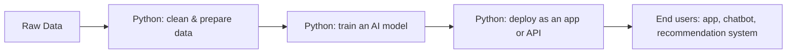
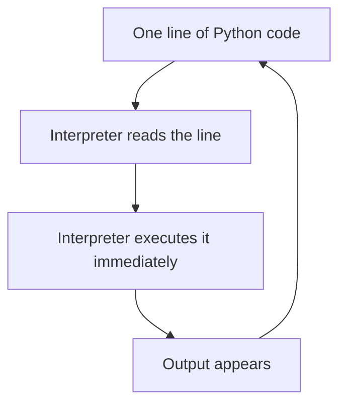
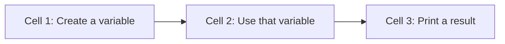

# The Python Environment

## Learning Objectives

By the end of this unit, you will be able to:

✓ Explain why Python is the standard language for AI and Machine Learning work.
✓ Describe how an interpreted language differs from a compiled language.
✓ Identify the parts of the Google Colab interface and explain what a runtime restart does.
✓ Write and run a Python program in Colab using `print()`, in the correct cell order.

## Overview

Python is the language you will use for every exercise, lab, and project
in this programme. Before writing a single line of it, you need to
understand two things: how Python actually executes the code you type,
and where you will be typing it. Both decisions shape every habit you
build from here onward.

Think of the way Python runs your code like a multimeter connected to a
live circuit. The moment you touch the probes to two points, the reading
appears immediately — you don't first draw out the entire circuit and
calculate the expected values on paper before getting a result. Python
behaves the same way: it reads and executes your instructions one at a
time, giving you immediate feedback instead of demanding the whole
program upfront.

This unit introduces that execution model — how Python interprets code
line by line — and Google Colab, the browser-based notebook you will use
throughout this course to write, run, and save your work.

Every AI system you will eventually build, from a simple data-cleaning
script to a trained model, is written and tested using exactly this
interpreter-and-notebook workflow — which is why getting comfortable with
it now matters more than it might seem.

## Description

### 3.1 Why Python for AI Work

Python leads AI and Machine Learning work for two concrete reasons.

**Readability — low syntax overhead**

A language's **syntax** is its grammar — the punctuation and structure it
demands before your code will even run. Some languages demand a lot of
it. Here is the same instruction in two languages:

Java:
```java
System.out.println("Result: " + marks);
```

Python:
```python
print("Result:", marks)
```

No semicolons. No wrapper class just to run one line. Python gets out of
your way, which matters because AI work is mostly experimentation — write
a little logic, test it, change it, test again. A language that doesn't
fight you at every line lets you focus on the actual problem.

**The AI/ML ecosystem**

Almost every major AI library is Python-first:

— **NumPy** and **Pandas** — handling numbers and tables
— **Scikit-learn** — classical machine learning
— **TensorFlow** and **PyTorch** — deep learning

When a research lab publishes a new AI technique, the code that comes
with it is almost always Python. Once an ecosystem forms around a
language like this, it becomes the practical default — the same way one
lab equipment brand ends up standard across every college in a
discipline, simply because everyone already builds on it.

**Where Python sits in an AI-native workflow:**



Python isn't used at one single stage — it runs through the whole
pipeline, from messy raw data to the finished product a user touches.

### 3.2 The Python Interpreter

A programming language needs something to convert your code into
instructions the computer can run. There are two broad approaches:

— **Compiled languages** work like a written exam — you submit your
  entire script, and only once it's fully submitted does the evaluator
  (the compiler) check it from start to end and hand back one final
  result.
— **Python is interpreted** — it works like a viva voce. The examiner
  asks one question, you answer immediately, and you get instant feedback
  before the next question is even asked. Python's **interpreter** reads
  your code one line at a time and runs each line immediately.



This line-by-line execution is exactly why you can test a single
expression in Python and see the result at once, instead of waiting for
an entire program to finish translating first.

**The REPL — Read, Evaluate, Print, Loop**

The REPL is the interactive mode of the Python interpreter. The name
describes exactly what it does:

— **Read** — Python reads the line you typed.
— **Evaluate** — Python computes the result.
— **Print** — Python displays the result.
— **Loop** — Python waits for your next input and repeats.

Google Colab's notebook cells work on this same principle. Each cell is a
unit you run independently, and the output appears directly below it. You
don't need to run the whole notebook to test one idea — just run the cell
you are working on.

### 3.3 Google Colab as the Standard Environment

Throughout this course, you will write and run every line of Python
inside **Google Colab** — a free, browser-based notebook tool from
Google.

A Colab file (called a **notebook**, extension `.ipynb`) is the digital
version of the practical record book you keep for a science or
engineering lab — except instead of writing procedure, code, and results
by hand, you type the code and Colab runs it and records the output for
you.

**Cells and run order**

A notebook is organised into **cells** — small blocks that hold either
code or explanatory text.

— **Order matters** — you choose the sequence cells run in.
— **Dependency** — a later cell can use a variable created in an earlier
  one.
— **Convention** — cells are normally run top to bottom, the same way you
  wouldn't skip Question 1 in a lab record and expect Question 2's answer
  to make sense on its own.



**The runtime — and restarting it**

The **runtime** is the live session behind your notebook. It remembers
every variable and value you've created so far.

If your notebook starts producing results you don't expect — say, a
variable seems to be holding an old value — you can **restart the
runtime**. This wipes the session clean, the same way starting a fresh
answer sheet removes every earlier mistake. After restarting, every cell
has to be run again from the top before its variables exist again.

**Saving to Google Drive**

Colab auto-saves your notebook to Google Drive as you work — the same way
an online college portal auto-saves a form as you fill it in. Close your
browser, come back later, and your notebook is exactly as you left it.

`[Insert screenshot: Google Colab interface — a new notebook showing an empty code cell and the Run button]`

### 3.4 Running Your First Program

`print()` is Python's basic tool for displaying a value on screen.
`print(value)` takes whatever you put inside the parentheses and writes
it out as output.

```python
print("Hello, world!")
```
```
Hello, world!
```

A few precise rules, since this pattern repeats constantly from here on:

— **Function** — `print` is a named, ready-made block of code that runs a
  specific action when called.
— **Argument** — the parentheses `()` pass information *into* the
  function; whatever is passed in is called an argument.
— **String** — text arguments must be wrapped in quotes (`"..."` or
  `'...'`), which marks them as a string, covered fully in the next unit.
— **Multiple arguments** — `print()` can take more than one argument,
  separated by commas; Python inserts a space between them automatically:

```python
print("Marks:", 78)
```
```
Marks: 78
```

**Reading output in sequence**

Each cell's output appears right beneath it once you run that cell —
similar to how your answer to one question on an online quiz appears
immediately, rather than all results showing up only at the very end.

```python
print("My name is Priya")
print("Department: Computer Science")
print("Batch: CRESCENT 2026")
```
```
My name is Priya
Department: Computer Science
Batch: CRESCENT 2026
```

## Real-World Application

| Where you see it | How Python is working behind the scenes |
|---|---|
| Your college result portal displaying marks the instant you log in | Backend Python code fetches your record and prints/renders it immediately — the same immediate display behaviour you just practised with `print()` |
| YouTube recommending your next video | Recommendation models are first tested in interactive notebooks, one small change at a time — exactly like running one Colab cell at a time |
| Spotify's "Made For You" playlists | Data scientists prototype playlist-ranking logic interactively, testing one idea, checking the result, then adjusting — the REPL cycle in practice |
| ChatGPT answering your question in seconds | The underlying model was built and refined using Python's line-by-line, interpreted workflow, letting engineers test small changes quickly |
| A UPI payment confirmation arriving within seconds | Backend systems log and print every transaction step for monitoring — the same debugging habit you just learned with `print()` |
| NPTEL or Internshala saving your progress automatically | Built on systems that continuously auto-save state — the same behaviour Colab uses when it saves your notebook to Google Drive |

## Worked Example

**Scenario:** Your Python lab instructor has asked every student to
submit a short notebook through the college assignment portal. The
notebook must print your name, department, and batch code, and must run
cleanly from a fresh session before submission.

**Step 1 — Create the first cell.**
```python
student_name = "Priya"
```
Run it (Shift+Enter). No output yet — this cell only stores a value.

**Step 2 — Create a second cell that uses the first cell's variable.**
```python
print("Student:", student_name)
```
```
Student: Priya
```
This works only because Step 1's cell has already run, so `student_name`
already exists in the runtime.

**Step 3 — Test the notebook fresh, the way you should before every
submission.** Restart the runtime (Runtime → Restart runtime), then run
**only** Step 2's cell, without re-running Step 1:
```
NameError: name 'student_name' is not defined
```
This error is Python telling you it has no memory of `student_name` —
restarting the runtime cleared it, exactly as described earlier.

**Step 4 — Correct the order and confirm before submitting.** Run Step
1's cell again, then Step 2's cell again:
```
Student: Priya
```
The notebook is now confirmed to run cleanly from the top and is ready to
upload to the assignment portal.

*Common mistake: many students restart the runtime just before
submitting, to "test it fresh," and then run only the last cell instead
of running all cells from the top. This produces a NameError even though
the code itself is correct. Always use Runtime → Run all before exporting
or submitting your notebook.*

## Summary

This unit gave you the two foundations every later unit builds on: how
Python executes code, and where you will write it.

— Python leads AI/ML work because of its readability and its large
  ecosystem of AI libraries.
— Python is an interpreted language — it executes code one line at a
  time rather than compiling the whole program first.
— The REPL (Read, Evaluate, Print, Loop) is what makes this line-by-line
  execution interactive, and Colab cells work on the same principle.
— Google Colab needs no installation, organises your code into cells, and
  auto-saves your work to Google Drive.
— Restarting a Colab runtime clears every stored variable, so cells must
  always be run again from the top afterwards.
— `print(value)` is your basic tool for displaying output, and it will
  appear in almost every program you write from this point onward.

With the environment in place, the next unit moves to the actual building
blocks of a Python program — variables, identifiers, and types.
