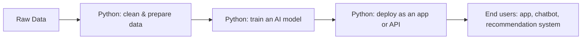
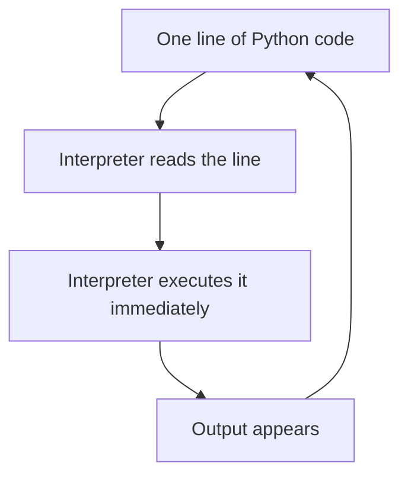
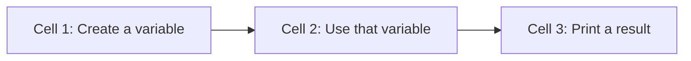

# The Python Environment

---

## 1. Learning Objectives

By the end of this unit, you will be able to:

✓ Explain why Python is the standard language for AI and Machine Learning work.  
✓ Describe how an interpreted language differs from a compiled language.  
✓ Identify the parts of the Google Colab interface and explain what a runtime restart does.  
✓ Write and run a Python program in Colab using `print()`, in the correct cell order.

---

## 2. Overview

Python is the language you will use for every exercise, lab, and project
in this programme. Before writing a single line of it, you need to
understand two things: how Python actually executes the code you type,
and where you will be typing it. Both decisions shape every habit you
build from here onward.

Think of the way Python runs your code like a multimeter connected to a
live circuit. The moment you touch the probes to two points, the reading
appears immediately — you don't first draw out the entire circuit and
calculate the expected values on paper before getting a result. Python
behaves the same way: it reads and executes your instructions one at a
time, giving you immediate feedback instead of demanding the whole
program upfront.

This unit introduces that execution model — how Python interprets code
line by line — and Google Colab, the browser-based notebook you will use
throughout this course to write, run, and save your work.

Every AI system you will eventually build, from a simple data-cleaning
script to a trained model, is written and tested using exactly this
interpreter-and-notebook workflow — which is why getting comfortable with
it now matters more than it might seem.

---

## 3. Description

### 3.1 Why Python for AI Work

Python became the standard language for AI because of three concrete advantages:

- **Readability and low syntax overhead.** Python reads close to plain English. There are no semicolons, no mandatory type declarations, and no curly braces to manage. A beginner can read a Python program and understand its intent without fighting the syntax. Less time on syntax means more time on the actual problem.

- **The AI and ML ecosystem.** Every major AI library — TensorFlow, PyTorch, scikit-learn, HuggingFace, LangChain — is Python-first. The global AI community has converged on Python as the common language. If you want to work with AI systems, Python is the only practical choice.

- **Python as the connector in an AI workflow.** In a real AI project, Python is the glue. It calls the model, pre-processes data before the model sees it, and formats the output after the model responds. Even when you are not training a model, you are using Python to interact with one.

**Where Python sits in an AI-native workflow:**



---

### 3.2 The Python Interpreter and Interactive Mode

Before writing code, it helps to understand what actually happens when you run it. There are two broad ways a programming language can work: compiled or interpreted.

|  | **Compiled Language (e.g. Java, C)** | **Interpreted Language (Python)** |
|---|---|---|
| **How it works** | You write the full program. A compiler translates the entire code into machine instructions first. Only then can you run it. | Python reads and executes the program one line at a time. There is no separate compile step. |
| **When you see errors** | After the full compilation attempt finishes. The program does not run at all until compilation succeeds. | The moment the faulty line is reached during execution. Earlier lines may have already run successfully. |
| **Feedback speed** | Slower loop — write, compile, fix, compile again, then run. | Fast loop — write a line, run it, see the result immediately. |
| **Best suited for** | High-performance applications where speed of execution matters (operating systems, game engines). | Data exploration, scripting, AI work — where speed of development and quick feedback matter more. |

Because Python is interpreted, it is well suited for learning and for data work: you can test a single idea in one cell without rewriting or recompiling the whole program.



**The REPL — Read–Evaluate–Print Loop**

The REPL is the interactive mode of the Python interpreter. The name describes exactly what it does:

- **Read** — Python reads the line you typed.  
- **Evaluate** — Python computes the result.  
- **Print** — Python displays the result.  
- **Loop** — Python waits for your next input and repeats.

Google Colab's notebook cells work on the same principle. Each cell is a unit you run independently, and the output appears directly below. You do not need to run the whole notebook to test one idea — run just the cell you are working on.

*Note: Cells share memory within a session. If Cell 3 uses a variable defined in Cell 2, run Cell 2 first. Always run notebooks top to bottom when you open them fresh.*

---

### 3.3 Google Colab as the Standard Environment

Google Colab (Colaboratory) is a free, browser-based Python notebook provided by Google. Your code runs on Google's servers — not on your laptop. No installation is needed. All you need is a browser and a Google account.

| **Colab Feature** | **What It Means for You** |
|---|---|
| **Cells** | A notebook is made of cells. A code cell contains Python. A text cell contains notes written in Markdown. Run cells one at a time or all at once. |
| **Run order** | Cells do not auto-run when you open a notebook. You must run them manually, top to bottom. |
| **The runtime** | A runtime is the server session running your code. It times out after roughly 90 minutes of inactivity. Always save to Drive, not just in the runtime. |
| **Restart runtime** | If variables get into a bad state, go to Runtime → Restart Runtime. This clears memory. Re-run all cells from the top afterwards. |
| **Save to Google Drive** | File → Save a copy in Drive. Your notebook is stored at My Drive → Colab Notebooks. Auto-save runs every few minutes, but do a manual save before closing. |



---

### 3.4 Running Your First Program — print()

The `print()` function is the first tool every Python programmer learns. It instructs Python to display a value on the screen. The syntax has three required parts:

| **Syntax element** | **Explanation** |
|---|---|
| `print` | The built-in function name. No import needed. |
| `(  )` | Parentheses are mandatory for every function call. Omitting them causes a SyntaxError. |
| `"text"` | The value to display. String values are wrapped in double quotes `" "` or single quotes `' '`. |
| `# comment` | A comment starts with `#`. Python ignores everything after it on that line. Use comments to explain your logic. |

Example:

```python
# My first Python program

print("Hello, World!")
print("I am learning Python for AI.")
```

Output:

```
Hello, World!
I am learning Python for AI.
```

---

## 4. Real-World Application

Python is in active use right now across industries. Here are examples that are directly relatable to where you are in your first year — drawn from things you already use or encounter every day.

| **Where you see it** | **How Python is working behind the scenes** |
|---|---|
| **YouTube / Spotify recommendations** | Every time the platform suggests the next video or song, a Python-based algorithm has run in the background, comparing your history to millions of other users. |
| **ChatGPT or any AI chatbot** | When you type a question into ChatGPT, the call that sends your message to the model and brings back the answer is made using a Python library. The Colab environment you are setting up today is exactly that kind of interface. |
| **Online exam proctoring (e.g., NPTEL, Coursera)** | Face detection and flagging during online exams is done using Python-based computer vision libraries such as OpenCV, running on a server as you write the test. |
| **UPI and digital payments** | Banks and payment apps like Paytm run Python scripts to detect unusual transactions in real time. Every UPI payment you make is scanned by a model within milliseconds. |

---

## 5. Worked Example

**Scenario:** Your professor asks you to submit a Colab notebook that prints your name, your branch, and your college before the next class. Here is the exact sequence to follow.

**1. Open Google Colab.** Go to colab.research.google.com in your browser. Sign in with your Google account. Click New Notebook.

**2. Rename the notebook.** Click "Untitled0" at the top. Type a clear name such as `Week1_Introduction_YourName`. Press Enter.

**3. Write the code.** Click inside the first code cell and type the following:

```python
# Week 1 — Introduction
# Author: Priya Nair | Computer Science | SRMIST, Chennai

print("My name is Priya Nair.")
print("I am in the Computer Science branch.")
print("My college is SRMIST, Chennai.")
```

**4. Run the cell.** Press `Shift + Enter`, or click the triangle (run) button on the left edge of the cell.

**5. Check the output.** The output appears directly below the cell:

```
My name is Priya Nair.
I am in the Computer Science branch.
My college is SRMIST, Chennai.
```

**6. Save to Google Drive.** Go to File → Save a copy in Drive. Your notebook is now stored safely and can be submitted or shared.

*Common mistake: If you see `NameError: name 'x' is not defined`, it means you ran cells out of order, or restarted the runtime without re-running earlier cells. Go to the top and run each cell in sequence.*

---

## 6. Summary

- **Python** is the standard language for AI and Machine Learning work, backed by a huge ecosystem of libraries and tools built specifically for it.
- **Interpreted execution** means your code runs line by line, so you get immediate feedback and can debug problems as soon as they appear.
- **The REPL** (Read, Evaluate, Print, Loop) is the interactive cycle running behind every cell you execute in Colab.
- **Google Colab** is browser-based and needs no installation — just run your cells top to bottom, in order.
- **The runtime** can be restarted whenever memory gets into a bad state, but every cell must then be run again from the top.
- **`print("text")`** is your first working syntax tool — both the quotes and the parentheses are required for it to run.
- **Python as the connector** ties together data, models, and output across every AI workflow you will build in this programme.

---

*© 2026 Revature · AI Native Engineering — Foundations · Unit 1.1 · Version 1.0*
