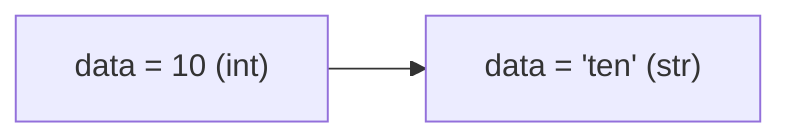

# Variables, Identifiers & Types

---

## 1. Learning Objectives

By the end of this unit, you will be able to:

✓ Create variables using the assignment operator and explain what happens when a value is stored.  
✓ Apply Python's identifier naming rules, including the snake_case convention, to write valid and readable variable names.  
✓ Identify the four basic data types (`int`, `float`, `str`, `bool`) and choose the correct one for a given value.  
✓ Use the `type()` function to inspect the type of any variable.  
✓ Explain what dynamic typing means and how it differs from a statically typed language.

---

## 2. Overview

In Unit 1.1, every value you printed was typed directly into the `print()` call. That works for a one-line demonstration, but no real program stays that simple — you need a way to store a value once and reuse it, update it, and combine it with other values. That storage mechanism is the **variable**, and it is the single most-used building block in every program you will write for the rest of this course.

Think of a variable the way you would think of a labelled terminal on a breadboard in an electronics lab. The label itself carries no current — it is simply a name that lets you find and reconnect to a specific point in the circuit whenever you need it. A variable works the same way: the name does not change the value, it just gives you a reliable way to refer to it anywhere else in your code.

This unit covers three things that build on each other: how to create a variable with **assignment**, the naming rules Python enforces for every variable name (called an **identifier**), and the four basic **types** of value a variable can hold. It closes with `type()`, the tool you will use to check exactly what a variable is holding at any point.

Every dataset column, every model parameter, and every configuration value you will work with later in this programme is, underneath everything else, a named variable holding a typed value — which is exactly why getting comfortable with this now pays off in every later unit.

---

## 3. Description

### 3.1 Variables and Assignment

A **variable** is a name that stores a value so you can use it again later, instead of retyping the value every time. You create one using the **assignment operator**, the equals sign (`=`):

```python
roll_number = 101
```

Here, `roll_number` is the variable name and `101` is the value stored in it. Note that `=` in Python does **not** mean "is equal to" — that is a different operator, covered in the next unit. It means "store the value on the right into the name on the left."

**Reassignment** means storing a new value into a variable that already exists — the old value is simply replaced:

```python
roll_number = 101
print(roll_number)

roll_number = 102
print(roll_number)
```

**Output:**
```
101
102
```

### 3.2 Identifiers — Naming Rules and Conventions

The name you give a variable is called an **identifier**. Python enforces a fixed set of rules on what is allowed:

- **Legal characters** — an identifier can contain letters, digits, and underscores (`_`), but it cannot **start** with a digit. `marks1` is valid; `1marks` is not.
- **snake_case convention** — when a name has multiple words, Python's standard style joins them with underscores in lowercase, for example `student_name` or `total_marks`. Following this convention is not optional in professional code — it is what every other developer reading your code will expect.
- **Reserved keywords** — Python has a fixed set of words that already carry a special meaning in the language (`if`, `for`, `class`, `return`, and others). None of these can be used as a variable name.
- **Case sensitivity** — Python treats uppercase and lowercase letters as different characters entirely. `Marks`, `marks`, and `MARKS` are three completely distinct variable names.

| Identifier | Valid? | Reason |
|---|---|---|
| `student_name` | Yes | Follows snake_case, starts with a letter |
| `1st_semester` | No | Starts with a digit |
| `class` | No | `class` is a reserved keyword |
| `CGPA` | Yes | Legal, though ALL CAPS is normally reserved for constants |

### 3.3 Values and Types

Every value in Python has a **type**, which tells Python — and you — what kind of data it is and what operations are valid on it. The four basic types you need for now are:

| Type | Meaning | Example |
|---|---|---|
| `int` | Whole number (integer) | `101`, `-5`, `0` |
| `float` | Decimal number | `8.7`, `-0.5` |
| `str` | Text (string) | `"Arjun"`, `'Chennai'` |
| `bool` | Boolean — only `True` or `False` | `True`, `False` |

```python
roll_number = 101        # int
cgpa = 8.7                # float
student_name = "Arjun"    # str
is_passed = True          # bool
```

### 3.4 Inspecting Types and Dynamic Typing

If you are ever unsure what type a variable currently holds, use the **`type()`** function to check:

```python
print(type(roll_number))
print(type(cgpa))
print(type(student_name))
print(type(is_passed))
```

**Output:**
```
<class 'int'>
<class 'float'>
<class 'str'>
<class 'bool'>
```

Python uses **dynamic typing** — you never declare a variable's type in advance; Python works it out automatically from the value you assign. You can also assign a completely different type of value to the very same variable name later:

```python
data = 10          # currently an int
print(type(data))

data = "ten"        # now a str
print(type(data))
```

**Output:**
```
<class 'int'>
<class 'str'>
```



This flexibility is convenient, but it also means you must always be aware of what type your variable currently holds — an operation valid for one type may raise an error on another.

---

## 4. Real-World Application

| **Where you see it** | **How Python is working behind the scenes** |
|---|---|
| **Your college ID card portal** | Your roll number (`int`), name (`str`), and CGPA (`float`) are each stored as typed variables in the backend before being displayed on your profile page. |
| **IRCTC PNR status check** | The 10-digit PNR number you type in is read as a string, then validated and looked up against a typed database record. |
| **A cricket score app** | Runs scored (`int`) and the run rate (`float`) are two different types updating live, calculated from the same underlying ball-by-ball data. |
| **Instagram follower count** | The number displayed is an `int` variable that gets reassigned every time someone follows or unfollows the account. |
| **A UPI app showing your balance** | Your account balance is stored as a `float`, while the transaction status ("Success" / "Failed") is stored as a `str`. |

---

## 5. Worked Example

**Scenario:** Your Python lab instructor has asked you to store a student's academic record in variables, print it out, and then explore what happens if you break the identifier naming rules.

**1. Create the student record.**
```python
roll_number = 101
student_name = "Arjun"
cgpa = 8.7
is_passed = True
```

**2. Print each value with its type.**
```python
print(roll_number, type(roll_number))
print(student_name, type(student_name))
print(cgpa, type(cgpa))
print(is_passed, type(is_passed))
```

**Output:**
```
101 <class 'int'>
Arjun <class 'str'>
8.7 <class 'float'>
True <class 'bool'>
```

**3. Try an illegal identifier.** Type the following into a new cell:
```python
1st_semester_marks = 78
```

**Output:**
```
SyntaxError: invalid decimal literal
```

This happens because identifiers cannot start with a digit — Python cannot tell where the number ends and the name begins.

**4. Fix the identifier and re-run.**
```python
semester_1_marks = 78
print(semester_1_marks)
```

**Output:**
```
78
```

*Common mistake: naming a variable starting with a digit, or naming it after a reserved keyword such as `class` or `for`, both raise a `SyntaxError` before your program even runs. Always check a new variable name against Python's naming rules before you type the rest of the line.*

---

## 6. Summary

- **Variables** store a value under a name using the assignment operator (`=`), so the value can be reused without retyping it.
- **Identifiers** must follow Python's naming rules — starting with a letter or underscore, using snake_case, and avoiding reserved keywords — and are always case-sensitive.
- **The four basic types** — `int`, `float`, `str`, and `bool` — describe what kind of value a variable holds and what operations are valid on it.
- **`type()`** lets you inspect exactly what type a variable currently holds, at any point in your program.
- **Dynamic typing** means Python works out a variable's type automatically from its value, and even allows the same variable name to hold a different type later.

With variables, identifiers, and types in place, the next unit moves on to operators and expressions — how you combine and compare the values you now know how to store.

---

*© 2026 Revature · AI Native Engineering — Foundations · Unit 1.2 · Version 1.0*
