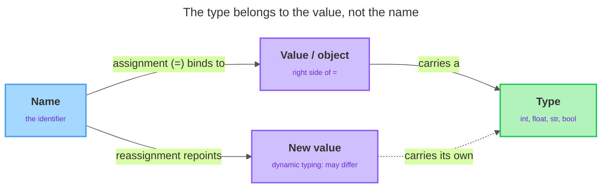

# Variables, Identifiers & Types

---

## 1. Learning Objectives

By the end of this unit, you will be able to:

✓ Create a variable using the assignment operator (`=`) and change its value by reassigning it.  
✓ Apply Python's naming rules and the `snake_case` convention to write legal, readable identifiers.  
✓ Recognize the four basic value types: `int`, `float`, `str`, and `bool`.  
✓ Use the `type()` function to inspect the type of any value.  
✓ Explain, in plain terms, what "dynamic typing" means in Python.

---

## 2. Overview

In unit 1.1 you learned to type code into a Colab cell, run it, and use `print()` to see a result. But printing a value once and forgetting it isn't very useful. Real programs need to hold on to values — a user's name, a price, a count of items — and reuse them later.

That's what a **variable** does: it gives a value a name so you can refer to it as often as you like, and change it in one place instead of hunting down every copy. In this unit you'll learn how to create variables, the rules for naming them, the four kinds of values you'll use most often, and a small tool (`type()`) that tells you what kind of value you're holding. These are the building blocks for everything else in Python.

---

## 3. Description

### 3.1 Variables and Assignment

A **variable** is a name that refers to a value. You create one with the **assignment operator**, the single equals sign `=`. The name goes on the left, the value goes on the right:

```python
x = 5
print(x)
```

Output:

```
5
```

Read `x = 5` as "let `x` refer to the value `5`" — not as "x equals 5" in the math sense. In mathematics, `=` states a fact that's either true or false. In Python, `=` performs an action: it binds the name on the left to the object on the right. After that line runs, any time you write `x`, Python looks up the value it points to and uses it in place of the name.

Because the right side is worked out first and then handed to the name, you can put any value there — a number, some text, or even the value another variable is already holding:

```python
first = 5
second = first
print(first, second)
```

Output:

```
5 5
```

Writing `second = first` doesn't link the two names together forever — it copies the *current* value of `first` and gives it to `second`.

One habit to form early: a name must exist before you use it. If you try to `print(total)` before you've ever written `total = ...`, Python has no value to look up and reports a `NameError`. A variable comes into being the moment you first assign to it.

### 3.2 Reassignment

You're not stuck with the first value. You can **reassign** a variable — give it a new value — at any time by writing another assignment to the same name:

```python
count = 10
print(count)
count = 20
print(count)
```

Output:

```
10
20
```

The second assignment replaces the first. The name `count` now refers to `20`; the old `10` is gone — nothing in your program remembers it anymore. This happens constantly in real programs: a score goes up, a balance goes down, a total grows.

You can even use a variable's current value on the right side to compute its next value. Python evaluates the whole right side first, using the old value, and only then rebinds the name:

```python
score = 100
score = score + 50
print(score)
```

Output:

```
150
```

Read the middle line as: take the current value of `score` (`100`), work out `score + 50` (`150`), then let `score` now refer to that result.

### 3.3 Identifiers — Naming Rules

The name you give a variable is called an **identifier**. Python has firm *rules* about which names are legal, and a separate *convention* about which names are good style. Rules are enforced by Python — break one and your code won't run. Conventions are agreements between programmers — break one and your code still runs, but other people (including future you) will find it harder to read.

The rules:

- An identifier may contain letters, digits, and the underscore `_`.
- It must **not start with a digit**. `age2` is fine; `2age` is an error.
- It may not contain spaces or punctuation like `-`, `!`, or `$`.
- It must not be a **reserved keyword**.

```python
2age = 30
```

Output:

```
SyntaxError: invalid decimal literal
```

Python can't even make sense of the line, so it stops before doing anything at all.

### 3.4 Reserved Keywords and Case Sensitivity

**Reserved keywords** are words Python has already claimed for its own grammar — `if`, `for`, `class`, `def`, `True`, `False`. You cannot use them as variable names. If a short, common English word causes a strange `SyntaxError`, a keyword clash is a likely cause — rename it (e.g. `iteration` instead of `for`).

Python is also **case sensitive**: it treats uppercase and lowercase letters as different, so `score`, `Score`, and `SCORE` are three completely separate variables with no connection between them:

```python
score = 1
Score = 2
print(score, Score)
```

Output:

```
1 2
```

This trips up beginners, because in everyday writing "Score" and "score" mean the same word. In Python they do not — pick one spelling per variable and stay consistent.

### 3.5 The `snake_case` Convention

Legal isn't the same as good. **PEP 8**, Python's official style guide, says variable names should be lowercase with words separated by underscores — a style called **`snake_case`**. Write `user_name`, not `username` or `UserName`.

If you've seen another language before, you may know **camelCase** (`userName`), which capitalizes each word after the first with no underscores. Python will happily run a camelCase name — it breaks no rule — but it isn't the Python convention.

```python
total_price = 19.99
print(total_price)
```

Output:

```
19.99
```

Good names also describe the value: `total_price` tells a reader far more than `tp` or `x`.

### 3.6 Values and Types

Every value in Python has a **type** — a category that says what kind of thing the value is. Four basic types cover almost everything you'll use for now:

- **`int`** — a whole number, no decimal point: `5`, `0`, `-42`.
- **`float`** — a number with a decimal point: `3.14`, `2.0`. `2.0` is still a `float`, even though it equals a whole number, because it was *written* with a decimal point.
- **`str`** — text wrapped in quotes: `"hello"`, `'Python'`. `"5"` is the text five; `5` is the number five.
- **`bool`** — a truth value, `True` or `False` only, always with a capital first letter.

```python
age = 30
price = 9.99
name = "Ada"
is_active = True
print(age, price, name, is_active)
```

Output:

```
30 9.99 Ada True
```

### 3.7 Inspecting Types with `type()`

When you're unsure what type a value is, ask Python directly with the built-in **`type()`** function:

```python
print(type(30))
print(type(9.99))
print(type("Ada"))
print(type(True))
```

Output:

```
<class 'int'>
<class 'float'>
<class 'str'>
<class 'bool'>
```

The word `class` here just means "type" — read `<class 'int'>` as "this is an `int`." `type()` never changes the value; it just tells you what it is.

### 3.8 Dynamic Typing

When you wrote `age = 30` you never told Python "this is an integer" — you just assigned the value, and Python figured out the type on its own. This is called **dynamic typing**. It means two things: you don't declare a variable's type in advance, and a variable can refer to a value of one type now and a different type later, because the variable is just a name — it's the *value* that carries the type.

```python
data = 100
print(type(data))
data = "one hundred"
print(type(data))
```

Output:

```
<class 'int'>
<class 'str'>
```

Python allows this without complaint because the type belongs to the value, not to the name. This makes Python flexible and quick to write — but it also means *you* are responsible for tracking what a variable holds, which is exactly why `type()` is so handy.

**Mental model.** A **name** is bound by `=` to a **value**, which carries a **type**; reassignment repoints the same name to a new value, and under dynamic typing that new value may carry a different type.



---

## 4. Real-World Application

An e-commerce checkout page holds exactly this mix of types in its code: a `str` for the customer's name, a `float` for the item price, an `int` for the quantity, and a `bool` for whether a coupon was applied — four variables, four different jobs, created the same way `age`, `price`, `name`, and `is_active` were above.

Anywhere a running total needs to update — a shopping cart total, a live score, a step counter — is the reassignment idea at work: the same variable name is repeatedly told to hold a new value, and the old one is simply gone.

---

## 5. Worked Example

**Goal:** Assign one value of each of the four types, confirm each with `type()`, then watch dynamic typing change a variable's type on the fly.

**1. Create one variable of each type.**

```python
items_in_cart = 3
unit_price = 4.50
customer_name = "Ada"
cart_is_empty = False
```

**2. Confirm each type with `type()`.**

```python
print(type(items_in_cart))
print(type(unit_price))
print(type(customer_name))
print(type(cart_is_empty))
```

Output:

```
<class 'int'>
<class 'float'>
<class 'str'>
<class 'bool'>
```

Notice how the decimal point in `4.50` makes `unit_price` a `float`, while `3` with no decimal point makes `items_in_cart` an `int`.

**3. Reassign one name across two types, and watch `type()` follow it.**

```python
label = 100
print(type(label))

label = "one hundred"
print(type(label))
```

Output:

```
<class 'int'>
<class 'str'>
```

One name, two different types over its lifetime — Python allows this without complaint because the type rides along with the value, not the name.

**4. Trigger a classic case-sensitivity mistake.**

```python
total = 50
print(Total)
```

Output:

```
NameError: name 'Total' is not defined
```

*Common mistake: you set `total` but read `Total` — Python treats them as two different variables, so it's never seen `Total`. When you get a `NameError` on a name you're sure you created, check the capitalization first.*

---

## 6. Summary

- A **variable** is a name that refers to a value; you create and change it with the assignment operator `=`, which binds the name on the left to the value on the right.
- **Identifiers** must follow Python's rules (letters, digits, underscores; no leading digit; no keywords) and should follow the **snake_case** convention from PEP 8.
- Python names are **case sensitive**: `score` and `Score` are different variables.
- The four basic **types** are `int`, `float`, `str`, and `bool`; `type()` reports the type of any value.
- Python uses **dynamic typing** — the type belongs to the value, not the name — so a variable can hold different types over time.

Next up: operators and expressions — how you combine and compare the values you now know how to store.

---

*© 2026 Revature · AI Native Engineering — Foundations · Unit 1.2 · Version 1.0*
