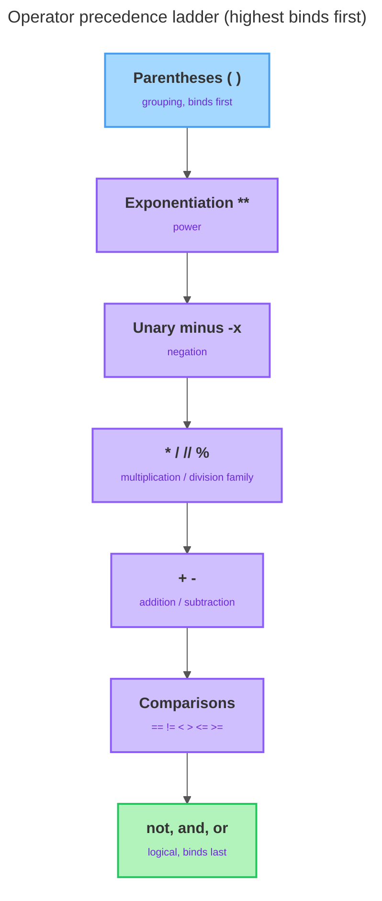

# Operators & Expressions

---

## 1. Learning Objectives

By the end of this unit, you will be able to:

✓ Use Python's arithmetic operators — `+`, `-`, `*`, `/`, `//`, `%`, and `**` — and explain how true division differs from floor division, including how each behaves with negative numbers.  
✓ Predict how Python evaluates an expression by applying operator precedence, and control that order deliberately with parentheses.  
✓ Compare two values with `==`, `!=`, `<`, `>`, `<=`, and `>=`, recognize that a comparison produces a `bool`, and read a chained comparison such as `1 < x < 10`.  
✓ Combine conditions with `and`, `or`, and `not`, explain the precedence among them, and explain what short-circuit evaluation does and why it's useful.  
✓ Identify which values Python treats as truthy and which as falsy, and explain how truthiness feeds the logical operators.

---

## 2. Overview

In unit 1.2 you learned to name values and check their types with `type()`. But a program that only stores values doesn't *do* anything with them — the moment you want to add a price to a tax, check whether a score passed a threshold, or decide "is the cart empty *and* is the user logged in," you need an **operator**: a symbol (or short keyword) that combines values into a new value. Put values, variables, and operators together into something Python can evaluate down to a single value, and you've written an **expression**.

This unit covers the five expression tools you'll use in almost every program from here on: arithmetic, precedence (which operator runs first when a line has more than one), comparison, logical operators, and truthiness. Every comparison and logical expression produces a `bool`, and those booleans are exactly what will drive the decisions your programs make once you reach conditionals in Part 2.

---

## 3. Description

### 3.1 Arithmetic Operators

Arithmetic operators do the math you'd expect, on `int` and `float` values:

| Operator | Name | Example | Result |
|---|---|---|---|
| `+` | addition | `7 + 3` | `10` |
| `-` | subtraction | `7 - 3` | `4` |
| `*` | multiplication | `7 * 3` | `21` |
| `/` | true division | `7 / 2` | `3.5` |
| `//` | floor division | `7 // 2` | `3` |
| `%` | modulo (remainder) | `7 % 2` | `1` |
| `**` | exponentiation | `7 ** 2` | `49` |

The *type* of the result depends on the operands: if both are `int`, `+`/`-`/`*` give back an `int`; the moment even one operand is a `float`, the result "promotes" to a `float` to keep the fractional part. `7 + 3` is `10`, but `7 + 3.0` is `10.0`.

Division is where Python most often surprises newcomers. `/` is **true division** — it *always* gives a `float`, even when the numbers divide evenly, so `6 / 2` is `3.0`, not `3`. `//` is **floor division** — it divides and rounds *down* to the nearest whole number, discarding the fraction. Read `//` as "how many whole times does the second number fit into the first?" — `20 // 6` is `3`. The precise rule is that `//` rounds *toward negative infinity*, never toward zero. For positive numbers that matches "chop off the decimal," but for negatives it doesn't: `-7 // 2` is `-4` (the true answer, `-3.5`, rounded *down*), not `-3`.

```python
print(7 / 2)
print(-7 // 2)
```

Output:

```
3.5
-4
```

`%` gives the **remainder** left over after floor division — it fits together with `//` so that `(a // b) * b + (a % b)` reconstructs the original number. Two everyday uses: the **even/odd test** (`n % 2` is `0` for even, `1` for odd), and **wrap-around**, like a 12-hour clock where any hour taken `% 12` lands back in `0..11`. Because Python floors toward negative infinity, the remainder takes the sign of the *divisor*, so `-7 % 2` is `1`, not `-1`.

Finally, `**` is exponentiation: `7 ** 2` is `49`. Don't confuse it with `*` — `2 ** 3` is `8` (2×2×2), while `2 * 3` is `6`.

### 3.2 Operator Precedence

When an expression has more than one operator, Python doesn't read left to right — it follows **operator precedence**, a fixed ranking of which operator runs first. This is the same "order of operations" from arithmetic class (multiplication before addition), extended to every operator Python has.

```python
print(2 + 3 * 4)
```

Output:

```
14
```

Python doesn't compute `2 + 3` first. Multiplication outranks addition, so `3 * 4` runs first (`12`), then `2 + 12` gives `14`. Here's the ladder, highest (runs first) at the top:

| Precedence | Operators | Group |
|---|---|---|
| Highest | `()` | parentheses (grouping) |
| | `**` | exponentiation |
| | `-x` | unary minus (negation) |
| | `*`, `/`, `//`, `%` | multiplication / division family |
| | `+`, `-` | addition / subtraction |
| | `<`, `<=`, `>`, `>=`, `==`, `!=` | comparisons |
| | `not` | logical NOT |
| | `and` | logical AND |
| Lowest | `or` | logical OR |



A few facts fall out of this ladder. `**` binds *tighter* than unary minus, so `-2 ** 2` reads as "negate `2 ** 2`" and gives `-4`; to square the negative number itself you must write `(-2) ** 2`, which is `4`. Arithmetic runs before comparison, and comparison runs before logic, so `2 + 3 > 4 and 1 < 2` reads as `((2 + 3) > 4) and (1 < 2)`. And when two operators share a precedence level (like `*` and `/`), Python evaluates left to right — **left-associativity** — so `20 / 4 * 2` is `(20 / 4) * 2 = 10.0`, not `2.5`.

You don't have to memorize the ladder. Any time the order isn't obvious, wrap the part you want done first in parentheses — they always win, cost nothing, and can never turn a correct expression into a wrong one.

### 3.3 Comparison Operators

A comparison operator compares two values and produces a `bool` — a comparison is a question, and Python answers yes or no.

| Operator | Meaning | Example | Result |
|---|---|---|---|
| `==` | equal to | `5 == 5` | `True` |
| `!=` | not equal to | `5 != 3` | `True` |
| `<` | less than | `3 < 5` | `True` |
| `>` | greater than | `3 > 5` | `False` |
| `<=` | less than or equal to | `5 <= 5` | `True` |
| `>=` | greater than or equal to | `3 >= 5` | `False` |

These work on more than numbers — two `str` values are equal only if they're the exact same text, character for character, and the comparison is case sensitive, just as identifiers were in unit 1.2:

```python
print("cat" == "cat")
print("cat" == "Cat")
```

Output:

```
True
False
```

**The single most common beginner bug** is confusing `==` with `=`. A single `=` is the assignment operator from unit 1.2 — it stores a value. A double `==` is the equality comparison — it asks a question and yields `True` or `False`. `x = 5` puts `5` into `x`; `x == 5` asks "does `x` currently equal `5`?"

Python also lets you **chain** comparisons the way mathematics does. Instead of `18 <= age and age < 65`, write `18 <= age < 65`, and Python reads it as "is `age` between 18 and 65?", evaluating each link and combining them for you:

```python
x = 7
print(1 < x < 10)
```

Output:

```
True
```

### 3.4 Logical Operators and Short-Circuit Evaluation

Logical operators combine or invert `bool` values into compound conditions. There are exactly three, written as plain English words:

- `A and B` is `True` only when **both** are true.
- `A or B` is `True` when **at least one** is true.
- `not A` flips the value.

| `A` | `B` | `A and B` | `A or B` |
|---|---|---|---|
| `True` | `True` | `True` | `True` |
| `True` | `False` | `False` | `True` |
| `False` | `True` | `False` | `True` |
| `False` | `False` | `False` | `False` |

Among these three, precedence runs highest to lowest as `not`, then `and`, then `or`. So `True or False and False` reads as `True or (False and False)` = `True` — *not* `(True or False) and False`, which would be `False`. In practice you rarely type bare booleans; you combine comparisons, and because comparisons outrank the logical operators, `age >= 18 and has_ticket` reads naturally with no extra parentheses needed.

The logical operators are also **short-circuit**: Python evaluates the left side first and stops early the instant the answer is already decided. For `and`, if the left side is falsy the whole thing can't be true, so the right side is never even checked. For `or`, if the left side is truthy the result is already true, so the right side is skipped. You can prove it by putting something that would crash on the right side:

```python
print(False and (10 / 0))
print(True or (10 / 0))
```

Output:

```
False
True
```

Neither line crashes — in the first, `and` already knows the answer is `False` from the left side alone; in the second, `or` already knows it's `True`. If short-circuiting didn't happen, both would raise a division-by-zero error.

### 3.5 Truthiness

Python treats *any* value as "true-ish" or "false-ish" in a logical context, not just `True` and `False` themselves — this is called **truthiness**. The falsy values are a short, fixed list: `False`, the numbers `0` and `0.0`, and the empty string `""`. Almost everything else is **truthy** — any non-zero number (including negatives like `-3`) and any non-empty string, even `"False"` written as text, because it's a non-empty string, not the boolean.

```python
cart_items = ""

if cart_items:
    print("Proceed to checkout")
else:
    print("Your cart is empty")
```

Output:

```
Your cart is empty
```

There's no `== ""` anywhere in that condition — the empty string is simply falsy on its own. These truthy/falsy verdicts are exactly what `and`, `or`, and `not` react to when you hand them a bare value instead of a comparison.

---

## 4. Real-World Application

A ride-hailing app's fare estimate leans on §3.1 and §3.2: base fare, distance, and a surge multiplier get combined with `+` and `*`, and precedence — not the order you'd read it in — decides the multiplier is applied before the totals are added. A login or payment screen leans on §3.3 and §3.4 together: a comparison checks the entered PIN, and `and` combines it with a balance check, where short-circuit evaluation means the PIN may never even get checked if the balance test already fails.

A checkout button that's greyed out on an empty cart is §3.5's truthiness at work — the app checks the cart directly, letting an empty list or string act as automatically falsy instead of writing out `if len(cart) != 0`.

---

## 5. Worked Example

**Goal:** Build a realistic "may this user enter?" condition step by step, storing intermediate booleans in well-named variables, then see the exact mistake that makes this kind of expression misbehave.

**1. Set the values.**

```python
score = 85
is_member = True
is_banned = False
```

**2. Check the score threshold, and confirm the result is really a `bool`.**

```python
passed = score >= 60
print(passed)
print(type(passed))
```

Output:

```
True
<class 'bool'>
```

**3. Check a range with a chained comparison.**

```python
in_range = 60 <= score <= 100
print(in_range)
```

Output:

```
True
```

**4. Combine three booleans into one final decision.**

```python
may_enter = passed and is_member and not is_banned
print(may_enter)
```

Output:

```
True
```

Because `not` binds tighter than `and`, `not is_banned` is evaluated first (to `True`), and `True and True and True` is `True`.

**5. Now trigger the #1 beginner bug on purpose — writing `=` inside a condition where you meant `==`.**

```python
age = 20

if age = 20:
    print("Exactly 20")
```

Output:

```
SyntaxError: invalid syntax
```

Python won't even let this one slip by silently — assignment isn't allowed inside a condition at all, so it refuses to run. The fix is the operator you actually meant:

```python
if age == 20:
    print("Exactly 20")
```

Output:

```
Exactly 20
```

*Common mistake: reaching for a single `=` inside a condition because it "looks like" the comparison you mean. If your code seems to always take the same branch regardless of the data, or crashes with a syntax error inside an `if`, check for a missing second `=` first.*

---

## 6. Summary

- **Arithmetic operators** include `+ - * **`, plus two kinds of division — `/` (true division, always a `float`) and `//` (floor division, rounds toward negative infinity) — and `%` (remainder, whose sign follows the divisor); mixing an `int` with a `float` promotes the result to `float`.
- **Operator precedence** fixes which operator runs first (`**` before unary minus, the `*`/`/`/`//`/`%` family before `+`/`-`, arithmetic before comparison, comparison before logical, and `not` before `and` before `or`); parentheses override it and make intent unmistakable.
- **Comparison operators** (`==`, `!=`, `<`, `>`, `<=`, `>=`) each produce a `bool`, can be chained as in `1 < x < 10`, and must never be confused with `=` (assign) versus `==` (compare).
- **Logical operators** `and`, `or`, and `not` combine or invert conditions using short-circuit evaluation, skipping the right side the moment the result is already decided.
- **Truthiness** means every value acts as true or false in a logical context — `False`, `0`, `0.0`, and `""` are falsy; everything else is truthy — and that verdict is what `and`, `or`, and `not` actually react to.

Next up: statements, type conversion, and formatted output — how to take the values and conditions from this unit and shape them into readable results.

---

*© 2026 Revature · AI Native Engineering — Foundations · Unit 1.3 · Version 1.0*
