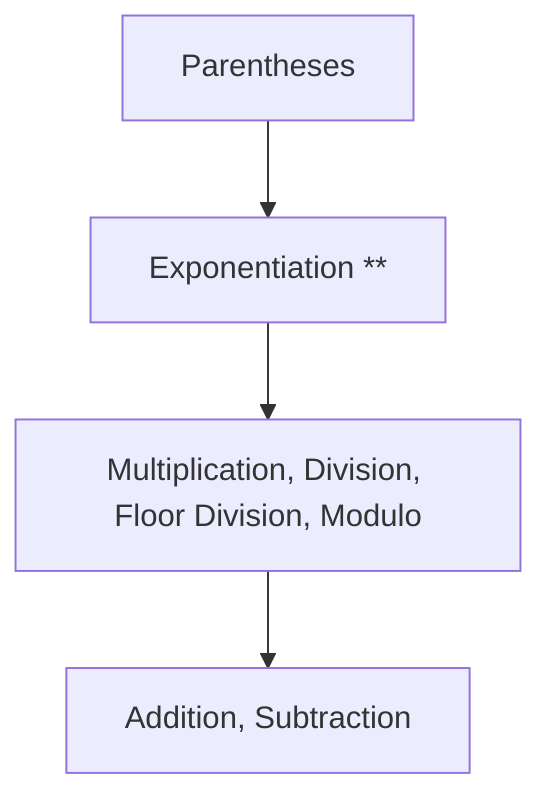

# Operators & Expressions

---

## 1. Learning Objectives

By the end of this unit, you will be able to:

✓ Apply all arithmetic operators correctly, including the distinction between true division and floor division.  
✓ Explain and apply Python's operator precedence rules when evaluating a multi-operator expression.  
✓ Use comparison operators to produce a boolean result from two values.  
✓ Combine conditions using logical operators, and explain short-circuit evaluation.  
✓ Identify which values are "truthy" and which are "falsy" in a Python condition.

---

## 2. Overview

Now that you can store a value in a variable, the next question is what you can actually do with it — combine it with another value, compare two values, or check whether a condition holds. That is the job of an **operator**: a symbol that tells Python to perform a specific action on one or more values.

Operator precedence is very similar to the order of operations on a physics or mathematics formula sheet — you do not add two terms before evaluating an exponent between them, and getting the order wrong produces a completely different, wrong answer even though every symbol was typed correctly. Python enforces exactly this kind of fixed order, and understanding it is what separates code that "looks right" from code that actually is right.

This unit covers four things: **arithmetic operators** for calculation, **operator precedence** for controlling the order those calculations happen in, **comparison operators** for evaluating whether one value relates to another in a particular way, and **logical operators** for combining multiple conditions into one.

Almost every decision an AI system makes — whether a data point should be filtered out, whether a prediction crosses a confidence threshold, whether a condition is met before an action is taken — reduces to exactly the comparison and logical expressions you will practise in this unit.

---

## 3. Description

### 3.1 Arithmetic Operators

These operators perform mathematical calculations on numbers:

| Operator | Meaning | Example | Result |
|---|---|---|---|
| `+` | Addition | `5 + 2` | `7` |
| `-` | Subtraction | `5 - 2` | `3` |
| `*` | Multiplication | `5 * 2` | `10` |
| `/` | True division | `5 / 2` | `2.5` |
| `//` | Floor division | `5 // 2` | `2` |
| `%` | Modulo (remainder) | `5 % 2` | `1` |
| `**` | Exponentiation (power) | `5 ** 2` | `25` |

The key distinction to remember: `/` (true division) always returns a decimal result, while `//` (floor division) keeps only the whole-number part and discards anything after the decimal point.

```python
print(7 / 2)
print(7 // 2)
```

**Output:**
```
3.5
3
```

### 3.2 Operator Precedence

When an expression contains more than one operator, Python evaluates them in a fixed order, called **precedence** — the same "BODMAS"/"PEMDAS" rules you already know from school mathematics:



```python
result = 2 + 3 * 4
print(result)
```

**Output:**
```
14
```

Use **parentheses** whenever you want to force a different order, or simply to make your intention explicit to anyone reading the code:

```python
result = (2 + 3) * 4
print(result)
```

**Output:**
```
20
```

### 3.3 Comparison Operators

Comparison operators compare two values and always produce a `bool` result (`True` or `False`):

| Operator | Meaning | Example | Result |
|---|---|---|---|
| `==` | Equal to | `5 == 5` | `True` |
| `!=` | Not equal to | `5 != 3` | `True` |
| `<` | Less than | `3 < 5` | `True` |
| `>` | Greater than | `3 > 5` | `False` |
| `<=` | Less than or equal to | `5 <= 5` | `True` |
| `>=` | Greater than or equal to | `4 >= 5` | `False` |

Remember: `==` compares two values, while `=` assigns a value. Confusing the two is one of the most common early mistakes in Python.

### 3.4 Logical Operators and Short-Circuit Evaluation

Logical operators combine multiple `True`/`False` expressions:

- **`and`** — the overall result is `True` only if **both** sides are `True`.
- **`or`** — the overall result is `True` if **at least one** side is `True`.
- **`not`** — reverses a boolean value.

```python
attendance = 82
internal_marks = 45

eligible = attendance >= 75 and internal_marks >= 40
print(eligible)
```

**Output:**
```
True
```

**Short-circuit evaluation** means Python stops checking as soon as the final result is already certain. For `and`, if the left side is `False`, the right side is never even evaluated, because the whole expression is already `False`. For `or`, if the left side is `True`, the right side is skipped for the same reason.

### 3.5 Boolean Values and Truthiness

`True` and `False` are the only two values of the `bool` type, written with a capital first letter.

Beyond actual `bool` values, Python treats certain other values as **"truthy"** or **"falsy"** when used in a condition:

| Category | Examples |
|---|---|
| Falsy | `0`, `0.0`, `""` (empty string) |
| Truthy | Any non-zero number, any non-empty string |

```python
if "":
    print("This will not run")
if "Hello":
    print("This will run, because a non-empty string is truthy")
```

**Output:**
```
This will run, because a non-empty string is truthy
```

---

## 4. Real-World Application

| **Where you see it** | **How Python is working behind the scenes** |
|---|---|
| **A ride-hailing app fare estimate** | The final fare is calculated using arithmetic operators combining base fare, distance, and surge multiplier, all evaluated in the correct precedence order. |
| **An online exam result screen** | A pass/fail decision is a comparison operator (`marks >= 40`) evaluated the instant you submit the test. |
| **A UPI app blocking a payment** | A logical `and` condition checks that the balance is sufficient **and** the PIN is correct before allowing the transaction to proceed. |
| **An attendance eligibility notice on your college portal** | A logical expression combining attendance percentage and minimum internal marks decides whether you are shown as "Eligible" or "Detained." |
| **An e-commerce app showing a discount** | A comparison operator checks whether your cart total crosses a threshold (for example, `cart_total >= 999`) before applying a coupon. |

---

## 5. Worked Example

**Scenario:** Your lab instructor asks you to build a simple exam eligibility checker: a student is eligible to sit the exam only if their attendance is at least 75% **and** their internal marks are at least 40.

**1. Store the student's data.**
```python
attendance = 82
internal_marks = 38
```

**2. Write the eligibility condition.**
```python
is_eligible = attendance >= 75 and internal_marks >= 40
print("Eligible for exam:", is_eligible)
```

**Output:**
```
Eligible for exam: False
```

**3. Check why it returned `False`.** Attendance passed the first condition, but internal marks (38) did not cross 40 — because `and` requires **both** sides to be `True`.

**4. Correct the marks and re-run.**
```python
internal_marks = 42
is_eligible = attendance >= 75 and internal_marks >= 40
print("Eligible for exam:", is_eligible)
```

**Output:**
```
Eligible for exam: True
```

*Common mistake: writing `attendance = 75` instead of `attendance == 75` inside a condition. The single `=` silently reassigns the variable rather than comparing it, and in Python this is not even legal inside an `if` condition — always use `==` when your intent is to compare, not to assign.*

---

## 6. Summary

- **Arithmetic operators** perform calculations, with `/` always returning a decimal and `//` returning only the whole-number part.
- **Operator precedence** follows a fixed BODMAS-style order — exponents before multiplication and division, and those before addition and subtraction — with parentheses always evaluated first.
- **Comparison operators** produce a `bool` result by comparing two values, and must never be confused with the assignment operator `=`.
- **Logical operators** (`and`, `or`, `not`) combine multiple conditions, and Python uses short-circuit evaluation to skip unnecessary checks.
- **Truthiness** means some non-boolean values — like `0` or an empty string — behave as `False` in a condition, even without an explicit comparison.

With expressions and conditions in place, the next unit covers statements, type conversion, and formatted output — how to shape and display the results these expressions produce.

---

*© 2026 Revature · AI Native Engineering — Foundations · Unit 1.3 · Version 1.0*
