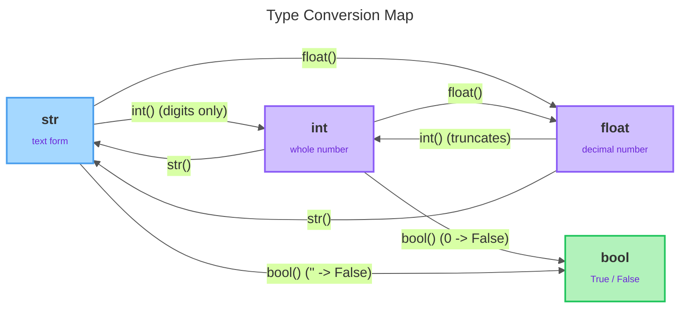

# Statements, Conversion & Output

---

## 1. Learning Objectives

By the end of this unit, you will be able to:

✓ Distinguish an assignment statement from an expression statement, and use chained assignment and tuple unpacking.  
✓ Convert values between types with `int()`, `float()`, `str()`, and `bool()`, and predict truncation and truthiness results.  
✓ Build readable output with f-strings, embedding expressions and applying format specifiers such as `:.2f`, `:d`, `:>10`, and `:^15`.  
✓ Recognize variable type-hint syntax (e.g. `count: int = 0`) and read a simple `match`/`case` block.  
✓ Write clear comments and apply the basics of PEP 8 style.

---

## 2. Overview

Across units 1.1 through 1.3 you learned to run code in Colab, store values in variables, know their types, and combine them with operators. That gives you raw capability, but a snippet that computes a number and never shows it clearly is not yet a program. This unit is the module closer: it turns that capability into code that *communicates*.

Three everyday problems come together here. Real data rarely arrives in the type you want — a number typed by a user comes in as text (`"42"`, not `42`), and text can't be added to a number. That's what **type conversion** fixes. A finished result also needs to be *shown nicely* — two decimals for a price, values lined up in a column — which is what **f-strings** are for. And growing programs need to be *read*, by you and by teammates, through comments, consistent style, and a couple of newer syntax forms (type hints, `match`/`case`) you'll increasingly meet in real Python.

None of this is exotic. It's the everyday glue that connects "I computed something" to "I displayed it clearly to a human" — the difference between a snippet and a program.

---

## 3. Description

### 3.1 Statements: Assignment vs. Expression

A **statement** is a complete instruction Python executes. You've already been writing them: `x = 5` is a statement, and so is `print(x)`. Two kinds matter here:

- **Assignment statement** — binds a value to a name using `=`; it doesn't produce a value of its own, it *stores* one: `total = 10 + 5`.
- **Expression statement** — an expression written on its own line, evaluated for its result or its side effect; `print(total)` is the one you'll write most.

```python
total = 10 + 5
print(total)
```

Output:

```
15
```

The key difference: an assignment *saves* a value for later use, while an expression statement *does* something now (like printing) — in a script, its value is discarded unless you capture it.

### 3.2 Chained Assignment and Tuple Unpacking

Python offers two compact assignment forms that save typing and make intent clear.

**Chained assignment** binds the same value to several names at once:

```python
a = b = 5
print(a, b)
```

Output:

```
5 5
```

Both `a` and `b` now refer to `5` — handy when several variables should start out equal.

**Tuple unpacking** assigns several values in one statement by matching them position-by-position, left side to right side:

```python
x, y = 1, 2
print(x, y)
```

Output:

```
1 2
```

The counts must match — two names, two values. Unpacking also powers a clean trick: swapping two variables with no temporary holder.

```python
x, y = y, x
print(x, y)
```

Output:

```
2 1
```

Python evaluates the whole right side first, then assigns — so the swap just works, with no third variable needed. (Tuples as a full data structure come later in this course; here you're just seeing the `x, y` form used as an assignment mechanism.)

### 3.3 Type Conversion

Every value has a type (unit 1.2). **Type conversion** — also called casting — produces a *new* value of a different type from an existing one, without changing the original; you get a converted copy back. Python gives you one conversion function per basic type:

- **`str()`** — turns any value into its text form; the one you'll use most, because output is text. `str(42)` gives the text `"42"`, which looks the same when printed but is now a `str`, not an `int`.
- **`int()`** — turns a value into a whole number: from a string of digits it parses the number; from a float it **truncates**, chopping off the decimal part rather than rounding. `int(3.9)` is `3`, not `4`, and because truncation always moves *toward zero*, `int(-3.9)` is `-3`. `int("5")` works because `"5"` is a clean integer string, but `int("3.14")` raises a `ValueError` — `"3.14"` isn't a whole number in text form.
- **`float()`** — turns a value into a floating-point number, either by parsing text (`float("3.14")` → `3.14`) or by adding a decimal point to an integer (`float(42)` → `42.0`).
- **`bool()`** — converts using the truthiness rules from unit 1.3: the falsy values `0`, `0.0`, and `""` (empty string) convert to `False`; almost everything else — `42`, `"hi"` — converts to `True`.

```python
print(int("5"))
print(int(3.9))
print(int(-3.9))
print(bool(0))
print(bool("hi"))
```

Output:

```
5
3
-3
False
True
```

The classic problem conversion solves: text that *looks* like a number is still text, so `"5" + 3` is a `TypeError`. Convert first, and `int("5") + 3` gives `8`.

Here's how the four basic types connect once you can move between them — each arrow is the conversion function you'd call, with the behaviors worth remembering attached:



### 3.4 String Basics: Quotes, Concatenation, Indexing

A **string** (`str`) is text in quotes. Python accepts **single or double quotes** with no difference in meaning — pick one and be consistent. Both exist so you can avoid escaping: use double quotes when the text contains an apostrophe (`"it's fine"`), and single quotes when it contains a double quote.

**Concatenation** joins strings with `+` — both sides must already be strings, which is exactly why `str()` matters:

```python
first = "Ada"
last = "Lovelace"
print(first + " " + last)
```

Output:

```
Ada Lovelace
```

**Indexing** reads one character out of a string by its position, in square brackets. Positions start at **0**, not 1:

```python
name = "Python"
print(name[0])
print(name[1])
```

Output:

```
P
y
```

That's enough to grab a character by position — slicing and the full string toolkit come later.

### 3.5 Formatted Output with f-strings

The best way to build readable output is the **f-string** (formatted string literal): a string prefixed with the letter `f`, in which anything inside curly braces `{}` is evaluated and its result dropped into the text.

```python
name = "Ada"
age = 42
print(f"{name} is {age} years old")
```

Output:

```
Ada is 42 years old
```

No `+`, no `str()` calls — Python converts each embedded value to text for you. Because the braces hold an *expression*, you can embed any expression, including the operators from unit 1.3:

```python
price = 20
qty = 3
print(f"Total: {price * qty}")
print(f"Cheaper? {price < 25}")
```

Output:

```
Total: 60
Cheaper? True
```

**Format specifiers** go after a colon inside the braces and control *how* the value is displayed. The four you need:

- `:.2f` — a float shown to 2 decimal places. Ideal for money.
- `:d` — an integer in plain decimal form.
- `:>10` — right-align the value in a field 10 characters wide.
- `:^15` — center the value in a field 15 characters wide.

```python
price = 19.5
print(f"{price:.2f}")
print(f"{42:d}")
print(f"{'hi':>10}")
print(f"{'hi':^15}")
```

Output:

```
19.50
42
        hi
      hi
```

The alignment specifiers pad with spaces to make columns line up — invaluable when printing tables of data. You can combine width and precision too: `{price:>10.2f}` right-aligns a two-decimal number in a 10-wide field.

### 3.6 Type Hints (Introduction)

A **type hint**, also called an annotation, records what type a variable is *expected* to hold. You write it with a colon after the name:

```python
count: int = 0
name: str = "Ada"
price: float = 9.99
```

The hint after the colon is documentation for humans and tools. Python does **not** enforce it — assigning a string to `count` above would still run — but editors and type-checkers use hints to catch mistakes and to autocomplete, which makes code self-describing.

You'll also see hints on functions, on their parameters and return type, which look like `def area(w: float, h: float) -> float:`. You'll meet functions properly in a later part of this course; for now, just recognize the shape when you see it.

### 3.7 `match-case` (Introduction)

`match`/`case` is **structural pattern matching**: you give it a value, and it runs the first `case` whose pattern matches.

```python
status = "active"

match status:
    case "active":
        print("User is active")
    case "banned":
        print("Access denied")
    case _:
        print("Unknown status")
```

Output:

```
User is active
```

Python compares `status` against each `case` top-to-bottom. `case "active"` matches, so its block runs and the rest are skipped. The underscore `case _` is the **wildcard** — it matches anything, acting as a catch-all "none of the above." This is an introduction: recognize the shape (`match value:` then indented `case pattern:` blocks) — pattern matching on richer shapes comes later.

### 3.8 Comments and Readability (PEP 8 Intro)

A **comment** is text Python ignores — it's for humans reading the code. A line comment starts with `#`; everything after it on that line is skipped:

```python
tax_rate = 0.08  # 8% sales tax
subtotal = 50    # before tax
```

Good comments explain *why*, not the obvious *what*. `# add tax` above `total = subtotal * 1.08` says nothing the code doesn't; `# state law requires rounding up` earns its place.

**PEP 8** is Python's official style guide (you met its `snake_case` rule in unit 1.2). A few basics: use spaces around operators (`x = 5`, not `x=5`); one statement per line; keep lines reasonably short; use blank lines to separate logical chunks. Consistent style makes code readable to every Python programmer — which matters the moment more than one person touches it.

---

## 4. Real-World Application

A food delivery app's final bill always shows exactly two decimals — `247.699999` internally, `₹247.70` on your screen — because it ran through an f-string with `:.2f` before ever reaching the display. Conversion shows up just as constantly on the input side: a signup form checking that you're old enough only works because your typed age arrived as a `str` and got passed through `int()` before anything compared it to a minimum age — skip that step, and the form would be comparing text to a number and failing outright.

---

## 5. Worked Example

**Goal:** Turn a raw, text-shaped value into a correctly formatted receipt line — the same pattern of get → convert → compute → format → print that this whole unit builds toward.

**1. Start with the values exactly as they'd arrive in a real program.**

```python
item: str = "Coffee"        # type hint documents intent
price_text: str = "4.5"     # imagine this came in as text
quantity: int = 3
```

**2. Try the math without converting first — on purpose.**

```python
total = price_text * quantity
```

Output:

```
TypeError: can't multiply sequence by non-int of type 'float'
```

Python isn't confused about what you meant — it's refusing to guess. `price_text` is still a `str`; Python will not silently treat text as a number just because it looks like one.

**3. Fix it with the conversion, then compute.**

```python
price = float(price_text)   # convert text -> float
total = price * quantity    # compute with unit 1.3 operators
print(total)
```

Output:

```
13.5
```

**4. Format the result into a clean receipt line.**

```python
print(f"{item:>10}: {quantity:d} x {price:.2f} = {total:.2f}")
```

Output:

```
    Coffee: 3 x 4.50 = 13.50
```

Every piece from this unit appears here: a type hint, a conversion, arithmetic, and an f-string carrying three specifiers — `{item:>10}` right-aligns `"Coffee"` in a 10-wide field (note the leading spaces), `{quantity:d}` shows the count as a plain integer, and `{price:.2f}`/`{total:.2f}` pin the money values to two decimals.

*Common mistake: assuming a value that "looks like a number" already behaves like one. Anything from a form, a file, or user input is text until you convert it yourself — every single time.*

---

## 6. Summary

- Assignment statements store a value; expression statements (like `print()`) act now. Chained assignment (`a = b = 5`) and tuple unpacking (`x, y = 1, 2`, including the swap `x, y = y, x`) are compact assignment forms.
- `int()`, `float()`, `str()`, and `bool()` convert between types; `int()` truncates toward zero, `int("3.14")` raises `ValueError`, and `bool()` follows truthiness (`0`, `0.0`, `""` → `False`).
- Strings use single or double quotes, join with `+`, and index from position `0` with `[]`.
- f-strings embed expressions in `{}` and format with specifiers — `:.2f`, `:d`, `:>10`, `:^15` — for clean, aligned output.
- Type hints (`count: int = 0`) and `match`/`case` are readable modern syntax worth recognizing now, not yet mastering; comments and PEP 8 style keep code readable for everyone.

That's the end of Part 1. Part 2 moves from single instructions into control structures — starting with conditionals, where your programs make their first real decisions.

---

*© 2026 Revature · AI Native Engineering — Foundations · Unit 1.4 · Version 1.0*
