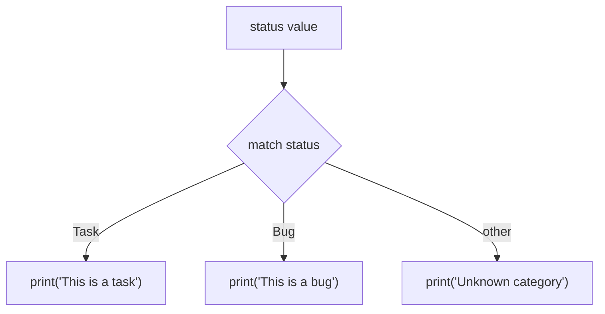

# Statements, Conversion & Output

---

## 1. Learning Objectives

By the end of this unit, you will be able to:

✓ Distinguish between statements and expressions, and use chained assignment and tuple unpacking correctly.  
✓ Convert values between `int`, `float`, `str`, and `bool` using Python's built-in conversion functions.  
✓ Explain the difference between rounding and truncation when converting a `float` to an `int`.  
✓ Build formatted output using f-strings and format specifiers.  
✓ Write a function with a basic type hint and a simple `match-case` statement.

---

## 2. Overview

This unit closes out Module P1 by covering the last pieces of core syntax you need before moving on to control structures: how Python organises instructions into statements, how to convert a value from one type to another, and how to produce clean, readable output.

Converting a value between types is very similar to using a currency counter at an airport exchange desk. The underlying quantity of money does not change — only its presentation changes to fit what you need next. Converting `"78"` to the integer `78` works the same way: the real value stays the same, only the type changes to one Python can calculate with.

This unit covers **statements** (including chained assignment and tuple unpacking), **type conversion**, **string basics**, **formatted output with f-strings**, and a first look at two features you will use in more depth later — **type hints** and **match-case**.

Every later module in this programme — reading a CSV file, validating a form input, formatting a model's prediction for display — depends on the type-conversion and output skills you build in this unit, so treat it as a toolbox you will keep reaching into.

---

## 3. Description

### 3.1 Statements

A **statement** is a complete instruction that Python executes — for example, an assignment like `age = 21`. This is different from an **expression**, which is anything that produces a value (like `2 + 3`); an assignment statement uses an expression but also does something extra: it stores the result.

**Chained assignment** assigns the same value to multiple variables in a single line:

```python
a = b = 5
print(a, b)
```

**Output:**
```
5 5
```

**Tuple unpacking** assigns multiple values to multiple variables in one line, matched left to right:

```python
x, y = 1, 2
print(x, y)
```

**Output:**
```
1 2
```

### 3.2 Type Conversion

Sometimes a value exists in one type but is needed in another — text typed by a user, for instance, is always a `str`, even if it looks like a number. Python provides built-in functions to **convert** between types:

| Function | Converts to |
|---|---|
| `int()` | Whole number |
| `float()` | Decimal number |
| `str()` | Text |
| `bool()` | True/False |

```python
age_text = "21"
age_number = int(age_text)
print(age_number + 1)
```

**Output:**
```
22
```

Converting a `float` to an `int` does **not** round — it **truncates**, simply discarding everything after the decimal point:

```python
print(int(9.9))
print(int(-9.9))
```

**Output:**
```
9
-9
```

### 3.3 String Basics

A **string** (`str`) is text, always written inside quotes.

- **Single vs double quotes** — `'hello'` and `"hello"` are identical in Python. Double quotes are common when the text itself contains an apostrophe, such as `"it's fine"`.
- **Concatenation** — joining strings together with `+`:

```python
first_name = "Arjun"
last_name = "Mehta"
full_name = first_name + " " + last_name
print(full_name)
```

**Output:**
```
Arjun Mehta
```

- **Indexing (introduction)** — every character in a string has a position, starting at `0`:

```python
word = "Python"
print(word[0])
print(word[1])
```

**Output:**
```
P
y
```

### 3.4 Formatted Output with f-strings

An **f-string** embeds variables and expressions directly inside a string by placing an `f` right before the opening quote:

```python
name = "Priya"
marks = 78.456
print(f"Student: {name}, Marks: {marks}")
```

**Output:**
```
Student: Priya, Marks: 78.456
```

You can control **how** a value is displayed using a **format specifier** after a colon `:` inside the curly braces:

| Specifier | Meaning | Example | Output |
|---|---|---|---|
| `:.2f` | 2 decimal places | `f"{marks:.2f}"` | `78.46` |
| `:d` | Whole number | `f"{25:d}"` | `25` |
| `:>10` | Right-align in 10 characters | `f"{'hi':>10}"` | `        hi` |
| `:^15` | Centre-align in 15 characters | `f"{'hi':^15}"` | `      hi       ` |

### 3.5 Type Hints and match-case (Introduction)

A **type hint** notes what type a function's parameter expects and what type it returns. Python does not enforce this at runtime — it exists to help you and other developers, and lets external tools catch mistakes early.

```python
def celsius_to_fahrenheit(c: float) -> float:
    return (c * 9 / 5) + 32
```

`match-case` compares a value against several patterns, similar to a more readable chain of `if`/`elif` statements. At this introductory level, you only need to recognise the basic shape:



```python
status = "Task"

match status:
    case "Task":
        print("This is a task")
    case "Bug":
        print("This is a bug")
    case _:
        print("Unknown category")
```

**Output:**
```
This is a task
```

The `case _:` line is a catch-all, matching anything not already matched above.

### 3.6 Comments and PEP 8

A **comment** is a note in your code that Python ignores when running the program — it exists purely to help a human reader.

```python
# This calculates the area of a rectangle
area = length * width
```

**PEP 8** is Python's official style guide. It recommends conventions such as clear variable names, consistent spacing, and `snake_case` — the same naming convention you learned in Unit 1.2. Following PEP 8 from your very first program is a habit worth building early.

---

## 4. Real-World Application

| **Where you see it** | **How Python is working behind the scenes** |
|---|---|
| **A food delivery app showing your bill** | The final amount is formatted with an f-string to exactly 2 decimal places (`:.2f`), never showing an untidy number like `247.6999999`. |
| **A college admission form validating your age** | The text you type into the form field is converted from `str` to `int` before the system checks whether you meet the minimum age. |
| **A weather app showing temperature** | A value stored internally in Celsius is converted and formatted before being displayed in Fahrenheit, using the same conversion pattern as `celsius_to_fahrenheit()`. |
| **A support chatbot routing your query** | A `match-case`-style structure checks the category of your message ("Billing", "Technical", "General") and routes it to the right response. |
| **A fitness app showing your step count** | A raw integer count is formatted with a thousands separator (`f"{steps:,}"`) before being displayed on your dashboard. |

---

## 5. Worked Example

**Scenario:** Your college fest committee asks you to build a small ticket price calculator: read a price as text (the way it would arrive from a web form), convert it to a number, apply a discount, and display the final amount formatted to two decimal places.

**1. Store the form input as text, exactly as it would arrive from a webpage.**
```python
price_text = "499"
```

**2. Convert it to a usable number.**
```python
price = float(price_text)
```

**3. Apply a 10% student discount.**
```python
final_price = price * 0.9
```

**4. Display the result using an f-string.**
```python
print(f"Final ticket price: Rs. {final_price:.2f}")
```

**Output:**
```
Final ticket price: Rs. 449.10
```

**5. See what happens if the conversion step is skipped.**
```python
price_text = "499"
final_price = price_text * 0.9
```

**Output:**
```
TypeError: can't multiply sequence by non-int of type 'float'
```

*Common mistake: trying to do arithmetic directly on a value that arrived as text, without converting it first. Every value coming from a form, a file, or user input is a `str` until you explicitly convert it — Python will not do this for you automatically.*

---

## 6. Summary

- **Statements** are complete instructions Python executes; chained assignment and tuple unpacking both let you write multiple assignments in a single line.
- **Type conversion functions** (`int()`, `float()`, `str()`, `bool()`) change a value's type without changing the underlying quantity it represents.
- **Converting a float to an int truncates** rather than rounds, simply discarding the decimal part.
- **f-strings** embed variables directly inside text and, with a format specifier, control exactly how a value is displayed.
- **Type hints and match-case**, introduced briefly here, will be used in much greater depth later in this programme.

This closes Module P1. The next module moves from single statements into control structures — conditionals, loops, and functions that let your programs make decisions and repeat work.

---

*© 2026 Revature · AI Native Engineering — Foundations · Unit 1.4 · Version 1.0*
