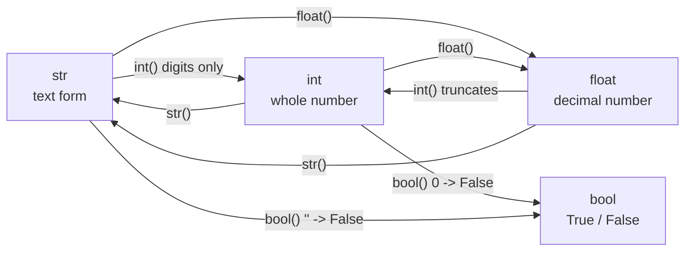
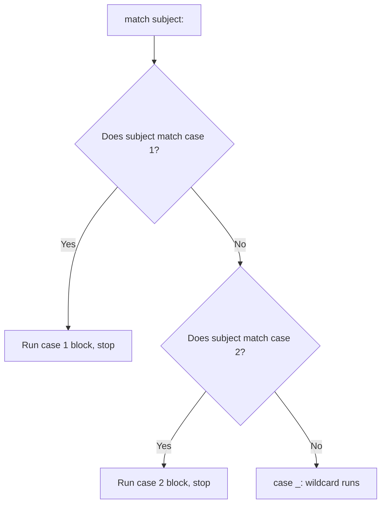

# Statements, Conversion & Output

---

## 1. Learning Objectives

By the end of this unit, you will be able to:

- **Differentiate** an assignment statement from an expression statement, and use chained assignment and tuple unpacking to write compact, correct code.
- **Apply** `int()`, `float()`, `str()`, and `bool()` to convert values between types, correctly predicting truncation and truthiness outcomes.
- **Create** clean, professional output using f-strings, embedding expressions and applying format specifiers such as `:.2f`, `:d`, `:>10`, and `:^15`.
- **Describe** the purpose of type hints (e.g. `count: int = 0`) and read a basic `match`/`case` block.
- **Implement** comments and the basics of PEP 8 style to keep code readable for yourself and your team.
- **Debug** the most common conversion errors — `TypeError` and `ValueError` — that occur when text-shaped data is used before being converted.

---

## 2. Overview

Across Units 1.1 to 1.3, you learned to run code in Colab, store values in variables, know their types, and combine them with operators. That gives you raw capability — but a snippet that computes a number and never shows it clearly is not yet a program. This unit is the closing piece of Part 1: it turns that capability into code that *communicates*, which is exactly what separates a classroom exercise from production-ready software.

Three everyday problems come together here. First, real data almost never arrives in the type you want — an amount typed into a UPI app, an age entered on a signup form, or a fare read from a railway booking API all arrive as **text**, not numbers, and text cannot be added or multiplied like a number. **Type conversion** fixes this. Second, a computed result still needs to be *shown* the way a paying customer or a bank auditor expects — two decimal places for money, values neatly aligned in a column — which is exactly what **f-strings** are built for. Third, as programs grow beyond a few lines, they need to be *read* — by you next week, and by teammates in a code review — which is where comments, PEP 8 style, and two newer syntax forms you will increasingly meet in real Python codebases, **type hints** and **`match`/`case`**, come in.

None of this is exotic — it is the everyday glue connecting "I computed something" to "I displayed it correctly to a human," which is the core job of every backend and full-stack developer in the Indian IT industry.

---

## 3. Description

### 3.1 Definition

A **statement** is one complete instruction that Python executes. Everything you have written so far — `x = 5`, `print(x)`, `total = price * qty` — is a statement. This unit gathers the remaining tools that turn a bare statement into readable, correct, professional code: converting values between types so operations don't fail, building formatted output with f-strings, documenting intent with type hints and comments, and recognizing the `match`/`case` syntax for choosing between fixed options.

### 3.2 Why This Concept Exists

Without these tools, a program can compute a correct answer and still be unusable. Consider what real software constantly has to do:

- **Accept text and use it as a number** — a user types their age into a form; until it is converted, `"20"` is a string, not a number you can compare or add.
- **Display a number the way a human expects** — a raw float like `247.69999999999999` must become `₹247.70` on a bill; nobody wants to see floating-point noise on a receipt.
- **Stay readable as it grows** — a five-line script doesn't need comments, but a two-hundred-line billing module does, or the next developer (possibly you, six months later) will struggle to maintain it.

Type conversion, f-strings, type hints, `match`/`case`, and comments each solve one of these recurring problems, and together they are the difference between code that merely *runs* and code that is fit to ship.

### 3.3 Key Terminology

| Term | Simple Meaning |
|---|---|
| **Statement** | One complete instruction that Python executes, such as `x = 5` or `print(x)`. |
| **Assignment statement** | A statement that binds a value to a name using `=`; it stores a value rather than producing one. |
| **Expression statement** | An expression written on its own line and evaluated for its result or side effect, e.g. `print(total)`. |
| **Chained assignment** | Binding the same value to several names in one statement, e.g. `a = b = 5`. |
| **Tuple unpacking** | Assigning several values in one statement by matching positions left to right, e.g. `x, y = 1, 2`. |
| **Type conversion (casting)** | Producing a new value of a different type from an existing value, without changing the original. |
| **Truncation** | Chopping off the decimal part of a float when converting to `int`, always moving toward zero (not rounding). |
| **`ValueError`** | The error Python raises when a conversion function is given text that cannot be parsed into the target type, e.g. `int("abc")`. |
| **`TypeError`** | The error Python raises when an operation is attempted between incompatible types, e.g. `"5" + 3`. |
| **String (`str`)** | Text data written inside single or double quotes. |
| **Concatenation** | Joining two strings together using `+`. |
| **Indexing** | Reading one character out of a string by its position, starting at `0`. |
| **f-string** | A string literal prefixed with `f`, in which `{}` holds an expression that Python evaluates and inserts as text. |
| **Format specifier** | Text after a colon inside an f-string's `{}` that controls how a value is displayed, e.g. `:.2f`. |
| **Type hint (annotation)** | A colon-based note recording the type a variable is expected to hold, e.g. `count: int = 0`; not enforced by Python itself. |
| **`match`/`case`** | Python's structural pattern matching statement; compares a value against patterns in order and runs the first matching block. |
| **Wildcard pattern (`_`)** | The catch-all `case _:` pattern that matches anything not already matched above it. |
| **Comment** | Text starting with `#` that Python ignores; written for humans reading the code. |
| **PEP 8** | Python's official style guide, covering naming, spacing, and layout conventions. |

### 3.4 Syntax

**Type conversion functions:**

| Function | Converts to | Example | Result |
|---|---|---|---|
| `str(x)` | Text (`str`) | `str(42)` | `"42"` |
| `int(x)` | Whole number (`int`) | `int("5")`, `int(3.9)` | `5`, `3` (truncated) |
| `float(x)` | Decimal number (`float`) | `float("3.14")`, `float(42)` | `3.14`, `42.0` |
| `bool(x)` | Truth value (`bool`) | `bool(0)`, `bool("hi")` | `False`, `True` |

**f-string syntax:** `f"{expression:format_spec}"`

| Part | What it is | Why it's there |
|---|---|---|
| `f` prefix | Marks the string literal as an f-string. | Tells Python to scan the string for `{}` and evaluate what's inside. |
| `{expression}` | Any valid Python expression — a variable, a calculation, a comparison. | Its result is converted to text and inserted in place. |
| `:format_spec` | Optional, after a colon inside the braces. | Controls width, alignment, and decimal precision of the displayed value. |

| Common format specifier | Meaning | Example | Result |
|---|---|---|---|
| `:.2f` | Show a float to 2 decimal places (ideal for money). | `f"{19.5:.2f}"` | `"19.50"` |
| `:d` | Show an integer in plain decimal form. | `f"{7:d}"` | `"7"` |
| `:>10` | Right-align the value in a field 10 characters wide. | `f"{'Tea':>10}"` | `"       Tea"` (7 spaces then `Tea`) |
| `:^15` | Center the value in a field 15 characters wide. | `f"{'Tea':^15}"` | `"      Tea      "` (6 spaces, `Tea`, 6 spaces) |

To see exactly what each specifier does to real values, run all four together:

```python
price = 19.5
quantity = 7
item = "Tea"

print(f"{price:.2f}")
print(f"{quantity:d}")
print(f"[{item:>10}]")
print(f"[{item:^15}]")
```

*Line-by-line explanation:*
- `f"{price:.2f}"` — `price` is `19.5`; `:.2f` forces exactly two digits after the decimal point, so it prints `19.50`.
- `f"{quantity:d}"` — `quantity` is the integer `7`; `:d` simply displays it as plain decimal digits, `7`.
- `f"[{item:>10}]"` — `item` is `"Tea"`, three characters long; `:>10` places it inside an invisible 10-character-wide field and right-aligns it, so 7 spaces are added before it. The square brackets around the f-string are not part of the format specifier — they are only there so you can *see* exactly where the padding spaces are.
- `f"[{item:^15}]"` — the same idea, but `:^15` centers `"Tea"` inside a 15-character-wide field, splitting the 12 leftover spaces evenly: 6 spaces, then `Tea`, then 6 spaces.

Output (square brackets included so the padding is visible):

```
19.50
7
[       Tea]
[      Tea      ]
```

Once you can see the spaces in this one example, every other use of `:.2f`, `:d`, `:>N`, and `:^N` in this unit follows the exact same rule: the letter/symbol says *what* to do (round, pad, align), and the number says *how wide* the field should be.

**Type hint syntax:** `name: type = value`

| Part | Meaning |
|---|---|
| `name` | The variable being annotated. |
| `: type` | The expected type — documentation only, not enforced by Python. |
| `= value` | The actual assignment, exactly as before. |

**`match`/`case` syntax:**

```python
match subject:
    case pattern_1:
        # runs if subject matches pattern_1
    case pattern_2:
        # runs if subject matches pattern_2
    case _:
        # wildcard — runs if nothing above matched
```

| Part | Meaning |
|---|---|
| `match subject:` | The value being compared, evaluated once. |
| `case pattern:` | One candidate pattern, checked top to bottom. |
| `case _:` | The wildcard — matches anything, acting as a catch-all. |

**Comment syntax:** `# this text is ignored by Python`

### 3.5 Rules

- A variable must exist before it is used, but **assignment always evaluates the right-hand side fully before binding the name** — this is what makes the no-temporary swap (`x, y = y, x`) work correctly.
- In chained assignment (`a = b = 5`) and tuple unpacking (`x, y = 1, 2`), the number of names and the number of values on each side must correspond correctly, or Python raises an error.
- `int()` **truncates** toward zero when converting a float — it does not round: `int(3.9)` is `3`, and `int(-3.9)` is `-3`.
- `int("3.14")` raises `ValueError` — a string must look like a whole number to convert to `int`; use `float()` first if the text has a decimal point.
- `bool()` follows the truthiness rules from Unit 1.3: `0`, `0.0`, and `""` convert to `False`; almost everything else converts to `True`.
- Strings must be **explicitly converted** before being combined with numbers — `"5" + 3` raises `TypeError`, but `int("5") + 3` works.
- An f-string's `{}` can hold *any* expression, including arithmetic and comparisons, not just a bare variable name.
- A type hint is **not enforced** at runtime — Python will still let you assign a `str` to a variable hinted as `int`; hints exist for humans and tooling (editors, type checkers).
- `match`/`case` checks patterns **top to bottom** and stops at the first match; `case _:` should normally come last, since anything after a matched wildcard never runs.
- A comment starting with `#` extends to the end of the line only; there is no multi-line comment symbol in Python.

### 3.6 Best Practices

- Convert input values **immediately** after receiving them, rather than deep inside a calculation where the failure is harder to trace.
- Prefer f-strings over string concatenation (`+`) or older formatting styles — they are more readable and less error-prone.
- Always format money and measurements with an explicit precision specifier (`:.2f`) rather than trusting a raw float to print cleanly.
- Add type hints on variables whose purpose isn't obvious from the name alone — they cost nothing and help both humans and editors.
- Keep a `case _:` wildcard at the end of every `match` block you write, so an unexpected value doesn't silently do nothing.
- Write comments that explain **why**, not **what** — the code already shows what it does; a comment should add reasoning the code cannot express.
- Follow PEP 8 basics consistently: spaces around `=`, one statement per line, blank lines between logical sections.

### 3.7 Common Mistakes

- **Assuming text that "looks like a number" behaves like one** — data from a form, file, or API is `str` until you convert it yourself, every single time.
- **Using `int()` on a decimal-looking string** — `int("3.14")` raises `ValueError`; convert with `float()` first if a decimal point is possible.
- **Expecting `int()` to round** — `int(3.9)` gives `3`, not `4`; truncation always moves toward zero, which surprises many beginners with negative numbers too.
- **Forgetting the `f` prefix** — `"{name}"` without the `f` prints the literal text `{name}`, not the variable's value.
- **Mismatched counts in tuple unpacking** — `x, y = 1, 2, 3` raises a `ValueError` because the number of values doesn't match the number of names.
- **Believing a type hint is enforced** — `age: int = "twenty"` runs without error; the hint is documentation, not a guarantee.
- **Placing `case _:` before other cases** — since matching stops at the first hit, an early wildcard makes every case below it unreachable.

### 3.8 Important Notes (Interview Insights)

- A common fresher interview question: *"What's the difference between implicit and explicit type conversion?"* Be ready to explain that Python performs a small amount of **implicit conversion** automatically (e.g. `3 + 4.0` becomes `7.0`, promoting the `int` to `float`), but never converts between unrelated types like `str` and `int` on its own — that always requires **explicit conversion** using `int()`, `float()`, `str()`, or `bool()`.
- Interviewers often ask why `int("3.14")` fails but `int(3.14)` works — the answer demonstrates that you understand `int()` parses digit-only text but truncates numeric values, which are two different code paths inside the same function.
- Knowing that `match`/`case` (introduced in Python 3.10 via PEP 634) exists and recognizing its basic shape is increasingly expected, even at entry level, since modern Python codebases use it in place of long `if`/`elif` chains.

### 3.9 Comparison Tables

**Implicit vs. Explicit Type Conversion**

| Aspect | Implicit Conversion | Explicit Conversion |
|---|---|---|
| Who performs it | Python, automatically | The programmer, using `int()`, `float()`, `str()`, `bool()` |
| When it happens | Only between compatible numeric types, e.g. `int` + `float` | Any time you need to change a value's type, including `str` to number |
| Example | `3 + 4.0` → `7.0` | `int("5") + 3` → `8` |
| Risk | Very low — Python only does this where no information is lost | Errors possible if the value can't be parsed, e.g. `int("abc")` |

**f-strings vs. `.format()` vs. `%` formatting**

| Aspect | f-string | `.format()` | `%` formatting |
|---|---|---|---|
| Syntax | `f"{name}"` | `"{}".format(name)` | `"%s" % name` |
| Readability | Highest — variable sits right where it's used | Moderate — placeholders separate from values | Lowest — easy to mismatch positions |
| Introduced | Python 3.6 (PEP 498) | Python 2.6+ | Original Python string formatting |
| Recommended for new code | Yes | Acceptable, mostly in older codebases | Avoid in new code |

### 3.10 Diagrams

**Type Conversion Map** — each arrow is a conversion function, with the behavior worth remembering:



**How `match`/`case` Evaluates** — patterns are checked top to bottom, and the first match wins:



### 3.11 Code Examples

**Basic example** — converting a value between types:

```python
raw_age = "20"
age = int(raw_age)
print(age)
print(type(age))
```

*Line-by-line explanation:*
- `raw_age = "20"` — a `str`, even though it looks like a number.
- `age = int(raw_age)` — parses the digits and produces a new `int` value; `raw_age` itself is unchanged.
- `print(age)` shows `20`; `print(type(age))` confirms it is now an `int`.
- Output:
  ```
  20
  <class 'int'>
  ```

**Beginner example** — building formatted output with an f-string:

```python
name = "Ada"
price = 19.5
print(f"{name} paid Rs.{price:.2f}")
```

*Line-by-line explanation:*
- `name = "Ada"` and `price = 19.5` store a string and a float.
- The f-string embeds `name` directly and formats `price` with `:.2f`, forcing exactly two decimal places.
- Output:
  ```
  Ada paid Rs.19.50
  ```

**Practical example** — combining a type hint, conversion, arithmetic, and an f-string:

```python
quantity: int = 3
price_text: str = "45.5"

price = float(price_text)   # convert text -> float
total = price * quantity    # arithmetic from Unit 1.3

print(f"Total: Rs.{total:.2f} for {quantity:d} items")
```

*Line-by-line explanation:*
- `quantity: int = 3` — a type hint documenting that `quantity` should always hold an `int`.
- `price_text: str = "45.5"` — simulates a value that arrived as text, as real input usually does.
- `price = float(price_text)` converts the text to a usable number before any math is attempted.
- `total = price * quantity` computes the amount using ordinary multiplication.
- The final f-string formats `total` to two decimals and `quantity` as a plain integer.
- Output:
  ```
  Total: Rs.136.50 for 3 items
  ```

**Industry-oriented example** — a UPI payment confirmation using conversion, f-strings, and `match`/`case`:

```python
amount_text: str = "1499.00"   # arrives as text from the payment gateway
amount: float = float(amount_text)
status = "SUCCESS"

print(f"Amount debited: Rs.{amount:.2f}")

match status:
    case "SUCCESS":
        print("Payment completed. Money credited to merchant.")
    case "PENDING":
        print("Payment is being processed. Please wait.")
    case "FAILED":
        print("Payment failed. Amount will be refunded.")
    case _:
        print("Unknown status. Contact support.")
```

*Line-by-line explanation:*
- `amount_text: str = "1499.00"` — a type-hinted variable holding the raw text value exactly as a payment gateway API would return it.
- `amount: float = float(amount_text)` converts the text into a usable `float`, hinted to confirm the intended type.
- `status = "SUCCESS"` holds one of a fixed set of outcomes a real payment system reports.
- The f-string prints the debited amount to two decimals, the standard way money is shown to a user.
- `match status:` compares `status` against each `case` in order; since it equals `"SUCCESS"`, that block runs and the rest — including the wildcard `case _:` — are skipped.
- Output:
  ```
  Amount debited: Rs.1499.00
  Payment completed. Money credited to merchant.
  ```

---

## 4. Real-World Application

- **Banking & FinTech:** Account statements convert raw decimal values into two-decimal currency strings using f-strings before they ever reach a customer's screen or PDF statement.
- **UPI / Payment Systems:** Every transaction amount arrives from an API as text and must be converted to `float` before validation or display, exactly as in the industry example above; transaction status is commonly handled with a `match`/`case`-style decision.
- **E-commerce:** A cart total computed in paise or with rounding noise is always formatted with `:.2f` before being shown at checkout, so customers never see numbers like `499.00000001`.
- **Food Delivery:** Order status — `"PLACED"`, `"OUT_FOR_DELIVERY"`, `"DELIVERED"` — is exactly the kind of fixed set of values `match`/`case` is built to handle cleanly.
- **Healthcare:** A patient's temperature or age, entered through a form as text, must be converted to a number before any medical threshold check can run.
- **Railway Booking (IRCTC-style systems):** Fare amounts and seat counts entered by a user arrive as text and are converted before being added to a total; the final ticket summary is built with f-strings for consistent alignment.
- **AI/ML:** A model's confidence score is almost always formatted to a fixed number of decimals (`:.4f`) before being logged or shown, and comments document why particular thresholds were chosen.

---

## 5. Worked Example

### Problem Statement

You are asked to generate a clean, single-line receipt entry for a food delivery order. The item name and quantity are already correct types, but the price arrives as text (as it would from an order API). You must convert it, compute the line total, and print a neatly formatted receipt line — then use `match`/`case` to print a message based on the order's status.

### Step 1: Understand the Problem

You need to take a text-shaped price, convert it into a usable number, multiply it by a quantity to get a line total, and display everything — item name, quantity, unit price, and total — cleanly aligned and rounded to two decimals. Separately, given a status value, you must print the correct message for that status using pattern matching.

### Step 2: Plan the Solution

First, store the given values, using a type hint where it helps document intent. Convert the text price to a `float`. Compute the total with ordinary multiplication (Unit 1.3). Build the receipt line with an f-string, using format specifiers for alignment and precision. Finally, write a `match`/`case` block covering the expected order statuses plus a wildcard for anything unexpected.

### Step 3: Write the Python Code

```python
item: str = "Chicken Biryani"
price_text: str = "249.5"
quantity: int = 2
order_status = "OUT_FOR_DELIVERY"

price = float(price_text)      # convert text -> float
total = price * quantity       # compute the line total

print(f"{item:>18}: {quantity:d} x {price:.2f} = {total:.2f}")

match order_status:
    case "PLACED":
        print("Your order has been placed.")
    case "OUT_FOR_DELIVERY":
        print("Your order is on the way!")
    case "DELIVERED":
        print("Your order has been delivered.")
    case _:
        print("Status unavailable. Please check the app.")
```

### Step 4: Explain Each Line

- `item: str = "Chicken Biryani"` — a type-hinted `str` holding the item name.
- `price_text: str = "249.5"` — the unit price, deliberately kept as text to mirror how it would arrive from a real order API.
- `quantity: int = 2` — a type-hinted `int`, no conversion needed.
- `order_status = "OUT_FOR_DELIVERY"` — one of a fixed set of status values a delivery app would send.
- `price = float(price_text)` — explicit conversion; without it, `price_text * quantity` would produce repeated text, not multiplication.
- `total = price * quantity` — ordinary arithmetic (Unit 1.3), now safe because `price` is a `float`.
- The f-string prints four pieces: `{item:>18}` right-aligns the item name in an 18-character field, `{quantity:d}` shows the count as a plain integer, and `{price:.2f}` / `{total:.2f}` pin both money values to two decimal places.
- `match order_status:` compares the status against each `case` top to bottom; `"OUT_FOR_DELIVERY"` matches the second case, so that block runs and the rest — including `case _:` — are skipped.

### Step 5: Sample Input

All values are assigned directly in the code above: `item = "Chicken Biryani"`, `price_text = "249.5"`, `quantity = 2`, `order_status = "OUT_FOR_DELIVERY"`.

### Step 6: Expected Output

```
  Chicken Biryani: 2 x 249.50 = 499.00
Your order is on the way!
```

### Step 7: Why the Output Is Produced

The receipt line reflects every formatting choice made: `float(price_text)` turned `"249.5"` into `249.5` so multiplication could run at all, giving `total = 499.0`; the f-string's `:.2f` specifiers then displayed both `price` and `total` with exactly two decimals, and `:>18` padded the item name with leading spaces so it lines up in a fixed-width column, exactly as a real receipt would. The second line appears because `match` found `"OUT_FOR_DELIVERY"` equal to the second `case` pattern and ran only that block — the `PLACED`, `DELIVERED`, and wildcard branches never executed, since `match` stops at the first match it finds.

*Common mistake: assuming a value that "looks like a number" already behaves like one. Anything from a form, a file, or an API is text until you convert it yourself — every single time.*

---

## 6. Key Takeaways

- A **statement** is one complete instruction; **assignment statements** store values while **expression statements** (like `print()`) act immediately. **Chained assignment** (`a = b = 5`) and **tuple unpacking** (`x, y = 1, 2`, including the swap `x, y = y, x`) are compact assignment forms.
- `int()`, `float()`, `str()`, and `bool()` perform **explicit type conversion**; `int()` **truncates** toward zero, `int("3.14")` raises `ValueError`, and `bool()` follows truthiness rules (`0`, `0.0`, `""` → `False`).
- Strings must be explicitly converted before combining with numbers — `"5" + 3` raises `TypeError`, but `int("5") + 3` works.
- **f-strings** embed expressions in `{}` and format them with specifiers — `:.2f`, `:d`, `:>10`, `:^15` — for clean, professional, aligned output; they are preferred over `.format()` and `%` formatting in modern Python.
- **Type hints** (`count: int = 0`) document expected types for humans and tools but are **not enforced** by Python at runtime.
- **`match`/`case`** compares a value against patterns top to bottom and runs the first match; `case _:` is the wildcard catch-all and should always come last.
- **Comments** (`#`) are ignored by Python and exist to explain *why*, not *what*; PEP 8 basics — spacing, one statement per line, blank lines between sections — keep code readable across a team.
- A recurring interview theme: implicit conversion happens automatically between numeric types, but explicit conversion is always required to bridge `str` and numeric types.

Coming next: Unit 2.1 — Conditionals, where your programs make their first real decisions using `if`, `elif`, and `else`.

---

## 7. Reference Links

- [Python 3 Documentation — Built-in Functions (`int`, `float`, `str`, `bool`)](https://docs.python.org/3/library/functions.html)
- [Python 3 Documentation — Formatted String Literals (f-strings)](https://docs.python.org/3/reference/lexical_analysis.html#f-strings)
- [PEP 498 — Literal String Interpolation](https://peps.python.org/pep-0498/)
- [PEP 634 — Structural Pattern Matching: Specification](https://peps.python.org/pep-0634/)
- [PEP 8 — Style Guide for Python Code](https://peps.python.org/pep-0008/)
- [Real Python — Python's F-String for String Interpolation and Formatting](https://realpython.com/python-f-strings/)
- [W3Schools — Python Casting (Type Conversion)](https://www.w3schools.com/python/python_casting.asp)

---

*© 2026 Revature · AI Native Engineering — Foundations · Unit 1.4 · Version 2.0*
