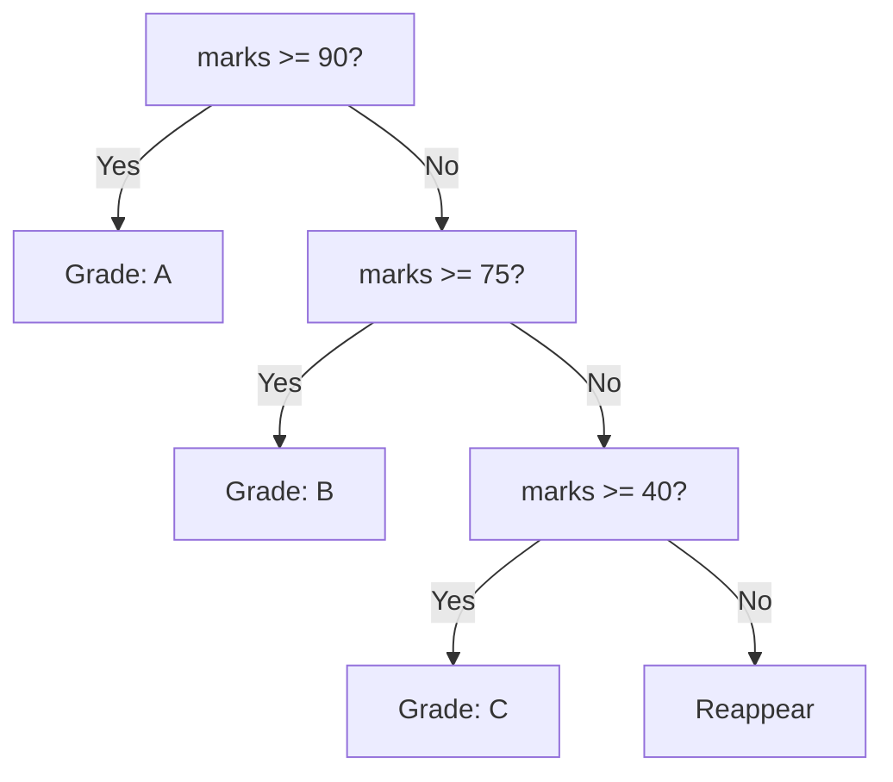

# Conditionals

---

## 1. Learning Objectives

By the end of this unit, you will be able to:

✓ Write single and multi-branch decisions using `if`, `elif`, and `else`.  
✓ Nest conditionals correctly and judge when nesting is hurting readability.  
✓ Combine comparisons with `and`, `or`, and `not` inside a condition.  
✓ Write a conditional (ternary) expression for a simple decision.  
✓ Trace, by hand, which branch of a conditional statement will run for a given input.

---

## 2. Overview

Every program you write from this point on needs to make decisions. A
college portal decides whether to show you "Pass" or "Reappear" based on
your marks; a food delivery app decides whether to show "Free Delivery"
based on your order value. Python makes these decisions with
**conditionals** — statements that run one block of code or another,
depending on whether something is true or false.

Think of a conditional the way an electrical circuit uses a switch. When
the switch is in one position, current flows through path A; in the other
position, it flows through path B. The circuit is not doing two things at
once — it evaluates the switch's position first, and only then commits to
one path. A Python conditional works the same way: Python checks a
condition first, and only then runs the matching block.

This unit covers `if`/`elif`/`else`, nested conditionals, combining
conditions with boolean logic, and the compact ternary expression for
simple decisions.

Every AI system that filters, validates, or routes data — deciding
whether a row of data is valid, whether a model's confidence score is
high enough to trust — relies on exactly this kind of decision-making at
its core.

---

## 3. Description

### 3.1 if / elif / else

- **Single-branch decision.** An `if` statement runs a block only when
  its condition is `True`:

```python
marks = 35
if marks < 40:
    print("Reappear")
```

**Output:**
```
Reappear
```

- **Multi-branch decision.** `elif` (else-if) lets you check several
  conditions in order, and `else` catches everything else:

```python
marks = 72

if marks >= 90:
    print("Grade: A")
elif marks >= 75:
    print("Grade: B")
elif marks >= 40:
    print("Grade: C")
else:
    print("Reappear")
```

**Output:**
```
Grade: C
```

Python checks each condition top to bottom and stops at the first one
that is `True` — later `elif` branches are never even checked once a
match is found.



- **Indentation as structure.** Python does not use `{ }` to mark a
  block — indentation itself defines which lines belong to the `if`,
  which belong to the `elif`, and which belong to the `else`. Inconsistent
  indentation is a syntax error, not just a style issue.

### 3.2 Nested Conditionals

- **Decisions inside decisions.** A conditional can contain another
  conditional inside its block, for when a decision depends on more than
  one factor:

```python
attendance = 78
marks = 42

if attendance >= 75:
    if marks >= 40:
        print("Eligible to appear for exam")
    else:
        print("Attendance OK, but marks too low")
else:
    print("Not eligible — attendance shortage")
```

**Output:**
```
Eligible to appear for exam
```

- **Readability trade-offs.** Nesting more than two or three levels deep
  makes code hard to follow. Combining the conditions with `and` (covered
  next) is often clearer than deep nesting for a simple case like this
  one.

### 3.3 Boolean Expressions in Conditions

- **Combining comparisons.** `and`, `or`, and `not` let a single `if`
  check more than one condition at once, often replacing a nested
  conditional:

```python
attendance = 78
marks = 42

if attendance >= 75 and marks >= 40:
    print("Eligible to appear for exam")
else:
    print("Not eligible")
```

**Output:**
```
Eligible to appear for exam
```

This single line does exactly what the nested version in 3.2 did — `and`
requires both conditions to be `True`, so there is no need to write one
`if` inside another.

### 3.4 Conditional (Ternary) Expression

- **Compact one-line decisions.** For simple cases where you just need to
  pick one of two values, Python offers a shorter form:

```python
marks = 82
result = "Pass" if marks >= 40 else "Fail"
print(result)
```

**Output:**
```
Pass
```

The pattern is `value_if_true if condition else value_if_false`. Use it
only for simple, short decisions — for anything with more than two
outcomes or extra logic, a full `if`/`elif`/`else` block stays more
readable.

---

## 4. Real-World Application

| **Where you see it** | **How Python is working behind the scenes** |
|---|---|
| **Your college result portal** showing "Pass" or "Reappear" | A conditional checks your marks against the passing threshold before deciding which message to display. |
| **A food delivery app** showing "Free Delivery Above ₹199" | A conditional compares your cart total against ₹199 to decide whether to waive the delivery fee. |
| **UPI apps** flagging a transaction as suspicious | A chain of conditionals checks the transaction amount, location, and frequency before deciding whether to allow, flag, or block it. |
| **An online exam portal** submitting your test automatically | A conditional checks whether the countdown timer has reached zero, and if so, auto-submits your answers. |
| **A cricket score app** showing "Won by 6 wickets" or "Match Tied" | Conditionals compare the two teams' scores to decide which result message to display. |

---

## 5. Worked Example

**Scenario:** Your professor has asked you to write a small Python
script that reads a student's attendance percentage and marks, and
prints their exam eligibility — a simplified version of the logic your
college's own portal uses every semester.

**1. Open a Colab notebook** and create a new code cell.

**2. Define the inputs.**
```python
student_name = "Rohan"
attendance = 68
marks = 55
```

**3. Write the eligibility check.**
```python
if attendance >= 75 and marks >= 40:
    print(student_name, "- Eligible to appear for exam")
elif attendance < 75:
    print(student_name, "- Not eligible: attendance shortage")
else:
    print(student_name, "- Not eligible: marks below minimum")
```

**4. Run the cell and check the output.**
```
Rohan - Not eligible: attendance shortage
```

**5. Test a second case** by changing `attendance = 80` and re-running
the cell:
```
Rohan - Eligible to appear for exam
```

*Common mistake: writing `if attendance >= 75 or marks >= 40:` instead of
`and` — this makes a student "eligible" even with a serious attendance
shortage, as long as their marks are high. Always check that you are
using `and` when a rule genuinely requires every condition to hold at
the same time.*

---

## 6. Summary

- **`if`/`elif`/`else`** lets a program run one of several possible
  blocks, checked top to bottom, stopping at the first match.
- **Indentation** defines a block in Python — there are no curly braces
  to mark where a block starts or ends.
- **Nested conditionals** place one decision inside another, but are
  often better replaced with `and`/`or` for readability.
- **Boolean expressions** (`and`, `or`, `not`) combine multiple
  comparisons into a single condition.
- **The ternary expression** (`value_if_true if condition else
  value_if_false`) compresses a simple two-outcome decision into one line.

With decision-making in place, the next unit introduces loops — how
Python repeats a block of code instead of writing it out again and again.

---

*© 2026 Revature · AI Native Engineering — Foundations · Unit 2.1 · Version 1.0*
