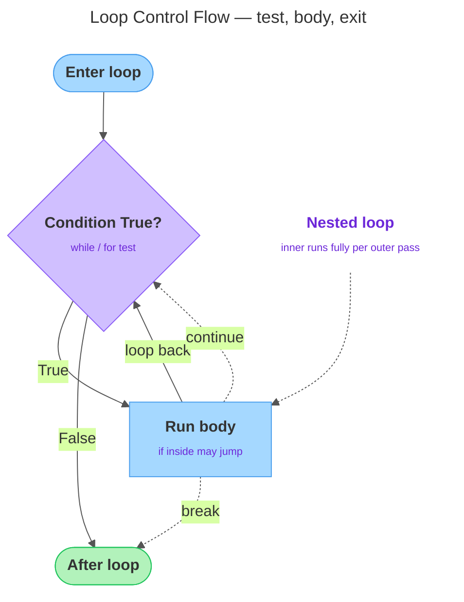

# Loops

---

## 1. Learning Objectives

By the end of this unit, you will be able to:

✓ Write a `while` loop that repeats a block as long as a condition holds, and explain how to stop it from running forever.  
✓ Iterate over a sequence with a `for` loop, naming the loop variable that takes each value in turn.  
✓ Generate numeric sequences with `range()` using its `start`, `stop`, and `step` arguments.  
✓ Use `enumerate()` to get an index alongside each value, and `zip()` to walk two sequences in step.  
✓ Control a loop from inside its body with `break` (leave early) and `continue` (skip to the next iteration).  
✓ Nest one loop inside another and describe what the loop `else` clause does.

---

## 2. Overview

Conditionals let a program choose a path once. But most real work is repetitive: print every character of a name, count down from ten, keep asking for input until the user finally types something valid. A **loop** runs a block of code over and over — either a fixed number of times or until a condition changes — so you never have to write the same statement out by hand.

Python gives you two loop keywords: `while`, which repeats *as long as* a condition is `True`, and `for`, which repeats *once for each item* in a sequence. This unit covers both, the tools that make looping practical (`range()`, `enumerate()`, `zip()`), and `break`/`continue` — two keywords that change a loop's flow from inside its own body.

---

## 3. Description

### 3.1 The `while` Loop

A `while` loop has the same shape as an `if`: a header line ending in a colon, then an indented block. The difference is what happens after the block runs — Python goes *back* to the top and tests the condition again, repeating the block as long as the condition is `True` and stopping the moment it becomes `False`.

```python
count = 5

while count > 0:
    print(count)
    count = count - 1

print("Lift off!")
```

Read it literally: "while `count > 0` is `True`, run the block." It prints `5`, `4`, `3`, `2`, `1`, and when `count` reaches `0` the condition is `False`, so the loop ends and `Lift off!` prints. The crucial line is `count = count - 1`: something inside the loop must eventually make the condition `False`. That's the loop's *progress* toward stopping.

The diagram below shows this cycle for both loop types — test the condition, run the body, loop back, and exit — including how `break` and `continue` redirect that flow and how one loop can nest inside another.



**Infinite loops and how to avoid them.** If the condition never becomes `False`, the loop never stops — an **infinite loop**, the classic `while` bug:

```python
count = 5

while count > 0:
    print(count)
    # forgot to change count — count stays 5 forever
```

Because `count` is never decreased, `count > 0` is always `True` and the program prints `5` endlessly until you force it to quit. The discipline is simple: **every `while` loop needs something in its body that moves the condition toward `False`.** Before running one, ask: "What changes each pass, and how does that eventually make the condition false?"

An infinite loop is not always a mistake — `while True:` is a common pattern *when paired with a `break`* that leaves the loop on some event, not on a timer. "Keep asking the user for input until they type something valid" is naturally a `while True:` with a `break` the moment the input passes a check, not a bug to fix. The rule is only that there must be *some* way out.

### 3.2 The `for` Loop and the Loop Variable

A `for` loop repeats its block **once for each item in a sequence**. On each pass the **loop variable** is set to the next item, and the block runs with that value. You do not manage a counter or a stop condition yourself — the `for` loop walks the sequence to its end for you. A string is a sequence of characters, so you can loop over one directly:

```python
for letter in "cat":
    print(letter)
```

Output:

```
c
a
t
```

The name `letter` is your choice — `for ch in "cat":` would work identically. Pick a name that describes one item. Use a `for` loop when you know the collection you're walking through; use a `while` loop when you're repeating until a condition changes and don't know the count in advance.

### 3.3 `range()` — Generating Numeric Sequences

Often you want to repeat something a fixed number of times, or count through numbers. `range()` produces a sequence of integers for a `for` loop to walk over. It has three forms:

| Form | Meaning | Example | Produces |
|---|---|---|---|
| `range(stop)` | Start at 0, stop *before* this number | `range(5)` | `0, 1, 2, 3, 4` |
| `range(start, stop)` | Start here, stop *before* the second number | `range(2, 6)` | `2, 3, 4, 5` |
| `range(start, stop, step)` | Start here, stop before the second, count by `step` each time | `range(0, 10, 2)` | `0, 2, 4, 6, 8` |

Two things trip people up. The `stop` value is **exclusive** — `range(5)` gives `0` through `4`, not `1` through `5`. And `step` can be negative to count *down*:

```python
for i in range(5, 0, -1):
    print(i)
```

Output:

```
5
4
3
2
1
```

That's an alternative, counter-free way to write the countdown from §3.1. `range()` is the standard way to say "do this N times": `for i in range(3):` runs its block three times, whether or not you use `i` inside it.

### 3.4 `enumerate()` and `zip()`

When you loop over a sequence you often want to know *where* you are as well as *what* the value is. `enumerate()` gives you both — on each pass it hands back a counter (starting at `0`) and the item itself:

```python
for index, letter in enumerate("cat"):
    print(index, letter)
```

Output:

```
0 c
1 a
2 t
```

Here `index, letter` unpacks the two values `enumerate` produces each pass into two loop variables at once. To start the count at `1` instead of `0`, pass a start value: `enumerate("cat", 1)` yields `1 c`, `2 a`, `3 t`.

`zip()` solves a different problem: walking **two sequences together**, one item from each per pass:

```python
for letter, digit in zip("abc", "123"):
    print(letter, digit)
```

Output:

```
a 1
b 2
c 3
```

One behavior worth knowing before it surprises you: `zip()` stops at the end of the **shorter** sequence — pairing `"abcd"` with `"12"` quietly gives you only two pairs, no error, no warning.

### 3.5 `break`, `continue`, Nested Loops, and the Loop `else` Clause

Two keywords change a loop's flow from within its own body:

- **`break`** immediately **leaves the loop entirely** — no more iterations; execution jumps to the first statement after the loop.
- **`continue`** **skips the rest of the current iteration** and goes straight to the next one.

```python
for letter in "python":
    if letter == "h":
        print("Found h — stopping.")
        break
    print(letter)
```

Output:

```
p
y
t
Found h — stopping.
```

This prints `p`, `y`, `t`, then hits `h`, prints the message, and `break` ends the loop — the `o` and `n` are never reached. `continue` skips forward without leaving:

```python
for i in range(6):
    if i % 2 == 0:
        continue
    print(i)
```

Output:

```
1
3
5
```

In short: `break` says "I am done with this loop"; `continue` says "I am done with *this one pass*, move on."

**Nested loops.** A loop's body can contain another loop — a **nested loop**. For every single pass of the outer loop, the inner loop runs all the way through, which is how you produce a grid or table:

```python
for row in range(1, 4):
    for col in range(1, 4):
        print(row * col, end=" ")
    print()
```

Output:

```
1 2 3
2 4 6
3 6 9
```

If the outer loop runs `n` times and the inner runs `m` times, the inner body runs `n × m` times in total. Keep nesting shallow — two levels are common, but each added level multiplies both the work and the difficulty of reading it.

**The loop `else` clause.** Python allows an optional `else` attached to a loop. It runs **only if the loop finished normally** — that is, it never hit a `break`:

```python
for letter in "cat":
    if letter == "z":
        print("Found z.")
        break
else:
    print("No z in the word.")
```

Output:

```
No z in the word.
```

Because `"cat"` contains no `"z"`, the `break` never fires, the loop runs to its end, and the `else` prints. Had the word contained a `"z"`, the `break` would have run and the `else` would have been skipped. It's a niche feature — recognize it when you see it, and reach for it only when it genuinely reads more clearly than a flag variable.

---

## 4. Real-World Application

A form that keeps re-prompting until you enter a valid email address is `while True:` paired with a `break` — read input, check it, loop again if it fails, break the moment it passes. A search feature that stops the instant it finds a match, instead of scanning every remaining record, is `break` doing exactly that job. A running total or a page-view counter that climbs by one each time is a `for i in range(...)` loop accumulating a value on every pass. And a multiplication table, a seating chart, or any row-by-column report is a nested loop — the outer loop picks the row, the inner loop fills it in completely before the outer loop moves on.

---

## 5. Worked Example

**Goal:** Build a `while` countdown from user input, trace exactly why it terminates, then deliberately break it with the classic infinite-loop mistake before fixing it.

**1. Read a number and count down to zero.**

```python
count = int(input("Count down from: "))

while count > 0:
    print(count)
    count = count - 1
print("Done.")
```

Say the user types `3`. Tracing it: `input()` reads text, `int(...)` converts it to the number `3`. Python tests `3 > 0` → `True` → prints `3`, then `count` becomes `2`. It loops back: `2 > 0` → `True` → prints `2`, `count` becomes `1`. Then `1 > 0` → `True` → prints `1`, `count` becomes `0`. Now `0 > 0` is `False`, so the loop ends and `Done.` prints.

Output:

```
3
2
1
Done.
```

**2. Introduce the classic mistake — drop the decrement.**

```python
count = 3

while count > 0:
    print(count)
    # count = count - 1   <-- missing on purpose
```

`count` never changes, so `count > 0` is always `True`. This would print `3` forever and never reach a `Done.` line — an infinite loop, exactly as described in §3.1. Don't actually run this version; reason through why it never stops instead.

**3. Fix it by restoring the line that makes progress.**

```python
count = 3

while count > 0:
    print(count)
    count = count - 1
print("Done.")
```

Output:

```
3
2
1
Done.
```

**4. Write the same countdown with `range()` instead — no counter to manage.**

```python
for i in range(3, 0, -1):
    print(i)
print("Done.")
```

Output:

```
3
2
1
Done.
```

Same result, but there's no variable to remember to decrement — `range()` owns the counting, which is exactly why a `for` loop is the safer choice whenever you already know how many times you need to repeat.

*Common mistake: writing a `while` loop's stopping condition correctly, then forgetting that the condition is only re-checked, not re-evaluated intelligently — it doesn't "know" you meant to stop. If nothing inside the loop changes the value the condition depends on, Python will keep asking the exact same question forever.*

---

## 6. Summary

- A **`while`** loop repeats as long as its condition is `True`; every one must contain something that eventually makes the condition `False` (or a deliberate `break`), or it runs forever.
- A **`for`** loop runs once per item in a sequence, binding each item to the loop variable in turn — there's no condition to get wrong, because it ends when the sequence runs out.
- **`range()`** produces integers using `start`, `stop`, and `step`, where `stop` is exclusive and `step` may be negative to count down.
- **`enumerate()`** pairs each item with an index; **`zip()`** walks two sequences together, stopping at the shorter one.
- **`break`** leaves a loop immediately; **`continue`** skips to the next iteration; a loop **`else`** runs only when the loop finishes without hitting a `break`.
- **Nested loops** run the inner loop fully for each pass of the outer loop — keep the nesting shallow.

Next up: functions — how to package a block of logic under a name, so you can reuse it by calling it instead of retyping or re-copying it.

---

*© 2026 Revature · AI Native Engineering — Foundations · Unit 2.2 · Version 1.0*
