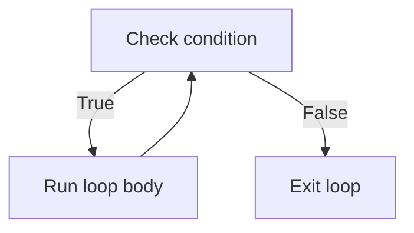

# Loops

---

## 1. Learning Objectives

By the end of this unit, you will be able to:

✓ Write a `while` loop and explain how to avoid writing an infinite one.  
✓ Write a `for` loop to iterate over a sequence, including with `range()`.  
✓ Use `enumerate()` and `zip()` to loop with index numbers or paired sequences.  
✓ Use `break` and `continue` to control a loop's flow from inside it.  
✓ Write and trace a nested loop.

---

## 2. Overview

A conditional (from the last unit) makes a decision once. A **loop**
makes a decision, and then repeats a block of code as many times as
needed — checking your entire class list for attendance, printing every
transaction in your UPI statement, or scanning every question on an exam
paper before submitting it.

Think of a loop the way a lab technician runs a titration experiment.
The technician repeats the same procedure — add a drop, check the
colour, add a drop, check the colour — until a specific condition is
met (the colour changes), and only then stops. A loop in Python behaves
identically: it repeats one block of code until a condition tells it to
stop.

This unit covers Python's two loop types — `while` and `for` — along
with the tools that make looping practical: `range()`, `enumerate()`,
`zip()`, and the `break`/`continue` keywords that let you control a loop
from the inside.

Every AI training process is, at its core, a loop — a model looks at
data, adjusts itself slightly, and repeats this thousands of times. The
loop patterns you learn here are the same shape you will see again when
you train your first model.

---

## 3. Description

### 3.1 while Loop

- **Loop condition.** A `while` loop keeps running its block as long as
  its condition stays `True`:

```python
attempts = 0

while attempts < 3:
    print("Attempt number:", attempts + 1)
    attempts = attempts + 1
```

**Output:**
```
Attempt number: 1
Attempt number: 2
Attempt number: 3
```

- **Infinite loops and how to avoid them.** If the condition never
  becomes `False`, the loop never stops — this is a bug, not a feature.
  Every `while` loop needs something inside it (like `attempts =
  attempts + 1` above) that eventually makes the condition `False`.



### 3.2 for Loop

- **Iterating over a sequence.** A `for` loop runs its block once for
  each item in a sequence, without you having to manage a counter
  yourself:

```python
subjects = ["Maths", "Physics", "Python"]

for subject in subjects:
    print("Studying:", subject)
```

**Output:**
```
Studying: Maths
Studying: Physics
Studying: Python
```

- **The loop variable.** `subject` above takes on each value in
  `subjects`, one at a time, for the duration of one pass through the
  loop.

### 3.3 range()

- **Looping a fixed number of times.** `range()` generates a sequence of
  numbers, most often used to repeat a block a set number of times:

```python
for i in range(5):
    print("Round", i)
```

**Output:**
```
Round 0
Round 1
Round 2
Round 3
Round 4
```

- **start, stop, step.** `range()` accepts up to three arguments:

| Form | Meaning | Example | Produces |
|---|---|---|---|
| `range(stop)` | 0 up to (not including) `stop` | `range(5)` | 0, 1, 2, 3, 4 |
| `range(start, stop)` | `start` up to (not including) `stop` | `range(2, 6)` | 2, 3, 4, 5 |
| `range(start, stop, step)` | `start` up to `stop`, counting by `step` | `range(0, 10, 2)` | 0, 2, 4, 6, 8 |

### 3.4 enumerate() and zip()

- **Index + value with `enumerate()`.** When you need both the position
  and the value while looping, `enumerate()` gives you both:

```python
subjects = ["Maths", "Physics", "Python"]

for index, subject in enumerate(subjects):
    print(index, "-", subject)
```

**Output:**
```
0 - Maths
1 - Physics
2 - Python
```

- **Pairing sequences with `zip()`.** `zip()` steps through two (or
  more) sequences together, pairing up items at the same position:

```python
subjects = ["Maths", "Physics", "Python"]
marks = [78, 85, 92]

for subject, mark in zip(subjects, marks):
    print(subject, ":", mark)
```

**Output:**
```
Maths : 78
Physics : 85
Python : 92
```

### 3.5 break, continue, and Nested Loops

- **`break` — early exit.** Stops the loop immediately, even if the
  original condition is still `True`:

```python
for number in range(1, 10):
    if number == 5:
        break
    print(number)
```

**Output:**
```
1
2
3
4
```

- **`continue` — skipping an iteration.** Skips the rest of the current
  pass and moves straight to the next one, without stopping the loop
  entirely:

```python
for number in range(1, 6):
    if number == 3:
        continue
    print(number)
```

**Output:**
```
1
2
4
5
```

- **Nested loops.** A loop can contain another loop — useful for
  grid-like data, such as rows and columns:

```python
for row in range(1, 3):
    for col in range(1, 3):
        print(f"Row {row}, Col {col}")
```

**Output:**
```
Row 1, Col 1
Row 1, Col 2
Row 2, Col 1
Row 2, Col 2
```

- **The loop `else` clause (brief).** A `for` or `while` loop can have an
  `else` block, which runs only if the loop finished without hitting a
  `break`. It is used rarely, but worth recognising if you see it in
  someone else's code.

---

## 4. Real-World Application

| **Where you see it** | **How Python is working behind the scenes** |
|---|---|
| **A college attendance system** processing every student's record | A `for` loop steps through the full list of students, checking each one's attendance percentage. |
| **Instagram/YouTube** loading more posts as you scroll | A loop keeps fetching and displaying the next batch of content until you stop scrolling or the app is closed. |
| **A UPI app** displaying your last 20 transactions | A `for` loop steps through your transaction history and prints each entry to the screen. |
| **An online quiz timer** counting down the seconds | A `while` loop keeps checking the remaining time each second until it reaches zero, then auto-submits. |
| **NPTEL** checking every module you've completed before issuing a certificate | A loop scans through each module's completion status before deciding whether you qualify. |

---

## 5. Worked Example

**Scenario:** Your professor has asked you to write a script that prints
a numbered list of every subject in your current semester, then stops
early if it reaches a subject you have already completed.

**1. Open a Colab notebook** and create a new code cell.

**2. Define the subject list.**
```python
subjects = ["Maths", "Physics", "Python", "Electronics", "Chemistry"]
completed = "Python"
```

**3. Loop through with `enumerate()`, and stop at the completed subject.**
```python
for index, subject in enumerate(subjects, start=1):
    if subject == completed:
        print(f"{index}. {subject} — already completed, stopping here.")
        break
    print(f"{index}. {subject}")
```

**4. Run the cell and check the output.**
```
1. Maths
2. Physics
3. Python — already completed, stopping here.
```

**5. Change `completed` to `"Chemistry"`** and re-run to see the loop
go all the way through the list without ever hitting `break`.

*Common mistake: forgetting to update the loop's counter inside a
`while` loop (for example, leaving out `attempts = attempts + 1`),
which leaves the condition permanently `True` and creates an infinite
loop that never stops on its own.*

---

## 6. Summary

- **`while`** repeats a block as long as its condition stays `True` — you
  are responsible for making sure the condition eventually turns `False`.
- **`for`** repeats a block once for each item in a sequence, without
  needing to manage a counter manually.
- **`range()`** generates a sequence of numbers using `start`, `stop`,
  and an optional `step`.
- **`enumerate()`** gives you the index and the value together;
  **`zip()`** pairs up items from two or more sequences.
- **`break`** exits a loop immediately; **`continue`** skips to the next
  iteration without exiting.

With repetition covered, the next unit introduces functions — how to
package a block of logic so you can reuse it by name instead of copying
it wherever you need it.

---

*© 2026 Revature · AI Native Engineering — Foundations · Unit 2.2 · Version 1.0*
