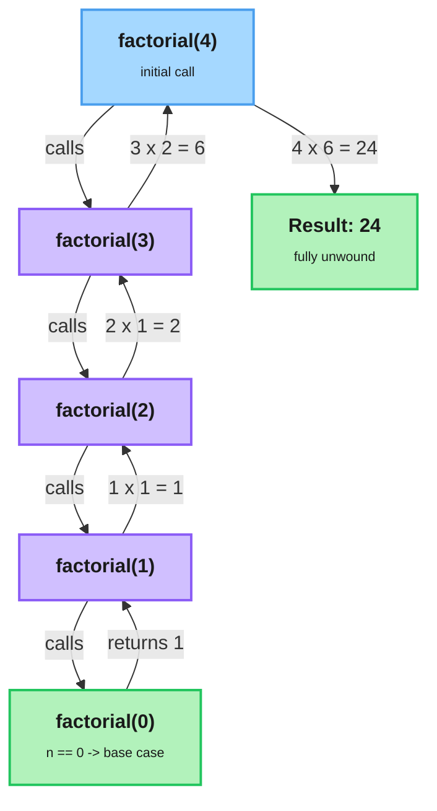

# Functions

---

## 1. Learning Objectives

By the end of this unit, you will be able to:

✓ Define a function with `def`, give it parameters, and return a value to the caller.  
✓ Distinguish positional, keyword, and default arguments, and pass them correctly.  
✓ Explain what `*args` and `**kwargs` collect, and iterate over extra positional arguments with a loop.  
✓ Describe local versus global scope and state what the `global` keyword does.  
✓ Write a recursive function with a correct base case and recursive case, using factorial as the model.  
✓ Attach a docstring so a function documents its own purpose.

---

## 2. Overview

You've been calling functions since unit 1.4 — every `print()` and `int()` hands work to code someone else wrote and gets an answer back. This unit teaches you to write your own: a named, reusable block of code that takes some inputs, does one job, and gives back a result. That shift — from one long script to organized, callable pieces — is what lets a program grow past a few lines without collapsing into spaghetti.

By the end of this unit you'll define functions, feed them input three different ways, understand why a variable created inside one disappears the moment the function finishes, and write a function that calls itself.

---

## 3. Description

### 3.1 Defining, Calling, and Returning

You create a function with the `def` keyword, a name, a pair of parentheses, and a colon. The indented block underneath is the function's **body**. Defining a function does not run it — it only teaches Python what the name means. You **call** it later by writing the name followed by parentheses.

```python
def greet():
    print("Hello there")

greet()   # runs the body -> Hello there
```

A function that only prints has done something visible but handed nothing back to whoever called it. The `return` statement ends the function immediately and produces a value the caller can store or reuse:

```python
def square(n):
    return n * n

answer = square(5)   # answer is now 25
```

This is the single most important distinction in the topic. `print` shows a value on screen and is gone; `return` gives the value back so the rest of the program — including an automated test — can use it. A function with no `return` statement (or a bare `return`) hands back the special value `None`.

### 3.2 Parameters and Arguments

A **parameter** is the name listed inside the parentheses when you define a function. An **argument** is the actual value you supply when you call it: in `def square(n)`, `n` is the parameter; in `square(5)`, `5` is the argument. **Positional arguments** are matched to parameters by their order:

```python
def power(base, exponent):
    result = 1
    for _ in range(exponent):
        result = result * base
    return result

power(2, 3)   # base=2, exponent=3 -> 8
```

**Keyword arguments** are matched by name instead of position, so order stops mattering and the call reads more clearly:

```python
power(exponent=3, base=2)   # still 8 — names win over order
```

**Default arguments** give a parameter a fallback value used when the caller omits it, which makes the argument optional:

```python
def greet(name, greeting="Hello"):
    return greeting + ", " + name

greet("Sam")               # "Hello, Sam"
greet("Sam", "Welcome")    # "Welcome, Sam"
```

One ordering rule to remember: parameters with defaults must come after parameters without them, and in a call, positional arguments must come before keyword arguments. There is also a real trap here — **a default value is evaluated once, at the moment the function is defined, not each time it is called**. For a plain number or string this never bites you; it becomes dangerous when the default is something that can be changed in place, like a list or dictionary. The safe habit is to keep defaults as simple, fixed values: a number, a string, or `None`.

### 3.3 Collecting Extra Arguments — `*args` and `**kwargs`

Sometimes you do not know in advance how many arguments a caller will pass. A single `*` before a parameter name tells Python to collect all the extra **positional** arguments together under that one name — by convention, `*args`. You then walk through them with a `for` loop:

```python
def total(*args):
    running = 0
    for value in args:
        running = running + value
    return running

total(3, 4, 5)   # 12
total()          # 0
```

The `*` is what matters; `args` is just the customary name. Two stars, `**kwargs`, do the same job for extra **keyword** arguments, keyed by their names. The concept to hold onto: one star gathers extra positional arguments, two stars gather extra keyword arguments, and both let a function accept a flexible number of inputs.

### 3.4 Scope: Local vs. Global

**Scope** is the region of a program where a name is visible. A variable created inside a function is **local** — it exists only while the function runs and cannot be seen from outside:

```python
def compute():
    temp = 42        # local to compute
    return temp

compute()
print(temp)          # ERROR: temp is not defined out here
```

A variable defined at the top level of your file, outside any function, is **global**, and functions can read it. But if a function *assigns* to a name, Python treats that name as local by default — which is usually what you want, since it keeps functions from stepping on each other's variables. When a function genuinely needs to reassign a global variable, the `global` keyword declares that intent:

```python
counter = 0

def bump():
    global counter
    counter = counter + 1

bump()
print(counter)       # 1
```

Use `global` sparingly. Functions that take inputs as parameters and hand results back with `return` are far easier to reason about and to test than functions that quietly reach out and mutate shared global state. Keep `global` as the rare exception, not the habit.

### 3.5 Recursion

**Recursion** is a technique where a function solves a problem by calling itself on a smaller version of that same problem. Every recursive function needs two parts. The **base case** is the simplest input — small enough that the answer is known directly, without any further call — and it is what stops the recursion from running forever. The **recursive case** is the branch where the function calls itself on a smaller or simpler input and combines that result to produce its own answer.

The classic worked example is **factorial**: `n!` is `n × (n-1) × ... × 1`, and `0!` is defined as `1`. Since `n!` equals `n × (n-1)!`, the definition is already a recursive shape:

```python
def factorial(n):
    if n == 0:            # base case
        return 1
    return n * factorial(n - 1)   # recursive case

factorial(4)   # 4 * 3 * 2 * 1 = 24
```

Each call to `factorial` that has not yet hit the base case is placed on the **call stack** — the mechanism Python uses to track every function call still waiting on a result. The diagram below traces `factorial(4)`: the calls descend one frame at a time until `factorial(0)` hits the base case, and then the stack unwinds bottom-up, each frame multiplying its piece into the next.



If the base case were missing or unreachable, the function would keep calling itself, pushing new frames onto the call stack indefinitely. Python limits how deep that stack can get; once a program exceeds it, Python raises a `RecursionError` reporting "maximum recursion depth exceeded" rather than letting the program hang or crash the interpreter.

The same job can be done with a `for` loop and an accumulator, exactly as you saw in unit 2.2. Recursion is not faster here — it is a different way of thinking that shines when a problem is naturally defined in terms of a smaller copy of itself. Getting the base case right is the whole game.

### 3.6 Docstrings

A **docstring** is a string literal placed as the very first statement inside a function body, written in triple quotes. Python stores it so tools and readers can see what the function does — it is the standard, built-in way to document a function:

```python
def factorial(n):
    """Return n! for a non-negative integer n."""
    if n == 0:
        return 1
    return n * factorial(n - 1)
```

A good docstring says what the function does, what it expects, and what it returns, in one or a few plain sentences. It is documentation that travels with the code instead of drifting out of date in a separate file.

---

## 4. Real-World Application

You've already been living this idea without writing a function yourself. Every `print()` and `int()` call you've made since unit 1.4 is a function someone else wrote once, that now runs identically no matter who calls it or how many times — writing your own function is doing, deliberately, exactly what those built-ins already do for you.

It's also why returning a value matters more than it might seem: a function that `return`s an answer hands back something a test can check automatically, while a function that only `print()`s a message doesn't give an automated check anything to grab onto — which is exactly the distinction your Week 3 checkpoint is built to reward.

---

## 5. Worked Example

**Goal:** Apply a repeatable recipe for turning a plain-English problem into a tested function, using `total(*args)` — a function that sums however many arguments it's given — as the example.

**1. Name the job.** The verb is "sum the arguments," so the function is `total`.

**2. List the inputs as parameters.** The caller might pass any number of values, so the parameter is `*args`, not a fixed list of names.

**3. Write a one-line docstring** stating what it returns: `"""Return the sum of all positional arguments."""`.

**4. Do the work in the body**, using tools you already know — a `for` loop and an accumulator.

**5. `Return` the answer** instead of merely printing it, so a test can check the value.

Steps 1–5 produce this function:

```python
def total(*args):
    """Return the sum of all positional arguments."""
    running = 0
    for value in args:
        running = running + value
    return running
```

**6. Call it with sample inputs** and confirm the returned value is correct.

```python
print(total(3, 4, 5))
print(total(10, 20))
print(total())
```

Output:

```
12
30
0
```

`total(3, 4, 5)` builds `running` from `0` to `3` to `7` to `12` and returns `12`; `total()` never enters the loop body at all, so it correctly returns `0`. Each step maps directly onto how a checkpoint like this is graded: a named function, explicit parameters, a docstring, and a returned value a test can assert against — never a printed message a test has to scrape.

*Common mistake: giving a parameter a mutable default like `[]` or `{}`. Because Python evaluates a default value once, at the moment the function is defined — not fresh on every call — every call that relies on that default ends up sharing the exact same list or dictionary, silently, across calls. Keep defaults simple and fixed: a number, a string, or `None`, and build any list or dict you need fresh inside the function body.*

---

## 6. Summary

- A function is defined with `def`, does one job, and hands a value back with `return`; returning (not printing) is what makes a function testable.
- Arguments are passed by position or by name, and default arguments make parameters optional — but a default is evaluated once, at definition time, not on every call.
- `*args` collects extra positional arguments (loop over them to use them) and `**kwargs` collects extra keyword arguments.
- Variables assigned inside a function are local by default; `global` is the rare exception for reassigning a top-level name.
- A recursive function needs a base case that stops the calls and a recursive case that shrinks the problem — factorial is the canonical example, and a missing base case ends in a `RecursionError`.

Up next: functional constructs — lambdas, `map`/`filter`, and comprehensions — which lean directly on the functions you just learned to write.

---

*© 2026 Revature · AI Native Engineering — Foundations · Unit 2.3 · Version 1.0*
