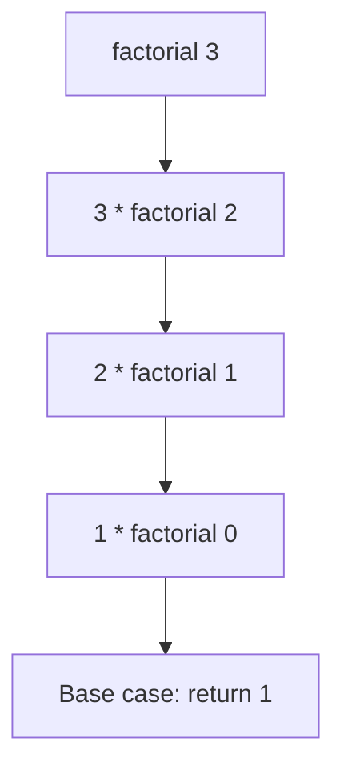

# Functions

---

## 1. Learning Objectives

By the end of this unit, you will be able to:

✓ Define and call a function using `def`, and return a value from it.  
✓ Use positional, keyword, and default parameters correctly.  
✓ Explain the difference between local and global scope.  
✓ Write a simple recursive function with a correct base case.  
✓ Write a docstring that documents what a function does.

---

## 2. Overview

So far, every piece of logic you have written has lived directly in your
notebook cell. A **function** lets you package a block of logic under a
name, so you can reuse it by calling that name instead of retyping the
logic every time you need it.

Think of a function the way a college uses a fixed admission-form
template. Every applicant fills in different details — name, marks,
category — but the form's structure and the process behind it stay the
same every single time. You do not redesign the form for each applicant;
you reuse the same template and simply feed it different input. A
function works exactly this way: the logic stays fixed, and only the
input (its **parameters**) changes each time you call it.

This unit covers defining and calling functions, the different ways to
pass parameters, how Python decides what a variable name refers to
(scope), recursion, and docstrings — the standard way to document what a
function does.

Every model, library, and tool you will use in AI work is built from
functions — `print()` itself is one you have already been calling since
Unit 1.1. Understanding how to build your own is what turns you from
someone who runs code into someone who writes it.

---

## 3. Description

### 3.1 Defining and Calling Functions

- **The `def` keyword.** A function is defined with `def`, a name, and
  parentheses that may hold parameters:

```python
def greet():
    print("Welcome to the AI Native Engineering programme")

greet()
```

**Output:**
```
Welcome to the AI Native Engineering programme
```

- **Calling and returning values.** `return` sends a value back to
  wherever the function was called, instead of just printing it:

```python
def add(a, b):
    return a + b

total = add(4, 5)
print(total)
```

**Output:**
```
9
```

A function that uses `return` gives you a value you can store in a
variable, pass to another function, or use in a further calculation —
`print()` alone cannot do this.

### 3.2 Parameters

- **Positional arguments** — matched to parameters by their order:

```python
def student_summary(name, marks):
    print(name, "scored", marks)

student_summary("Priya", 88)
```

**Output:**
```
Priya scored 88
```

- **Keyword arguments** — matched by name, so order no longer matters:

```python
student_summary(marks=88, name="Priya")
```

**Output:**
```
Priya scored 88
```

- **Default arguments** — a parameter can have a fallback value, used
  only when the caller does not supply one:

```python
def greet(name, greeting="Hello"):
    print(greeting, name)

greet("Rohan")
greet("Rohan", "Welcome back")
```

**Output:**
```
Hello Rohan
Welcome back Rohan
```

- **`*args` and `**kwargs` (introduction).** These let a function accept
  any number of extra positional or keyword arguments:

```python
def total_marks(*scores):
    return sum(scores)

print(total_marks(78, 85, 92))
```

**Output:**
```
255
```

`*args` collects any number of positional arguments into a tuple;
`**kwargs` does the same for keyword arguments, collecting them into a
dictionary. You will see both used more heavily once you start reading
library code.

### 3.3 Scope

- **Local vs global scope.** A variable created inside a function is
  **local** — it exists only while that function runs, and disappears
  afterwards:

```python
def calculate():
    result = 100
    print(result)

calculate()
print(result)
```

**Output:**
```
100
```
```
NameError: name 'result' is not defined
```

`result` was created inside `calculate()`, so it does not exist outside
it — this is exactly why the second `print(result)` fails.

- **The `global` keyword (brief).** A function can modify a variable
  from outside its own scope using `global`, though this is used
  sparingly, since it makes code harder to trace:

```python
counter = 0

def increment():
    global counter
    counter = counter + 1

increment()
print(counter)
```

**Output:**
```
1
```

### 3.4 Recursion

- **Base case and recursive case.** A recursive function calls itself,
  but only after checking a **base case** that stops the recursion —
  without one, the function would call itself forever.



- **Worked example: factorial.**

```python
def factorial(n):
    if n == 0:
        return 1
    return n * factorial(n - 1)

print(factorial(5))
```

**Output:**
```
120
```

`factorial(0)` is the base case — it returns immediately without calling
itself again. Every other call multiplies `n` by the factorial of the
number one smaller, until it reaches that base case.

### 3.5 Documentation

- **Docstrings.** A docstring is a short description placed as the very
  first line inside a function, explaining what it does:

```python
def factorial(n):
    """Return the factorial of a non-negative integer n."""
    if n == 0:
        return 1
    return n * factorial(n - 1)
```

Unlike a `#` comment, a docstring can be read by other tools (and other
developers) using `help(factorial)`, which makes it the standard way to
document a function's purpose.

---

## 4. Real-World Application

| **Where you see it** | **How Python is working behind the scenes** |
|---|---|
| **A UPI app's "Send Money" button** | A single function handles the entire transfer — validating the amount, checking the balance, and confirming the transaction — called every time you tap send. |
| **ChatGPT generating a response** | The system calls the same underlying function for every user's message; only the input (your prompt) changes each time. |
| **A college portal's grade calculator** | A function takes marks as input and returns a grade, reused identically for every one of thousands of students. |
| **Spotify's "shuffle" feature** | A function is called repeatedly, once for each song, to decide the next track to play. |
| **An OTP verification system** | A function checks whether the code you entered matches the one sent, returning `True` or `False` to the calling app. |

---

## 5. Worked Example

**Scenario:** Your professor asks you to write a reusable function that
calculates a student's grade from their marks, so it can be called for
every student in a class list without repeating the logic.

**1. Open a Colab notebook** and create a new code cell.

**2. Define the function.**
```python
def get_grade(marks):
    """Return a letter grade for a given marks value."""
    if marks >= 90:
        return "A"
    elif marks >= 75:
        return "B"
    elif marks >= 40:
        return "C"
    else:
        return "Reappear"
```

**3. Call it for a list of students.**
```python
students = {"Priya": 92, "Rohan": 68, "Arjun": 35}

for name, marks in students.items():
    print(name, "-", get_grade(marks))
```

**4. Run the cell and check the output.**
```
Priya - A
Rohan - C
Arjun - Reappear
```

**5. Reuse the same function** for a new student by simply calling
`get_grade(81)` — no need to rewrite the grading logic.

*Common mistake: forgetting the `return` keyword and using `print()`
inside the function instead. This makes the function display a value on
screen but return `None`, so any code that tries to use its result (like
storing it in a variable) silently breaks.*

---

## 6. Summary

- **`def`** defines a function; **`return`** sends a value back to the
  caller, which `print()` alone cannot do.
- **Parameters** can be positional, keyword, or given a default value,
  and `*args`/`**kwargs` accept a variable number of extra arguments.
- **Local scope** means a variable created inside a function does not
  exist outside it; `global` is the rare exception that reaches outside.
- **Recursion** is a function calling itself, always guarded by a base
  case that stops it from calling itself forever.
- **Docstrings** document what a function does, in a way tools like
  `help()` can read directly.

With reusable logic in place, the next unit introduces functional
constructs — lambdas, decorators, and generators — that build on the
functions you have just learned to write.

---

*© 2026 Revature · AI Native Engineering — Foundations · Unit 2.3 · Version 1.0*
