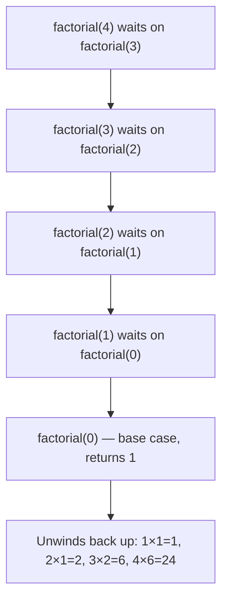

# Functions

---

## 1. Learning Objectives

By the end of this unit, you will be able to:

✓ Define and call a function with `def`, and explain why `return` is not the same thing as `print()`.  
✓ Pass arguments positionally, by keyword, and with defaults — and know the one default-argument trap that catches almost every beginner.  
✓ Explain local vs. global scope, and why reaching into global state with the `global` keyword is a last resort, not a habit.  
✓ Write a recursive function with a correct base case.  
✓ Write a docstring that documents what a function actually does.

---

## 2. Overview

Everything you've written so far has lived loose in a single notebook cell, run top to bottom, once. A **function** is a named, reusable block of code: you write the logic once, give it a name, and from then on you can run that exact logic again — as many times as you want, with different input each time — without ever retyping it.

Picture a vending machine. You put in a specific input — a coin and a button press — and every single time, the same internal mechanism runs and hands you back a specific output. The machine doesn't redesign itself for each customer; it's built once, and it reacts to whatever input arrives. That's exactly what a function does: the same logic, run on demand, reacting to whatever you feed it.

By the end of this unit you'll define functions, feed them input in three different ways, understand why a variable created inside one disappears the moment it finishes, and write a function that calls itself. That last one sounds strange until you see it — it's coming in §3.4.

---

## 3. Description

### 3.1 Defining and Calling a Function

A function is defined with `def`, a name, and parentheses — then called later by writing that name followed by parentheses again.

```python
def greet():
    print("Welcome to the program.")

greet()
```

Output:

```
Welcome to the program.
```

This function prints something, but it hands nothing back — it's the vending machine's little "Thank You" light flashing, not the machine actually dispensing a snack. If you want the function to hand a *value* back to whoever called it — something you can store, pass along, or do more math with — you need `return`:

```python
def add(a, b):
    return a + b

total = add(4, 5)
print(total)
```

Output:

```
9
```

`total` now holds the number `9`, because `return` sent that value out of the function and back to the line that called it. A function built only around `print()` can *show* you `9` on screen, but there is nothing there for `total = ...` to actually catch — `print()` always hands back `None` behind the scenes, which is almost never what you meant to store.

### 3.2 Feeding a Function Input — Parameters and Arguments

A **parameter** is the name a function uses internally for its input; the **argument** is the actual value you hand it when calling. Python gives you three ways to hand arguments over.

- **Positional** — matched to parameters purely by their order, left to right:

```python
def student_summary(name, marks):
    print(name, "scored", marks)

student_summary("Priya", 88)
```

Output:

```
Priya scored 88
```

- **Keyword** — matched by name instead of position, so order stops mattering:

```python
student_summary(marks=88, name="Priya")
```

Output:

```
Priya scored 88
```

- **Default** — a fallback value the parameter uses only if the caller doesn't supply one:

```python
def greet(name, greeting="Hello"):
    print(greeting, name)

greet("Rohan")
greet("Rohan", "Welcome back")
```

Output:

```
Hello Rohan
Welcome back Rohan
```

Defaults are convenient, but there's a famous trap here — it's subtle enough that it catches experienced beginners, not just careless ones — and it's the centerpiece of this unit's worked example below.

**Collecting an unknown number of arguments.** Sometimes you don't know in advance how many inputs a function will get. `*args` collects any number of extra positional arguments into a tuple (a fixed, ordered group of values — covered in Part 3); `**kwargs` does the same for keyword arguments, collecting them into a dictionary (a set of labeled values, also in Part 3). You don't need to master these yet — just recognize them when you see them in library code:

```python
def total_marks(*scores):
    return sum(scores)

print(total_marks(78, 85, 92))
```

Output:

```
255
```

### 3.3 Scope — Who Can See a Variable

**Scope** is the answer to "where in the code is this variable name actually visible?" A variable created inside a function is **local** to it — it exists only while that function is running, and is gone the instant the function finishes, exactly like the vending machine's internal coin-counting mechanism: you can't reach in from outside and read it directly.

```python
def calculate():
    result = 100
    print(result)

calculate()
print(result)
```

Output:

```
100
```
```
NameError: name 'result' is not defined
```

`result` never existed outside `calculate()` — the second `print(result)` is asking about a variable that was never in scope to begin with.

Occasionally, a function needs to reach out and change a variable that lives *outside* it, at the top level of your program (this outer level is called **global scope**). The `global` keyword allows that — but treat it like the vending machine technician's master key: it can override the machine's normal behavior, but if you use it carelessly, you can no longer trust that the machine behaves the same way every time, which defeats half the point of writing a function in the first place.

```python
counter = 0

def increment():
    global counter
    counter = counter + 1

increment()
print(counter)
```

Output:

```
1
```

### 3.4 Recursion — A Function That Calls Itself

**Recursion** is a function that calls itself, working on a smaller version of the same problem each time — right up until it hits a **base case**: the one condition where it stops calling itself and just returns an answer directly. Without a base case, the function would call itself forever.

Picture a set of Russian nesting dolls (matryoshka). You open the largest doll and find a slightly smaller one inside — identical in shape, just smaller. You open that one and find another, smaller still. This continues until you reach one solid doll that doesn't open at all — that's the base case, the point where the nesting stops. A recursive function works the same way: each call hands off a smaller version of the same problem, until one call finally doesn't need to call itself again.

```python
def factorial(n):
    if n == 0:
        return 1          # the base case — the "solid doll"
    return n * factorial(n - 1)

print(factorial(5))
```

Output:

```
120
```

`factorial(0)` is the base case — it returns immediately, no further calls. Every other call multiplies `n` by the factorial of the number one smaller than it, until execution reaches that base case and the chain of calls finally resolves:



Each call stacks on top of the last, waiting, until the base case finally has an answer — then the whole chain resolves in reverse, from the bottom back up.

### 3.5 Docstrings — Labeling What a Function Does

A **docstring** is a short description written as the very first line inside a function, in triple quotes — it's the spec label stuck on the vending machine telling you exactly what it dispenses, before you ever put a coin in.

```python
def factorial(n):
    """Return the factorial of a non-negative integer n."""
    if n == 0:
        return 1
    return n * factorial(n - 1)
```

Unlike a `#` comment, a docstring can be read by other tools — typing `help(factorial)` displays it directly — which makes it the standard way to document a function's purpose for anyone (including future you) who calls it without reading its internals.

---

## 4. Real-World Application

When ChatGPT answers a message, it isn't running custom-written logic per user — the same underlying function runs for everyone, and only the argument (§3.2, your prompt) changes each time it's called. That's the entire economic case for functions at scale: write the logic once, and every one of millions of calls just supplies different input.

Recursion (§3.4) shows up the moment a problem is naturally nested inside itself. A file-explorer's search feature looks inside a folder, and if it finds another folder, it searches *that* one the same way — "check this level, then repeat on whatever's inside it" — right up until it hits a folder with no folders left inside, its base case.

And that "helpful hint" your code editor pops up the moment you type a function's name and open a parenthesis? That's your docstring (§3.5) being read straight off the function, the same way `help()` reads it — which is the actual, practical reason to write one, not just good etiquette.

---

## 5. Worked Example

**Goal:** Build a function that adds an item to a shopping cart — and run into one of Python's most famous beginner traps along the way.

**1. Write a first version, using a default argument for an empty cart.**

```python
def add_item(item, cart=[]):
    cart.append(item)
    return cart
```

This looks reasonable: if you don't pass in a cart, start with an empty one.

**2. Call it for two different, unrelated customers.**

```python
first_customer_cart = add_item("book")
second_customer_cart = add_item("pen")

print(second_customer_cart)
```

Output:

```
['book', 'pen']
```

That's wrong — the second customer's cart should contain only `'pen'`. Instead it has the first customer's book in it too.

**3. Here's why.** A default value like `cart=[]` is created exactly **once** — at the moment Python reads the `def` line — not fresh on every call. Every call that doesn't supply its own `cart` argument ends up sharing that *same* list, silently, across every customer:

```python
print(first_customer_cart is second_customer_cart)
```

Output:

```
True
```

Both variables point at the exact same list in memory. This is the single most common "gotcha" in Python's parameter system — it has nothing to do with your logic being wrong, and everything to do with when the default value actually gets created.

**4. Fix it — use `None` as the signal for "nothing was passed," and build the list fresh inside the function.**

```python
def add_item(item, cart=None):
    if cart is None:
        cart = []
    cart.append(item)
    return cart

first_customer_cart = add_item("book")
second_customer_cart = add_item("pen")

print(first_customer_cart)
print(second_customer_cart)
```

Output:

```
['book']
['pen']
```

Now each call that doesn't supply a `cart` gets a genuinely new, empty list, created fresh inside the function body every time it runs.

*Common mistake: using a mutable default value — an empty list `[]` or dictionary `{}` — as a parameter default. Rule of thumb going forward: never default a parameter to `[]` or `{}` directly; default it to `None` and build the real value inside the function, exactly as shown in step 4.*

---

## 6. Summary

- **`def`** defines a function; **`return`** hands a value back to the caller — something `print()`, which only displays text and returns `None`, cannot do.
- **Positional, keyword, and default arguments** are three ways to hand a function its input; `*args`/`**kwargs` collect an unknown number of extras into a tuple or dictionary.
- **Local scope** means a variable created inside a function vanishes the moment that function finishes; `global` reaches outside that boundary, but sparingly and deliberately, not by default.
- **Recursion** is a function calling a smaller version of itself, always guarded by a base case that stops the chain — like a set of nesting dolls that eventually stops opening.
- **A mutable default argument** (`[]` or `{}`) is created once and silently shared across every call that relies on it — default to `None` and build the value inside the function instead.
- **Docstrings** document a function's purpose in a way tools like `help()` can read directly, unlike an ordinary `#` comment.

Up next: functional constructs — lambdas, `map`/`filter`, and comprehensions — which lean directly on the functions you just learned to write.

---

*© 2026 Revature · AI Native Engineering — Foundations · Unit 2.3 · Version 1.0*
