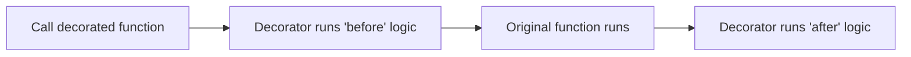

# Functional Constructs

---

## 1. Learning Objectives

By the end of this unit, you will be able to:

✓ Write a `lambda` function and use it as a sort key.  
✓ Explain what a higher-order function is, using `map()`, `filter()`, and `sorted(key=...)` as examples.  
✓ Read and write a simple decorator using `@` syntax.  
✓ Write a generator using `yield` and explain how it differs from a normal function.

---

## 2. Overview

The functions you wrote in the last unit are named and defined once,
ahead of time. Python also supports a more flexible style, built around
**functional constructs** — small, throwaway functions, functions that
take other functions as input, and functions that pause and resume
instead of running start to finish in one go.

Think of a lambda function the way you use a sticky note versus a
printed form. A printed form (a regular function) is worth creating when
you will reuse it many times. A sticky note (a lambda) is for a single,
quick, disposable use — you write it, use it once in place, and it is
gone. Both serve a purpose; the choice depends on whether you need it
again.

This unit covers lambda functions, higher-order functions like `map()`
and `filter()`, a light introduction to decorators, and generators —
functions that produce values one at a time using `yield`.

Every AI/ML pipeline leans heavily on these patterns — sorting model
results by confidence score, filtering out invalid data rows, and
streaming large datasets one record at a time instead of loading
everything into memory at once.

---

## 3. Description

### 3.1 Lambda (Anonymous) Functions

- **Syntax.** A `lambda` is a small, unnamed function written in a
  single line:

```python
square = lambda x: x * x
print(square(6))
```

**Output:**
```
36
```

- **Use as a sort key.** Lambdas are most often used inline, as a
  throwaway function passed straight into another function:

```python
students = [("Priya", 92), ("Rohan", 68), ("Arjun", 81)]

students.sort(key=lambda student: student[1])
print(students)
```

**Output:**
```
[('Rohan', 68), ('Arjun', 81), ('Priya', 92)]
```

The lambda tells `sort()` exactly which part of each tuple to sort
by — here, the marks (index `1`) — without needing a separately defined
function just for this one use.

### 3.2 Higher-Order Functions

A **higher-order function** is any function that takes another function
as an argument, or returns one.

- **`map()` (concept)** — applies a function to every item in a
  sequence:

```python
marks = [78, 85, 92]
percentages = list(map(lambda m: m / 100, marks))
print(percentages)
```

**Output:**
```
[0.78, 0.85, 0.92]
```

- **`filter()` (concept)** — keeps only the items for which a function
  returns `True`:

```python
marks = [35, 78, 42, 88, 39]
passing = list(filter(lambda m: m >= 40, marks))
print(passing)
```

**Output:**
```
[78, 42, 88]
```

- **`sorted(key=...)`** — the most commonly used higher-order function
  you will reach for, since it does not modify the original list:

```python
students = [("Priya", 92), ("Rohan", 68), ("Arjun", 81)]
ranked = sorted(students, key=lambda s: s[1], reverse=True)
print(ranked)
```

**Output:**
```
[('Priya', 92), ('Arjun', 81), ('Rohan', 68)]
```

### 3.3 Decorators (Light Introduction)

- **The `@decorator` syntax.** A decorator wraps a function to add
  behaviour before or after it runs, without changing the function's own
  code:



- **A `@timer` example.**

```python
import time

def timer(func):
    def wrapper():
        start = time.time()
        func()
        end = time.time()
        print("Took", round(end - start, 4), "seconds")
    return wrapper

@timer
def slow_greeting():
    time.sleep(1)
    print("Hello from AI Native Engineering!")

slow_greeting()
```

**Output:**
```
Hello from AI Native Engineering!
Took 1.0006 seconds
```

`@timer` is shorthand for `slow_greeting = timer(slow_greeting)` — the
original function still runs, but now it is wrapped with extra timing
logic on either side.

### 3.4 Generators

- **The `yield` keyword.** A generator function looks like a normal
  function, but uses `yield` instead of `return` — it produces one value
  at a time and pauses, instead of running to completion in one go:

```python
def countdown(n):
    while n > 0:
        yield n
        n -= 1

for number in countdown(3):
    print(number)
```

**Output:**
```
3
2
1
```

- **Lazy evaluation (concept).** A generator does not compute all its
  values upfront — each value is produced only when it is asked for.
  This matters for large datasets, where computing every value in
  advance would use far more memory than you need at any one moment.

---

## 4. Real-World Application

| **Where you see it** | **How Python is working behind the scenes** |
|---|---|
| **A leaderboard** on a coding practice platform (e.g. HackerRank) | `sorted(key=...)` ranks every participant by score, without a manually written sorting function. |
| **YouTube/Spotify** filtering out content you have already watched or heard | `filter()`-style logic removes already-seen items from your recommendations before display. |
| **A UPI app** logging how long a payment took to process | A decorator-style wrapper times the transaction function and logs the duration for monitoring. |
| **Streaming a large video file** without downloading it entirely first | A generator-style pattern produces the next chunk of data only when it is needed, instead of loading the whole file into memory. |
| **An internship platform** ranking listings by relevance to your profile | A higher-order function scores and sorts every internship listing using your profile as the sort key. |

---

## 5. Worked Example

**Scenario:** Your professor asks you to rank a list of students by
marks (highest first) and time how long the ranking takes to run, as
practice combining a lambda, `sorted()`, and a simple decorator.

**1. Open a Colab notebook** and create a new code cell.

**2. Define the timer decorator.**
```python
import time

def timer(func):
    def wrapper(*args):
        start = time.time()
        result = func(*args)
        end = time.time()
        print("Ranking took", round(end - start, 5), "seconds")
        return result
    return wrapper
```

**3. Write the ranking function, decorated with `@timer`.**
```python
@timer
def rank_students(students):
    return sorted(students, key=lambda s: s[1], reverse=True)
```

**4. Call it and check the output.**
```python
students = [("Priya", 92), ("Rohan", 68), ("Arjun", 81)]
print(rank_students(students))
```

**Output:**
```
Ranking took 0.00002 seconds
[('Priya', 92), ('Arjun', 81), ('Rohan', 68)]
```

*Common mistake: writing `key=student[1]` instead of `key=lambda
student: student[1]`. `sorted()` needs a function it can call for every
item, not the value from a single item — leaving out `lambda` causes a
`TypeError` immediately.*

---

## 6. Summary

- **Lambda functions** are short, unnamed functions, most useful as a
  throwaway argument to another function, such as a sort key.
- **Higher-order functions** (`map()`, `filter()`, `sorted(key=...)`)
  take a function as an argument to transform, filter, or order data.
- **Decorators** wrap a function with extra behaviour using `@syntax`,
  without changing the function's own code.
- **Generators** use `yield` to produce values one at a time, computing
  each one only when it is actually needed.

With these functional patterns in place, the next unit moves from
individual functions to organising code across files — modules,
packaging, and the professional tooling every Python project uses.

---

*© 2026 Revature · AI Native Engineering — Foundations · Unit 2.4 · Version 1.0*
