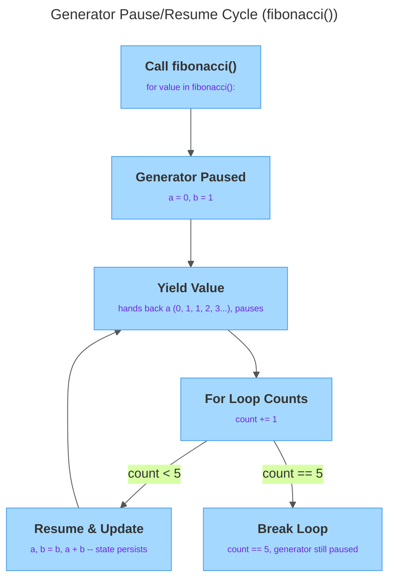

# Functional Constructs

---

## 1. Learning Objectives

By the end of this unit, you will be able to:

✓ Write a `lambda` expression and explain when it is preferable to a named `def` function.  
✓ Use a lambda as the `key` argument to `sorted()` to control how a list is ordered.  
✓ Explain what a higher-order function is and describe what `map()` and `filter()` do conceptually.  
✓ Write a simple decorator using the `@decorator` syntax, including a `@timer` that measures a function's run time.  
✓ Write a generator function using `yield` and explain lazy evaluation — why a generator does not compute all its values up front.

---

## 2. Overview

You have three everyday problems: order a list of words by length instead of alphabetically, time a slow function without littering it with `print(time.time())` calls, and produce a huge — maybe infinite — sequence of values without building the whole thing in memory first. Python solves all three with one small, reusable idea: a function is just a value, so you can pass it around, wrap one function around another, or have a function hand back its values one at a time instead of all at once.

This unit covers four constructs built on that idea — lambda expressions, higher-order functions like `sorted(key=...)`, decorators, and generators — and none of them need new syntax beyond what `def`, `return`, and `*args`/`**kwargs` from the functions unit were already preparing you for.

---

## 3. Description

### 3.1 Lambda (Anonymous) Functions

A **lambda** is a small, unnamed function written on a single line: `lambda parameters: expression` — no parentheses around the parameters, no `return`, and no name unless you choose to assign one.

```python
square = lambda n: n * n
square(5)          # 25
```

`square` behaves exactly like `def square(n): return n * n` — the expression after the colon is returned automatically. A lambda's real value is not naming it and calling it later; it is passing it, unnamed, directly into another function that expects a function as an argument. That is the pattern the rest of this unit builds on: `sorted(words, key=lambda w: len(w))` reads as "sort `words`, and for each one, use its length as the thing to compare."

A lambda can hold only a single expression — no loops, no multiple statements, no assignment. If the logic needs more than one line, write a regular `def` function instead and pass its name.

### 3.2 Higher-Order Functions: `map()`, `filter()`, `sorted(key=...)`

A **higher-order function** is a function that takes another function as an argument, returns one, or both — possible only because functions are values in Python, storable in a variable or a list and passable to another function exactly like a number or string.

Three higher-order functions matter here:

**`sorted(iterable, key=...)`** returns a new, sorted list. Without `key`, items are compared directly. With `key`, Python calls your function once per item and sorts by *that result* instead of the item itself:

```python
words = ["banana", "fig", "kiwi", "watermelon"]
sorted(words, key=lambda w: len(w))
# ['fig', 'kiwi', 'banana', 'watermelon']  -- shortest to longest
```

**`map(function, iterable)`** applies `function` to every item and hands back the transformed results, one per input:

```python
doubled = map(lambda n: n * 2, [1, 2, 3, 4])
list(doubled)        # [2, 4, 6, 8]
```

`map()` itself does not hand you a list — it hands you a `map` object that produces values as you ask for them. Wrapping it in `list(...)` forces it to produce everything right now. This "produce on demand" behavior is the same idea generators use below.

**`filter(function, iterable)`** keeps only the items where `function` returns a truthy value, and drops the rest:

```python
evens = filter(lambda n: n % 2 == 0, [1, 2, 3, 4])
list(evens)          # [2, 4]
```

`sorted(key=...)` is the one of these three you will reach for constantly — ordering results by score, by distance, by length, by any rule you can write as a one-line function. `map` and `filter` are worth recognizing when you read other people's code, but a list comprehension (a later unit) often reads more clearly for the same job. What matters now is the underlying concept: passing a small function into a built-in one to customize its behavior.

### 3.3 Decorators (Light Introduction)

A **decorator** is a function that takes another function and returns a new function that wraps extra behavior around it, without changing the original function's code. Writing `@my_decorator` directly above a `def` is shorthand for defining the function and then reassigning its name to `my_decorator(function)`.

```python
def shout(func):
    def wrapper(*args, **kwargs):
        result = func(*args, **kwargs)
        return result.upper()
    return wrapper

@shout
def greet(name):
    return f"hello, {name}"

greet("sam")   # "HELLO, SAM"
```

Three pieces make this work, all of them things you already have from the functions unit. `shout` accepts a function (`func`) and returns a function (`wrapper`). `wrapper`, defined *inside* `shout`, is what actually replaces `greet` — calling `greet("sam")` really calls `wrapper("sam")`, which calls the original `greet` internally and does something extra with its result. And `wrapper(*args, **kwargs)` uses the exact `*args`/`**kwargs` collecting pattern you already know, because a decorator has to work on *any* function, regardless of how many arguments it takes.

### 3.4 Generators: the `yield` Keyword and Lazy Evaluation

A **generator function** looks like an ordinary function, except its body contains at least one `yield` statement instead of (or alongside) `return`. Calling a generator function does not run its body immediately — it returns a **generator object**, and the body only starts running when you start pulling values out of it, most commonly with a `for` loop.

```python
def count_up_to(n):
    current = 1
    while current <= n:
        yield current
        current += 1

for value in count_up_to(5):
    print(value)
# 1 2 3 4 5
```

Each time execution reaches `yield`, the function hands out that value and *pauses* — everything about its state is frozen exactly where it stopped. When the `for` loop asks for the next value, the function wakes up right after the `yield` and keeps going until it hits `yield` again or the function ends. This is **lazy evaluation**: values are produced one at a time, only when requested, instead of an entire list being built and held in memory up front.

The classic worked example is a Fibonacci generator:

```python
def fibonacci():
    a, b = 0, 1
    while True:
        yield a
        a, b = b, a + b
```

`fibonacci()` never finishes on its own — the `while True` loop runs forever — but that is fine, because nothing forces it to produce every value at once. You just take as many as you need with a `for` loop, stopping yourself once you have enough:

```python
count = 0
for value in fibonacci():
    print(value)
    count += 1
    if count == 5:
        break
# 0 1 1 2 3
```

The diagram below traces exactly this cycle. Calling `fibonacci()` creates a paused generator object holding `a = 0, b = 1`. Each pass hands back the current value of `a` through `yield`, the `for` loop's counter advances, and — unless the count has reached 5 — the generator resumes, updates `a, b = b, a + b`, and loops back around to the next `yield`.



The `break` is what stops the loop, not the generator running out — an infinite generator never runs out on its own, so it is the caller's job to decide when enough values have been produced. Try writing this as a regular function that `return`s a list, and you hit a wall immediately: a function cannot `return` an infinite list, because it would have to finish building it first, and it never would. A generator sidesteps the problem entirely by never building the whole sequence — it only ever holds the next value to produce.

---

## 4. Real-World Application

`sorted(..., key=lambda ...)` is the pattern you will meet constantly with real data: ranking search results by relevance score, ordering log entries by timestamp, sorting a leaderboard by highest score first. The lambda is disposable — it exists for one call to `sorted()` and is never reused, which is exactly why it does not need a name.

Decorators show up anywhere the same wrapping behavior needs to apply to many different functions: timing slow operations to find performance bottlenecks, logging every call for debugging, or retrying a flaky operation automatically before giving up. `@timer` is the simplest member of that family — the same wrapper structure, with different logic inside `wrapper`, covers all of them.

Generators earn their keep whenever the full sequence would be wasteful or impossible to hold in memory at once: reading a huge file, streaming rows from a large dataset, or producing values from a sequence — like Fibonacci — that has no natural end. Lazy evaluation means the program only pays for the values it actually asks for.

---

## 5. Worked Example

**Goal:** Sort a list by a derived value, build and apply the canonical `@timer` decorator, then write a small generator of your own.

**1. Sort words by length, shortest to longest and back again.**

```python
words = ["python", "ai", "engineering", "loop", "yield"]
print(sorted(words, key=lambda w: len(w)))
print(sorted(words, key=lambda w: len(w), reverse=True))
```

Output:

```
['ai', 'loop', 'yield', 'python', 'engineering']
['engineering', 'python', 'yield', 'loop', 'ai']
```

**2. Build the `@timer` decorator, step by step.** Define an outer function (`timer`) that takes the function being decorated; inside it, define an inner `wrapper(*args, **kwargs)` so it can accept any call; have `wrapper` record a start time, call the original function, record an end time, report the elapsed time, and `return` the original result unchanged; have `timer` `return wrapper` itself, not call it.

```python
import time

def timer(func):
    def wrapper(*args, **kwargs):
        start = time.time()
        result = func(*args, **kwargs)
        end = time.time()
        print(f"{func.__name__} took {end - start:.4f} seconds")
        return result
    return wrapper
```

**3. Apply it to a deliberately slow function and confirm both the timing and the correct result show up.**

```python
@timer
def slow_add(a, b):
    total = 0
    for _ in range(10_000_000):
        total += 1
    return a + b

print(slow_add(2, 3))
```

Output:

```
slow_add took 0.3521 seconds
5
```

`slow_add` still returns `5` to its caller exactly as before — the decorator adds the timing message as a side effect without touching a single line inside `slow_add`.

**4. Write a small generator of your own — `countdown(n)` — and drive it with a `for` loop.**

```python
def countdown(n):
    while n > 0:
        yield n
        n -= 1

for value in countdown(3):
    print(value)
```

Output:

```
3
2
1
```

*Common mistake: writing a decorator's `wrapper` with just `(*args)`, or forgetting to `return result` at the end of `wrapper`. The first breaks the decorator the moment someone calls the decorated function with a keyword argument; the second silently discards whatever value the wrapped function was supposed to hand back, even though the timing or logging still appears to work.*

---

## 6. Summary

- A **lambda** is a single-expression, unnamed function — useful for a one-off argument to another function, not for logic that needs a name or more than one line.
- A **higher-order function** accepts or returns another function; `sorted(key=...)`, `map()`, and `filter()` are the built-in examples, and `sorted(key=...)` is the one you will use most.
- A **decorator** is a function that wraps another function and returns the wrapper; `@decorator` syntax is shorthand for `func = decorator(func)`, and a general-purpose wrapper needs `*args, **kwargs` to accept any function's signature.
- A **generator** function uses `yield` instead of `return` to produce values one at a time, pausing between each `yield` and resuming exactly where it left off.
- **Lazy evaluation** — producing values only when asked for them — is what lets a generator represent a sequence too large, or too infinite, to ever build as a complete list.

Next up: organizing code across files — modules, packaging, and the professional tooling every Python project uses.

---

*© 2026 Revature · AI Native Engineering — Foundations · Unit 2.4 · Version 1.0*
