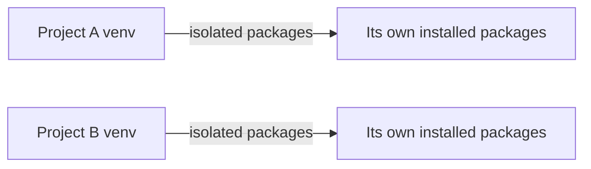

# Modules, Packaging & Professional Tooling

---

## 1. Learning Objectives

By the end of this unit, you will be able to:

✓ Import a module using `import`, `from ... import`, and `as`.  
✓ Use at least three modules from Python's standard library.  
✓ Explain what `pip` does and install a package with it.  
✓ Explain why a virtual environment (`venv`) is used on a real project.  
✓ Describe, at a concept level, what Poetry and Pytest are used for.

---

## 2. Overview

Every function you have written so far has lived in a single notebook.
Real projects are organised across many files, use code other people
have already written, and are tested before anyone trusts them. This
unit covers the professional habits that make that possible — modules,
package management, isolated environments, and testing.

Think of a virtual environment the way a hospital uses a separate,
sealed operating theatre for each procedure. Instruments are sterilised
and set up fresh each time so that nothing from a previous procedure
contaminates the next one. A Python virtual environment does the same
for your code — it keeps one project's packages completely separate
from another's, so installing something for one project can never
silently break a different one.

This unit covers modules and imports, the Python standard library,
installing packages with `pip`, working inside a virtual environment,
and a concept-level introduction to Poetry and Pytest — tools you will
use throughout the rest of this programme.

Every professional Python project — including the ones you will build
later in this course — depends on this exact tooling: organised modules,
managed dependencies, and a test suite that confirms the code still
works after every change.

---

## 3. Description

### 3.1 Modules and Imports

- **`import`** — brings an entire module into your code, accessed with a
  dot:

```python
import math
print(math.sqrt(81))
```

**Output:**
```
9.0
```

- **`from ... import`** — brings a specific name out of a module, so you
  can use it directly:

```python
from math import sqrt
print(sqrt(81))
```

**Output:**
```
9.0
```

- **`as`** — gives an imported module or name a different (usually
  shorter) alias:

```python
import math as m
print(m.sqrt(81))
```

**Output:**
```
9.0
```

- **Namespacing.** Using `import math` and calling `math.sqrt()` keeps
  the function clearly tied to where it came from — this avoids
  confusion when two different modules happen to define something with
  the same name.

### 3.2 The Python Standard Library

Python ships with a large collection of ready-to-use modules — no
installation required.

| **Module** | **What it is used for** |
|---|---|
| `random` | Generating random numbers, shuffling lists, picking a random item. |
| `math` | Mathematical functions — square roots, powers, trigonometry, constants like `pi`. |
| `datetime` | Working with dates and times — today's date, calculating a difference between two dates. |

```python
import random
import datetime

print(random.choice(["Rohan", "Priya", "Arjun"]))
print(datetime.date.today())
```

**Output:**
```
Priya
2026-07-17
```

### 3.3 Package Management with pip

- **Installing and using packages.** Beyond the standard library,
  thousands of community-built packages can be installed with `pip`,
  Python's package installer:

```python
!pip install requests
```

Once installed, a package is imported and used exactly like a standard
library module. Google Colab comes with many popular packages
(including `requests`) already installed, so this command is often
instant.

### 3.4 Virtual Environments (venv)

- **Why isolation matters (concept).** A virtual environment is an
  isolated copy of Python and its packages, created for one project at a
  time. Without it, installing a newer version of a package for one
  project could quietly break a different project that needed the older
  version.



- **Offline practice (concept).** On your own laptop, a virtual
  environment is created once per project and activated before you work
  in it. Google Colab does not need this step, since every notebook
  already runs in its own isolated cloud session — but you will use
  `venv` directly once you move to writing code outside Colab.

### 3.5 Poetry

- **`poetry new` to initialise a project (concept).** Poetry is a tool
  that manages a Python project's dependencies and packaging together,
  replacing several older, separate tools. Running `poetry new
  my_project` sets up a ready-to-use project structure, including a file
  that records exactly which packages (and versions) the project
  depends on.

### 3.6 Pytest

- **Writing and running a first test (concept).** Pytest is the standard
  tool for writing automated tests — small scripts that check your code
  behaves correctly, without you having to check it by hand every time:

```python
def add(a, b):
    return a + b

def test_add():
    assert add(2, 3) == 5
```

Running `pytest` on a file like this automatically finds any function
starting with `test_` and checks whether its `assert` statements hold
true — if `add(2, 3)` ever stopped returning `5`, this test would fail
immediately and tell you exactly where.

---

## 4. Real-World Application

| **Where you see it** | **How Python is working behind the scenes** |
|---|---|
| **A weather app** showing today's forecast | Uses `datetime` to know the current date and time before fetching the right day's forecast. |
| **A shuffle feature** on Spotify | Uses `random` to reorder your playlist so it does not play in the same order every time. |
| **Any professional Python project on GitHub** | Uses `pip`-installed packages and a virtual environment, so contributors can set up the exact same environment on their own laptop. |
| **A company's automated testing pipeline** | Runs Pytest automatically every time new code is pushed, blocking the change if any test fails. |
| **An AI chatbot's backend** | Imports multiple modules — one for handling requests, one for logging, one for talking to the AI model — each with a clear, separate responsibility. |

---

## 5. Worked Example

**Scenario:** Your professor asks you to write a small script that
picks a random student from your class for a surprise viva, logs the
date it was run, and includes a test confirming the picking logic
works correctly.

**1. Open a Colab notebook** and create a new code cell.

**2. Import the modules you need.**
```python
import random
import datetime
```

**3. Write the selection logic.**
```python
students = ["Priya", "Rohan", "Arjun", "Meera"]
chosen = random.choice(students)
today = datetime.date.today()

print(f"Viva selected for {today}: {chosen}")
```

**4. Run the cell and check the output.**
```
Viva selected for 2026-07-17: Rohan
```

**5. Add a simple Pytest-style check** confirming the function only ever
picks a name that is actually in the list:

```python
def pick_student(names):
    return random.choice(names)

def test_pick_student():
    students = ["Priya", "Rohan", "Arjun", "Meera"]
    assert pick_student(students) in students

test_pick_student()
print("Test passed — no error means the assertion held.")
```

**Output:**
```
Test passed — no error means the assertion held.
```

*Common mistake: installing a package with `pip install` directly on a
shared laptop or server without a virtual environment. This can silently
upgrade or downgrade a package that a different project on the same
machine depends on, breaking code that has nothing to do with your
current work.*

---

## 6. Summary

- **`import`, `from ... import`, and `as`** bring code from a module
  into your program, with `as` giving it a shorter alias.
- **The standard library** (`random`, `math`, `datetime`, and many more)
  ships with Python, ready to use without installing anything.
- **`pip`** installs community-built packages beyond the standard
  library.
- **Virtual environments** isolate one project's packages from another's,
  preventing one project's dependencies from silently breaking a
  different one.
- **Poetry** manages a project's dependencies and structure; **Pytest**
  automatically checks that your code still behaves correctly.

This closes Part A's core Python teaching. The next module moves from
individual values into the data structures — lists, tuples, sets, and
dictionaries — every later AI lab in this programme relies on.

---

*© 2026 Revature · AI Native Engineering — Foundations · Unit 2.5 · Version 1.0*
