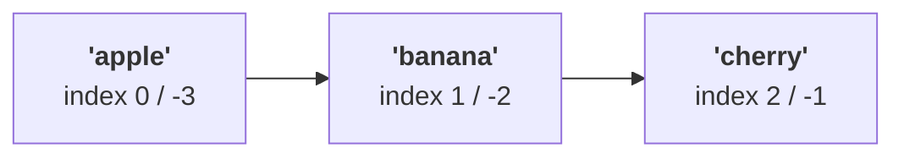

# Lists

---

## 1. Learning Objectives

By the end of this unit, you will be able to:

✓ Create a list literal and access any element using positive and negative indexing.  
✓ Slice a list with a start, stop, and step — including the `[::2]` and `[::-1]` idioms.  
✓ Explain what mutability means and modify a list in place.  
✓ Apply the core list methods (`append`, `insert`, `remove`, `pop`, `extend`, `index`, `count`, `clear`) to the right task.  
✓ Iterate over a list with a `for`-loop, and sort it with `sort()` versus `sorted()`, using the `reverse` and `key=` arguments.  
✓ Build a nested list and write a list comprehension that maps and/or filters in a single expression.

---

## 2. Overview

Almost every real program juggles *collections* of things, not single values: a shopping cart of items, the scores in a game, the rows returned from a query. A **list** is Python's everyday container for holding many values in order, in a single variable. Lists are the workhorse of the language — ordered, able to hold anything, and, crucially, changeable after you create them, a property called **mutability**.

Master lists and you can store a batch of values, reach into it by position, carve out sub-sections, grow and shrink it, sort it, and transform it into a new list with one compact line.

---

## 3. Description

### 3.1 Creating a List

A list is written as a comma-separated sequence of values inside **square brackets** `[ ]`. It is a single value of type `list` that happens to contain other values — the elements — and it keeps them in the order you wrote them, an order that does not shuffle on its own:

```python
fruits = ["apple", "banana", "cherry"]
numbers = [10, 20, 30, 40, 50]
mixed = ["Bob", 42, True, 3.14]   # items can be of different types
empty = []                         # a list with no items

print(type(fruits))   # <class 'list'>
print(len(fruits))    # 3  — len() gives the number of items
```

### 3.2 Indexing — Positive and Negative

Each element has a numbered position called its **index**. Python indexes from **zero** — the first element is at index `0`, the second at `1`, and so on — and you reach an element with the list name followed by the index in square brackets. Python also supports **negative indexing**, which counts from the *end*: `-1` is the last element, `-2` the second-to-last, saving you from computing `len(list) - 1` every time.

The diagram below shows both numbering schemes over the same three slots — positive indices running left to right, negative indices running right to left:



```python
fruits = ["apple", "banana", "cherry"]
print(fruits[0])   # apple  — first element
print(fruits[-1])  # cherry — last element
print(fruits[-3])  # apple  — same as fruits[0]
```

Asking for an index that does not exist (for example `fruits[3]` on a three-element list) raises an `IndexError`. Positive and negative indices point at the same physical slots from opposite directions — for a list of length `n`, index `0` and index `-n` are the same element.

### 3.3 Slicing with a Step

**Slicing** pulls out a *range* of elements and returns them as a **new list**. The syntax is `list[start:stop:step]`, where `start` is included, `stop` is excluded, and `step` is how far to jump each time. `start` defaults to `0`, `stop` to `len(list)`, so `a[:]` is a full copy:

```python
a = [0, 1, 2, 3, 4, 5, 6, 7, 8, 9]

print(a[1:5])     # [1, 2, 3, 4]     — 5 excluded
print(a[:3])      # [0, 1, 2]        — start defaults to 0
print(a[7:])      # [7, 8, 9]        — stop defaults to len(a)
print(a[::2])     # [0, 2, 4, 6, 8]  — every 2nd element
print(a[1:5:2])   # [1, 3]           — from 1 to 5, stepping by 2
print(a[::-1])    # [9, 8, ... 0]    — reversed copy
```

Two idioms are worth memorizing: `a[::2]` takes every second item, and `a[::-1]` produces a reversed copy of the list — a negative step walks backward. Because a slice always builds a *new* list, slicing never changes the original.

### 3.4 Mutability

Lists are **mutable** — you can change their contents after creation without making a new list. Assigning to an index replaces one element in place, and assigning to a slice replaces several at once:

```python
colors = ["red", "green", "blue"]
colors[1] = "yellow"              # ['red', 'yellow', 'blue']
colors[0:2] = ["black", "white"]  # ['black', 'white', 'blue']
```

Mutability has a consequence worth understanding early. A variable holding a list holds a *reference* to that list, not a private copy — so if two names point at the same list, a change through one is visible through the other:

```python
a = [1, 2, 3]
b = a            # b and a refer to the SAME list
b.append(4)
print(a)         # [1, 2, 3, 4]  — a changed too!
```

For an independent copy, slice it (`b = a[:]`) or call `a.copy()`. The takeaway: lists can be changed in place, and sharing a list means sharing its changes.

### 3.5 List Methods

Lists carry built-in **methods** — functions attached to the list, called with the dot syntax `list.method(...)`. The everyday eight fall into three groups.

**Methods that add elements:**

- `append(x)` — add `x` as a single new element at the end.
- `insert(i, x)` — insert `x` so it lands at index `i`, shifting later items right.
- `extend(iterable)` — add *each* item of another sequence to the end.

**Methods that remove elements:**

- `remove(x)` — delete the first element equal to `x` (raises `ValueError` if absent).
- `pop(i)` — remove and **return** the element at index `i`; with no argument, removes and returns the last element.
- `clear()` — remove every element, leaving `[]`.

**Methods that search and count:**

- `index(x)` — return the index of the first element equal to `x` (raises `ValueError` if absent).
- `count(x)` — return how many times `x` appears.

```python
nums = [1, 2, 3]
nums.append(4)        # [1, 2, 3, 4]
nums.insert(0, 99)    # [99, 1, 2, 3, 4]
nums.extend([5, 6])   # [99, 1, 2, 3, 4, 5, 6]
```

Note the difference between `append` and `extend`: `nums.append([5, 6])` adds the *list* `[5, 6]` as one nested element, whereas `extend` unpacks it into individual elements. All of `append`, `insert`, `extend`, `remove`, `pop`, and `clear` change the list *in place* and rely on mutability; `index` and `count` only read from it.

### 3.6 Looping Through a List

Because a list is ordered and iterable, a `for`-loop visits each element in turn. When you also need the position, pair the loop with `range(len(...))`; otherwise iterate directly for the values:

```python
fruits = ["apple", "banana", "cherry"]

for fruit in fruits:
    print(f"I like {fruit}")

for i in range(len(fruits)):
    print(f"{i}: {fruits[i]}")
```

Walking the items, testing each with a conditional, and accumulating a result is the most common thing you will do with a list — and the foundation the comprehension in §3.9 compresses into one line.

### 3.7 Sorting: `sort()` vs. `sorted()`

There are two ways to order a list, and the difference matters:

- **`list.sort()`** is a *method* that sorts the list **in place** and returns `None` — the original is rearranged.
- **`sorted(list)`** is a *built-in function* that returns a **new** sorted list and leaves the original untouched.

```python
nums = [3, 1, 2]
nums.sort()                 # nums is now [1, 2, 3]; sort() returns None

result = sorted([3, 1, 2])  # result == [1, 2, 3]; original unchanged
```

A common mistake is writing `nums = nums.sort()`, which assigns `None` to `nums` because `sort()` returns nothing. Use the method when you don't need the original order back, the function when you do.

Both accept the same two keyword arguments:

- **`reverse=True`** sorts from largest to smallest (descending).
- **`key=`** takes a function applied to each element to decide the sort order — the list is sorted by the *result* of that function, not the element itself.

```python
words = ["banana", "apple", "kiwi"]

print(sorted(words, reverse=True))  # ['kiwi', 'banana', 'apple']
print(sorted(words, key=len))       # ['kiwi', 'apple', 'banana'] — by length
```

The `key` function can be `len`, or any function you define with `def` that takes one element and returns a comparable value.

### 3.8 Nested Lists

A list element can itself be a list, giving you a **nested list** — a natural way to represent a grid, a table, or rows of data. The first index selects a row; the second reaches inside that row:

```python
grid = [[1, 2, 3], [4, 5, 6], [7, 8, 9]]

print(grid[0])       # [1, 2, 3]  — the first row (a list)
print(grid[0][2])    # 3          — row 0, then column 2

for row in grid:
    for value in row:
        print(value, end=" ")
    print()
```

Each inner list is a full-fledged list with all the methods and slicing you already know. To visit every cell, nest one loop inside another, exactly as above.

### 3.9 List Comprehension

A **list comprehension** builds a new list from an existing sequence in a single expression, replacing the "create an empty list, loop, append" pattern with one line. Read `[expression for item in iterable]` left to right: "the expression, for each item in the iterable." The part before `for` is what each new element becomes. A comprehension can map, filter, or do both:

- **Map** — transform every item: `[n * n for n in range(5)]` gives `[0, 1, 4, 9, 16]`.
- **Filter** — add an `if` clause to keep only items that pass a condition: `[n for n in range(10) if n % 2 == 0]` gives `[0, 2, 4, 6, 8]`.
- **Both at once** — transform *and* select: `[n * 2 for n in nums if n % 2 == 0]` gives `[4, 8, 12]`.

Comprehensions are idiomatic Python — shorter, faster to read once you know the pattern, and they always return a fresh list without touching the source.

---

## 4. Real-World Application

**Accumulating results.** Start with `results = []`, loop over some input, and `append` each computed value — the pattern behind reports, parsed files, and API responses.

**Ranking and top-N.** `sorted(scores, reverse=True)[:3]` composes sorting and slicing in one line to pull out the top three, without ever building a separate leaderboard structure.

**A stack.** `append` to push and `pop()` to remove the most recent item gives you a last-in-first-out stack with no extra machinery — the same two methods you already know, used for a new purpose.

---

## 5. Worked Example

**Goal:** Work through the core list operations end to end on a week of temperature readings, then deliberately trigger the mutability/aliasing bug so you recognize it later.

**1. Index into the list, positive and negative, and take a step slice.**

```python
temps = [68, 71, 65, 74, 69, 72, 66]

print(temps[0])     # 68  — first reading
print(temps[-1])    # 66  — last reading
print(temps[::2])   # [68, 65, 69, 66]  — every other day
```

**2. Grow the list, then find the three warmest days.**

```python
temps.append(70)
print(sorted(temps, reverse=True)[:3])  # [74, 72, 71]
```

`sorted(..., reverse=True)` ranks the readings highest first without disturbing `temps`; `[:3]` then slices off just the top three.

**3. Filter and map with comprehensions.**

```python
warm = [t for t in temps if t > 70]              # [71, 74, 72]
labels = [f"Day reading: {t}F" for t in temps]   # one label per reading
print(warm)
print(labels)
```

Output:

```
[71, 74, 72]
['Day reading: 68F', 'Day reading: 71F', 'Day reading: 65F', 'Day reading: 74F', 'Day reading: 69F', 'Day reading: 72F', 'Day reading: 66F', 'Day reading: 70F']
```

**4. Now trigger the aliasing bug on purpose.** Suppose you want to try a "what if a bonus reading is added" experiment, so you grab what looks like a safe copy:

```python
trial = temps          # looks like a copy — it is NOT
trial.append(100)

print("Trial:", trial)
print("Original:", temps)   # temps changed too!
```

Output:

```
Trial: [68, 71, 65, 74, 69, 72, 66, 70, 100]
Original: [68, 71, 65, 74, 69, 72, 66, 70, 100]
```

**5. Fix it with an actual copy.**

```python
trial = temps.copy()
trial.append(100)

print("Trial:", trial)
print("Original:", temps)   # unaffected this time
```

*Common mistake: assuming `new_list = old_list` makes a copy. It doesn't — it makes a second name for the same list. Use `.copy()` or a full slice (`old_list[:]`) whenever you need an independent list.*

---

## 6. Summary

- A **list** is an ordered, mutable collection written with `[ ]`; elements are reached by index, with `0` as the first and `-1` as the last.
- **Slicing** (`a[start:stop:step]`) returns a *new* list; `a[::2]` takes every second item and `a[::-1]` reverses.
- In-place methods (`append`, `insert`, `extend`, `remove`, `pop`, `clear`) change the list itself and return `None`, while `sorted()` and slices produce new lists.
- **`sort()` reorders in place; `sorted()` returns a new sorted list** — both accept `reverse=` and `key=`.
- A **list comprehension** maps and/or filters in one expression, replacing the empty-list-loop-`append` pattern; a **nested list** models two-dimensional data.

Next up: tuples — a collection that looks similar to a list but makes the opposite trade-off: no mutability, in exchange for a guarantee that its contents can never change out from under you.

---

*© 2026 Revature · AI Native Engineering — Foundations · Unit 3.1 · Version 1.0*
