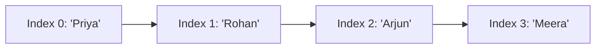

# Lists

---

## 1. Learning Objectives

By the end of this unit, you will be able to:

✓ Create a list and access its elements using positive and negative indices.  
✓ Slice a list, including slicing with a step, to extract part of it.  
✓ Explain mutability and update a list's contents in place.  
✓ Use built-in list methods to add, remove, and search for elements.  
✓ Sort a list using `sort()` and `sorted()`, including custom order.  
✓ Build nested lists and write a list comprehension.

---

## 2. Overview

So far you have stored one value at a time in one variable — a single mark, a single name. Real problems rarely work that way. A professor doesn't have one student's marks to process; they have an entire class's. Python's **list** is the tool for exactly this: an ordered collection of values held under a single variable name.

Think of a list like the row of numbered lockers in a hostel corridor. Locker 0, locker 1, locker 2, and so on — each position has a fixed number, called an **index**, and you can open any locker directly by its number, put something new in it, remove what's there, or add a new locker at the end of the row.

This unit covers creating and indexing a list, slicing out part of it, modifying it in place, the built-in methods every list supports, sorting, nesting lists inside each other, and writing a list comprehension.

Lists are the data structure you will reach for constantly in Part B — a batch of prompts sent to an AI model, a set of scores returned by it, a list of records read from a file. Getting comfortable here pays off immediately.

---

## 3. Description

### 3.1 Creating and Indexing a List

A list is written as comma-separated values inside square brackets `[ ]`. Each element has a position, starting at index `0`.



```python
students = ["Priya", "Rohan", "Arjun", "Meera"]

print(students[0])
print(students[2])
```

Output:

```
Priya
Arjun
```

**Negative indexing** counts backwards from the end — `-1` is always the last element, `-2` the second-last, and so on.

```python
print(students[-1])
```

Output:

```
Meera
```

### 3.2 Slicing with a Step

A **slice** extracts a sub-list using `list[start:stop:step]`. `start` is included, `stop` is excluded.

```python
print(students[1:3])
print(students[::2])
print(students[::-1])
```

Output:

```
['Rohan', 'Arjun']
['Priya', 'Arjun']
['Meera', 'Arjun', 'Rohan', 'Priya']
```

`students[::2]` takes every second element; `students[::-1]` reverses the entire list.

### 3.3 Updating Items and Mutability

Unlike a value such as a number or string, a list is **mutable** — you can change its contents without creating a new list.

```python
students[1] = "Kavya"
print(students)
```

Output:

```
['Priya', 'Kavya', 'Arjun', 'Meera']
```

This matters because if two variables point to the same list, changing it through one variable changes it for the other too — there is only one list in memory, being shared.

### 3.4 List Methods

| **Method** | **What it does** |
|---|---|
| `append(x)` | Adds `x` to the end of the list. |
| `insert(i, x)` | Inserts `x` at position `i`. |
| `remove(x)` | Removes the first occurrence of value `x`. |
| `pop(i)` | Removes and returns the item at index `i` (last item if `i` is omitted). |
| `extend(iterable)` | Adds every element of another list (or iterable) to the end. |
| `index(x)` | Returns the index of the first occurrence of `x`. |
| `count(x)` | Returns how many times `x` appears in the list. |
| `clear()` | Removes every element, leaving an empty list. |

```python
students.append("Sara")
students.remove("Arjun")
print(students)
```

Output:

```
['Priya', 'Kavya', 'Meera', 'Sara']
```

### 3.5 Looping Through a List

```python
for name in students:
    print("Student:", name)
```

Output:

```
Student: Priya
Student: Kavya
Student: Meera
Student: Sara
```

### 3.6 Sorting a List

`sort()` sorts a list **in place** (it changes the original list and returns nothing). `sorted()` returns a **new**, sorted list, leaving the original untouched.

```python
marks = [78, 45, 92, 60]

marks.sort()
print(marks)

print(sorted(marks, reverse=True))
```

Output:

```
[45, 60, 78, 92]
[92, 78, 60, 45]
```

The `key` argument controls what is compared — for example, `sorted(students, key=len)` sorts names by their length instead of alphabetically.

### 3.7 Nested Lists

A list can hold other lists as its elements — useful for representing a grid or a table of records.

```python
class_marks = [
    ["Priya", 78],
    ["Rohan", 65],
    ["Arjun", 90],
]

print(class_marks[2][0])
print(class_marks[2][1])
```

Output:

```
Arjun
90
```

### 3.8 List Comprehension

A **list comprehension** builds a new list in a single line, optionally filtering as it goes.

```python
squares = [n * n for n in range(1, 6)]
print(squares)

high_scorers = [name for name, mark in class_marks if mark >= 70]
print(high_scorers)
```

Output:

```
[1, 4, 9, 16, 25]
['Priya', 'Arjun']
```

---

## 4. Real-World Application

| **Where you see it** | **How Python is working behind the scenes** |
|---|---|
| **Your college attendance app** showing a roll-number-ordered class list | The names are stored and displayed as a Python list, indexed exactly the way `students[0]`, `students[1]` work here. |
| **A cricket app's batting order** | The order in which players bat is an ordered list — the index of a player in the list is literally their batting position. |
| **Spotify's "Up Next" queue** | Songs waiting to play are held in an ordered, list-like structure — adding a song appends it to the end, the same as `append()`. |
| **Food delivery apps** showing your past orders | Your order history is fetched and displayed as a list, most recent order usually first. |
| **NPTEL's course dashboard** listing enrolled courses | The courses shown on your dashboard are rendered from a list fetched from the server. |

---

## 5. Worked Example

**Scenario:** Your lab instructor asks you to write a script that stores the marks of five students, prints the class average, and identifies the topper.

**1. Store the data.**
```python
students = ["Priya", "Rohan", "Arjun", "Meera", "Kavya"]
marks = [78, 65, 90, 55, 82]
```

**2. Loop through both lists together and print each student's mark.**
```python
for i in range(len(students)):
    print(students[i], "scored", marks[i])
```

Output:

```
Priya scored 78
Rohan scored 65
Arjun scored 90
Meera scored 55
Kavya scored 82
```

**3. Calculate the class average.**
```python
average = sum(marks) / len(marks)
print("Class average:", average)
```

Output:

```
Class average: 74.0
```

**4. Find the topper using the index of the maximum mark.**
```python
topper_index = marks.index(max(marks))
print("Topper:", students[topper_index])
```

Output:

```
Topper: Arjun
```

*Common mistake: assuming a list's last valid index is the same as its length. A list of 5 students has indices 0 to 4, not 1 to 5 — trying to access `students[5]` raises `IndexError: list index out of range`.*

---

## 6. Summary

- **Lists** are ordered, mutable collections written inside `[ ]`, indexed from `0`, with negative indices counting from the end.
- **Slicing** (`list[start:stop:step]`) extracts part of a list without changing the original.
- **Mutability** means a list can be changed in place — updating one reference to it updates every reference to the same list.
- **Built-in methods** like `append()`, `remove()`, and `pop()` cover almost every day-to-day list operation you will need.
- **`sort()` changes the list itself; `sorted()` returns a new one** — knowing the difference avoids a very common bug.
- **Nested lists and list comprehensions** let you represent tables of records and build filtered lists in a single, readable line.

The next unit introduces tuples — a close relative of the list that trades mutability for guaranteed safety.

---

*© 2026 Revature · AI Native Engineering — Foundations · Unit 3.1 · Version 1.0*
