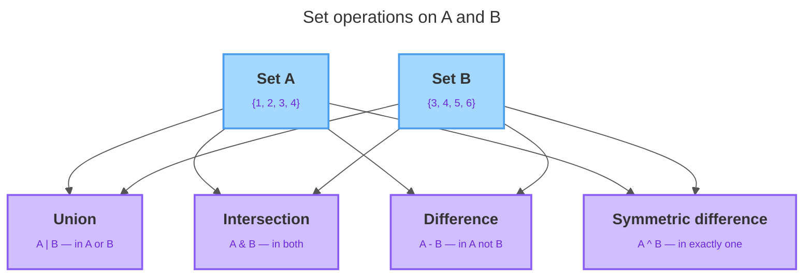

# Sets

---

## 1. Learning Objectives

By the end of this unit, you will be able to:

✓ Create a set from literals and from an iterable, and explain the uniqueness guarantee that removes duplicates automatically.  
✓ Choose a set over a list when the task is about uniqueness, membership testing, or overlap between collections.  
✓ Apply the four core set operations — union, intersection, difference, and symmetric difference — using both operator and method forms, and their in-place variants.  
✓ Compare two sets with the subset, superset, and disjoint relations.  
✓ Mutate a set safely with `add`, `remove`, and `discard`, and describe how `remove` and `discard` differ on a missing element.  
✓ Explain why set membership (`in`) is fast — roughly constant time via hashing — compared with scanning a list.  
✓ Use `frozenset` when you need an immutable set, and write a simple set comprehension.

---

## 2. Overview

You already have lists and tuples, and both keep every item you put in — duplicates and all — and both remember order. But a lot of real data work isn't about order at all; it's about *which distinct things are present* and *whether two collections overlap*: "Which unique tags did users apply?" "Which emails appear in both mailing lists?" A **set** is Python's built-in answer — think of it as "like a list, but unordered and with no duplicates." Reaching for a set instead of a hand-rolled list loop is exactly the kind of judgment that separates clean code from slow, brittle code.

This unit covers what a set actually is, creating one, the four operations for comparing two sets, mutating one safely, the subset/superset/disjoint relations, why membership checks stay fast at any size, `frozenset`, and set comprehensions.

---

## 3. Description

### 3.1 What a Set Is

A set is an **unordered collection of unique, immutable elements**. Three words carry the weight:

- **Unordered** — a set doesn't track position. There's no `my_set[0]`; indexing and slicing simply don't apply, and the print order can change between runs.
- **Unique** — a set never holds two equal elements. This is the *uniqueness guarantee*, and it's the whole point.
- **Immutable elements** — every item you store must itself be immutable (hashable). Numbers, strings, and tuples are fine. A list is not, because lists can change — try to put one in a set and Python raises `TypeError`. (The set *itself* is mutable — you can add and remove elements — but each element must be an unchangeable value.)

Placed against the structures you already know:

| | List | Tuple | Set |
|---|---|---|---|
| Ordered / indexable | yes | yes | **no** |
| Allows duplicates | yes | yes | **no** |
| Mutable container | yes | no | yes |
| Elements must be immutable | no | no | **yes** |
| Written with | `[ ]` | `( )` | `{ }` or `set()` |

Read the "no" column top to bottom and you have the definition of a set at a glance: it drops order and duplicates in exchange for the uniqueness guarantee and fast membership. Everything else — looping with `for`, testing with `in`, building with a comprehension — is deliberately the same as lists and tuples, so there's very little new syntax to absorb. The novelty is entirely in *what a set promises*, not in how you type it.

### 3.2 Creating Sets and the Uniqueness Guarantee

Write a set with curly braces around comma-separated values, or build one from any iterable with `set()`:

```python
colors = {"red", "green", "blue"}
digits = set([1, 2, 3, 2, 1])   # from a list
letters = set("hello")          # from a string
```

The uniqueness guarantee is enforced *at construction*. Duplicates collapse the moment the set is built — you don't ask for it, and there's no way to switch it off:

```python
digits = {1, 2, 3, 2, 1}
print(digits)
letters = set("hello")
print(letters)
```

Output:

```
{1, 2, 3}
{'h', 'e', 'l', 'o'}
```

Notice two things. First, `set("hello")` produced individual *characters*, not the whole word — `set()` iterates whatever you pass it. Second, the elements printed in an order that has nothing to do with how you typed them; never write code that depends on it.

This gives the single most common one-liner involving sets: **de-duplicate a list** by round-tripping it through a set — `unique_names = list(set(names))`. It removes duplicates but *discards order* in the process; if you need the original order preserved, this is the wrong tool.

One trap worth knowing now, before it costs you a debugging session: `{}` is an **empty dictionary**, not an empty set.

```python
empty_set = set()
looks_like_a_set = {}

print(type(empty_set))
print(type(looks_like_a_set))
```

Output:

```
<class 'set'>
<class 'dict'>
```

`{}` was claimed by dictionaries long before sets existed as a separate idea, so Python reads bare `{}` as an empty dictionary. To get an empty set, you must write `set()` explicitly.

### 3.3 Membership Testing

Because a set is built around uniqueness, its headline query is "is this element present?" — the same `in` operator you already use on lists and strings:

```python
colors = {"red", "green", "blue"}
print("red" in colors)
print("purple" not in colors)
```

Output:

```
True
True
```

You can also loop over a set with a `for` loop exactly as you would a list, remembering only that the order you visit elements in is never guaranteed.

### 3.4 The Four Set Operations — Operators and Methods

This is where sets earn their place. Each operation has two spellings: a **method** (which accepts any iterable) and an **operator** (which requires both sides to be sets). They mean the same thing — the operator form reads like math, the method form is handy when your other side happens to be a list.



Given `a = {1, 2, 3, 4}` and `b = {3, 4, 5, 6}`:

| Operation | Operator | Method | Meaning |
|---|---|---|---|
| Union | `a \| b` | `a.union(b)` | Everything in either set: `{1,2,3,4,5,6}` |
| Intersection | `a & b` | `a.intersection(b)` | Only what's in both: `{3, 4}` |
| Difference | `a - b` | `a.difference(b)` | In `a`, not in `b`: `{1, 2}` |
| Symmetric difference | `a ^ b` | `a.symmetric_difference(b)` | In exactly one: `{1, 2, 5, 6}` |

All four return a **new** set and leave the originals untouched, so you can chain them: `(a | b) - c`. The operator-versus-method choice is the one place the two spellings genuinely diverge: the **operator requires a set on both sides** (`a & [3, 4]` raises `TypeError`), while the **method iterates any iterable** (`a.intersection([3, 4])` works). Real data usually arrives as a list, so the method form lets you compare against it without a `set()` conversion first.

### 3.5 In-Place Update Forms

Each of the four operations also has an **in-place** form that modifies the left-hand set directly instead of building a new one:

| Builds a new set | Updates in place |
|---|---|
| `a \| b` | `a \|= b` (or `a.update(b)`) |
| `a & b` | `a &= b` (or `a.intersection_update(b)`) |
| `a - b` | `a -= b` (or `a.difference_update(b)`) |
| `a ^ b` | `a ^= b` (or `a.symmetric_difference_update(b)`) |

Reach for the in-place form when you're **accumulating into one set over time**: `all_seen |= batch` is clearer and cheaper than `all_seen = all_seen | batch`, because it avoids allocating a fresh set on every pass. Use the plain forms from §3.4 when you need to keep the original set intact.

### 3.6 Subset, Superset, and Disjoint Relations

Beyond combining sets, you often need to *compare* them: does one set sit entirely inside another?

```python
required = {"read", "write"}
user_has = {"read", "write", "delete"}

print(required <= user_has)          # True — every item on the left is also on the right
print(required.issubset(user_has))   # same check, spelled as a method
```

`<=` (or `issubset()`) asks "is everything on the left also on the right?" `>=` (or `issuperset()`) asks the mirror question. `<` and `>` add one more condition — the two sets must not be exactly equal — so a set is always a subset of itself, but never a *proper* subset of itself. One relation has no operator at all: `isdisjoint()` asks whether two sets share **nothing**.

```python
morning = {"asha", "rohan"}
evening = {"priya", "zara"}
print(morning.isdisjoint(evening))
```

Output:

```
True
```

### 3.7 Mutating a Set — `add`, `remove`, `discard`

```python
collector = {"red", "green"}
collector.add("blue")
collector.discard("pink")   # no-op, "pink" was never there

print(collector)
```

Output:

```
{'red', 'green', 'blue'}
```

`discard()` removes a value **if it's present**, and does nothing if it isn't. `remove()` does the same job but raises a `KeyError` if the value doesn't exist. Default to `discard()` unless a missing element would genuinely be a bug you want to hear about. Because `add()` silently ignores repeats, it's the natural fit for a "collect the distinct things I encounter" loop:

```python
seen = set()
for word in stream_of_words:
    seen.add(word)
```

### 3.8 `frozenset` — a Set That Can Never Change

A tuple is a list that can't be edited after creation. A **`frozenset`** is the same idea applied to sets: once built, it has no `add()`, no `discard()` — nothing that changes its contents.

```python
fs = frozenset({"gold", "silver"})
fs.add("bronze")
```

Output:

```
AttributeError: 'frozenset' object has no attribute 'add'
```

Because it can never change, a `frozenset` is hashable — which means it's allowed to live *inside* another set, something a plain `set` can't do:

```python
teams = set()
teams.add(frozenset({"ana", "ben"}))
teams.add(frozenset({"ben", "ana"}))   # same pair, unordered — collapses
teams.add(frozenset({"cara", "dan"}))
print(len(teams))
```

Output:

```
2
```

`frozenset({"ana","ben"})` and `frozenset({"ben","ana"})` are equal — sets ignore order — so the second `add` is a no-op. You couldn't do this with plain sets as elements at all; Python would raise `TypeError: unhashable type: 'set'`.

### 3.9 Why Set Membership Is Fast — Hashing

With a list, `x in my_list` means Python checks the first element, then the second, and so on until it finds a match or runs out — a linear scan that gets slower as the list grows.

A set avoids that scan entirely. It stores each element in a location computed from the element's **hash**, so `x in my_set` hashes `x`, jumps straight to that location, and checks only there — roughly constant time, no matter how large the set is. That's exactly why every element must be immutable: the hash has to stay stable while the element sits in the set.

```python
big_list = list(range(1_000_000))
big_set = set(range(1_000_000))

print(999_999 in big_list)   # correct, but may scan ~1,000,000 items
print(999_999 in big_set)    # correct, and effectively instant
```

Any time you test membership **repeatedly** — inside a loop, once per incoming record — converting a list to a set once, up front, is often the single biggest speed-up you can make.

### 3.10 Set Comprehensions

A set comprehension is a list comprehension with curly braces instead of square brackets — the result is unordered and de-duplicated:

```python
nums = [1, 2, 2, 3, 3, 3, 4]
evens = {x for x in nums if x % 2 == 0}
print(evens)
```

Output:

```
{2, 4}
```

It shines at **de-dup-while-transforming**, since the transform can map several different inputs to the same output and the set silently keeps just one:

```python
raw_names = ["Ana", "ANA", "ana", "Ben", "BEN"]
distinct = {name.lower() for name in raw_names}
print(distinct)
```

Output:

```
{'ana', 'ben'}
```

Five differently-cased inputs collapse to two distinct lowercase names — the transform and the de-duplication happen together.

---

## 4. Real-World Application

**De-duplication.** Log processing and import pipelines routinely funnel a messy list through `set()` to get the distinct values before doing anything else — `unique = set(rows)` replaces a hand-written duplicate-checking loop. When you must transform while de-duplicating (lower-casing emails, stripping whitespace), a set comprehension does both at once: `{e.strip().lower() for e in raw_emails}`.

**Fast "have I seen this already?" tracking.** Crawlers and cycle-detection code keep a `seen = set()` and check `if item in seen` before processing — fast even when `seen` grows to millions of entries, precisely because set membership doesn't slow down the way list membership does. If `seen` were a list, that check inside a loop would turn the whole job quadratic — this is the single most common reason a working program swaps a list for a set.

**Finding overlap and uniques between two collections.** Comparing "roles a user has" against "roles an action requires" is an intersection; "which required roles are missing" is a difference; "does the user have everything required?" is a subset check. Audience overlap between two mailing lists, or items in a new inventory but not the old one, are one- or two-line set operations rather than nested loops.

---

## 5. Worked Example

**Goal:** Find how two articles' tags relate, then catch a case-sensitivity bug that a naive set doesn't fix on its own.

**1. Compare two articles' tag sets.**

```python
tags_a = {"python", "data", "sets", "python"}   # duplicate collapses to one
tags_b = {"data", "sql", "sets"}

shared = tags_a & tags_b
only_a = tags_a - tags_b
all_tags = tags_a | tags_b
one_only = tags_a ^ tags_b

print("Shared:", shared)
print("Only in A:", only_a)
print("All tags:", all_tags)
print("In exactly one:", one_only)
```

Output:

```
Shared: {'data', 'sets'}
Only in A: {'python'}
All tags: {'python', 'data', 'sets', 'sql'}
In exactly one: {'python', 'sql'}
```

Four readable expressions replace four hand-written loops.

**2. Now deduplicate a messier list — raw signups from a form.**

```python
raw_names = ["Ana", "ANA", "ana", "Ben", "BEN"]
unique_names = set(raw_names)

print(unique_names)
print("Unique count:", len(unique_names))
```

Output:

```
{'Ana', 'ANA', 'ana', 'Ben', 'BEN'}
Unique count: 5
```

**3. Spot the bug.** There are really only **2** distinct names — Ana and Ben. A set compares values *exactly*, character by character, and `"A"` is not the same character as `"a"`. The set isn't wrong; it's doing precisely what you asked it to do.

**4. Fix it by normalizing before deduplicating.**

```python
unique_names = {name.lower() for name in raw_names}
print(unique_names)
print("Unique count:", len(unique_names))
```

Output:

```
{'ana', 'ben'}
Unique count: 2
```

*Common mistake: assuming a set will catch "obvious" duplicates on its own. A set only ever compares values exactly as they are — if two values should be treated as equal, it's your job to make them look identical (same case, same spacing) before they go in.*

---

## 6. Summary

- A **set** is an unordered collection of unique, immutable elements; the uniqueness guarantee removes duplicates automatically at construction.
- Sets are the right choice for **membership testing, de-duplication, and overlap** — not for ordered or position-based data.
- The four operations — **union (`|`), intersection (`&`), difference (`-`), symmetric difference (`^`)** — each have a method form that accepts any iterable, and an **in-place** variant (`|=`, `&=`, `-=`, `^=`) that mutates the left set.
- **Subset (`<=`), superset (`>=`), and `isdisjoint()`** compare two sets as wholes.
- **`discard()`** removes a value safely if present; **`remove()`** raises an error if it's missing.
- **Set membership (`in`) is roughly constant-time via hashing**, staying fast at any size, while list membership slows as the list grows.
- A **`frozenset`** is a set that can never be edited after creation — which is exactly what lets it live inside another set. A **set comprehension** is a list comprehension with `{ }`.

Up next: dictionaries — a structure that pairs every value with its own key, instead of just a position or a bare presence check.

---

*© 2026 Revature · AI Native Engineering — Foundations · Unit 3.3 · Version 1.0*
