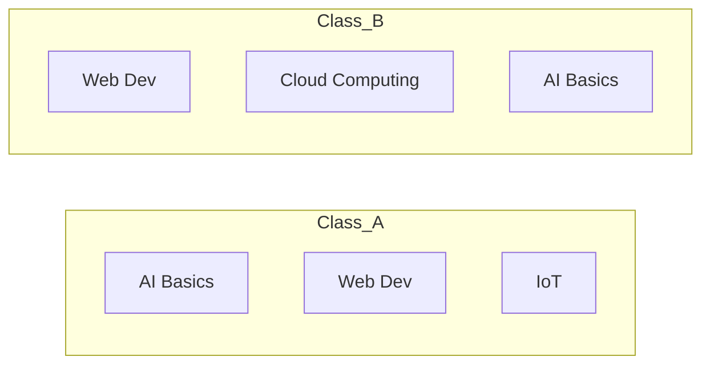

# Sets

---

## 1. Learning Objectives

By the end of this unit, you will be able to:

✓ Create a set and explain the uniqueness guarantee it enforces.  
✓ Perform union, intersection, difference, and symmetric difference on two sets.  
✓ Add, remove, and safely discard elements from a set.  
✓ Write a simple set comprehension.  
✓ Identify situations where a set is the right structure instead of a list.

---

## 2. Overview

Imagine your class's list of registered elective subjects — if ten students each pick the same three electives, you don't want a list with duplicate subject names, you want the **distinct** set of electives being offered. Python's **set** exists for exactly this: an unordered collection that automatically removes duplicates and never allows them back in.

Think of a set like the unique roll numbers admitted into an examination hall — no roll number can appear twice on the hall's admitted list, no matter how many times it is submitted for entry. Order doesn't matter here either; what matters is simply whether a roll number is in the set or not.

This unit covers creating sets, the four core set operations (union, intersection, difference, symmetric difference), adding and removing elements safely, and a brief look at set comprehensions.

Sets become genuinely useful the moment you need to compare two collections — common tags between two datasets, overlapping students between two elective lists, or unique words in a block of text — all problems you will meet again once you start working with real data in Part B.

---

## 3. Description

### 3.1 Creating a Set

A set is written with comma-separated values inside curly braces `{ }`. Duplicate values are automatically dropped.

```python
electives = {"AI Basics", "Web Dev", "AI Basics", "IoT"}
print(electives)
```

Output:

```
{'AI Basics', 'Web Dev', 'IoT'}
```

Notice `"AI Basics"` appears only once, even though it was written twice — this is the uniqueness guarantee a set enforces automatically.

### 3.2 Set Operations

Given two sets of electives chosen by two different classes:

```python
class_a = {"AI Basics", "Web Dev", "IoT"}
class_b = {"Web Dev", "Cloud Computing", "AI Basics"}
```



| **Operation** | **Syntax** | **Meaning** |
|---|---|---|
| Union | `class_a \| class_b` | All electives chosen by either class, no duplicates. |
| Intersection | `class_a & class_b` | Electives chosen by **both** classes. |
| Difference | `class_a - class_b` | Electives chosen by Class A but **not** Class B. |
| Symmetric difference | `class_a ^ class_b` | Electives chosen by exactly **one** of the two classes. |

```python
print(class_a | class_b)
print(class_a & class_b)
print(class_a - class_b)
print(class_a ^ class_b)
```

Output:

```
{'AI Basics', 'Web Dev', 'IoT', 'Cloud Computing'}
{'AI Basics', 'Web Dev'}
{'IoT'}
{'IoT', 'Cloud Computing'}
```

### 3.3 Membership and Mutation

```python
electives.add("Cybersecurity")
electives.discard("IoT")

print(electives)
print("Web Dev" in electives)
```

Output:

```
{'AI Basics', 'Web Dev', 'Cybersecurity'}
True
```

`discard()` removes an element **only if it exists**, without raising an error. `remove()` does the same, but raises a `KeyError` if the element is not present — prefer `discard()` when you are unsure whether the value is there.

### 3.4 Set Comprehension

```python
lengths = {len(subject) for subject in electives}
print(lengths)
```

Output:

```
{9, 7, 13}
```

---

## 4. Real-World Application

| **Where you see it** | **How Python is working behind the scenes** |
|---|---|
| **A college portal showing "students eligible for both scholarships"** | The portal computes an **intersection** of two sets — students in Scholarship A and students in Scholarship B. |
| **Instagram or LinkedIn showing "mutual connections"** | Mutual connections between two profiles are computed as the **intersection** of each person's set of connections. |
| **A plagiarism checker flagging repeated words** | Checking whether a word has already appeared relies on set membership, which Python can check almost instantly. |
| **An exam portal deduplicating a list of registered roll numbers** | If a roll number is submitted twice by mistake, converting the list to a set instantly removes the duplicate. |

---

## 5. Worked Example

**Scenario:** Your professor asks you to compare two classes' chosen electives and report which subjects are common to both, and which are unique to each class.

**1. Store each class's electives as a set.**
```python
class_a = {"AI Basics", "Web Dev", "IoT", "Cloud Computing"}
class_b = {"Web Dev", "Cloud Computing", "Cybersecurity"}
```

**2. Find the common electives.**
```python
common = class_a & class_b
print("Common electives:", common)
```

Output:

```
Common electives: {'Web Dev', 'Cloud Computing'}
```

**3. Find electives unique to Class A.**
```python
only_a = class_a - class_b
print("Only in Class A:", only_a)
```

Output:

```
Only in Class A: {'AI Basics', 'IoT'}
```

**4. Find electives that appear in exactly one class.**
```python
unique_to_one = class_a ^ class_b
print("Unique to one class:", unique_to_one)
```

Output:

```
Unique to one class: {'AI Basics', 'IoT', 'Cybersecurity'}
```

*Common mistake: expecting a set to preserve the order you added elements in. Sets are unordered — never rely on a set printing or iterating in insertion order; use a list if order matters.*

---

## 6. Summary

- **Sets** are unordered collections written inside `{ }` that automatically remove duplicate values.
- **Union (`|`), intersection (`&`), difference (`-`), and symmetric difference (`^`)** are the four core set operations for comparing two collections.
- **`discard()`** removes an element safely if present; **`remove()`** raises an error if the element is missing.
- **Set comprehensions** build a set in one line, using the same syntax pattern as a list comprehension but with `{ }`.
- **Choose a set** whenever uniqueness or fast membership checking matters more than order.

The next unit introduces dictionaries — a structure that pairs every value with its own key, instead of just a position.

---

*© 2026 Revature · AI Native Engineering — Foundations · Unit 3.3 · Version 1.0*
