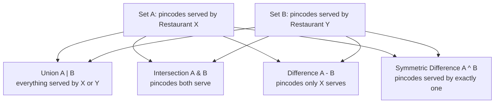

# Sets

---

## 1. Learning Objectives

By the end of this unit, you will be able to:

- **Explain** what a set is and why the uniqueness guarantee makes it different from a list or a tuple.
- **Create** sets using the literal `{}` syntax and the `set()` constructor, from both direct values and existing iterables.
- **Apply** the four core set operations — union, intersection, difference, and symmetric difference — using both operator and method forms.
- **Differentiate** a list from a set on duplicates, order, indexing, and membership-check speed, and choose the right one for a given task.
- **Implement** membership testing with `in` and safe mutation using `add()`, `remove()`, and `discard()`.
- **Debug** the most common set mistakes — confusing `{}` with an empty dictionary, assuming order is preserved, and trying to index a set.

---

## 2. Overview

By now you have worked with lists (Unit 3.1) and tuples (Unit 3.2). Both remember the order you put things in, and both happily store duplicates — a list of phone numbers can hold the same number three times if that's what got typed in. But a huge amount of real-world data work is not about order at all; it is about **which distinct values are present** and **whether two collections overlap**. Has this customer's phone number already been saved? Which pincodes does a food delivery app service? Which courses do two students have in common?

A **set** is Python's built-in answer to exactly this kind of question. Picture a set as a bag of unique items — you can drop things in, but the bag never lets a duplicate sit inside it, and it doesn't care in what order things went in.

In the Indian IT industry, sets show up constantly and quietly: a banking system removing duplicate transaction IDs during reconciliation, a UPI app checking a payer's VPA against a blacklist in a split second, an e-commerce recommendation engine comparing what two customers bought to find overlap, a college placement cell de-duplicating a messy Google Form export. Learning to reach for a set instead of writing a manual duplicate-checking loop is a small decision that consistently separates clean, fast code from slow, bug-prone code.

This unit covers creating sets, the four set operations, membership testing, safe mutation, and set comprehensions.

---

## 3. Description

### 3.1 Definition

A **set** is an unordered collection of unique, immutable elements. Three ideas sit inside that one sentence:

- **Unordered** — a set does not track position. There is no first element or last element in any reliable sense, so you cannot ask for `my_set[0]`.
- **Unique** — a set never stores two equal elements. If you try to add a value that is already present, nothing happens — the set silently stays the same. This is called the **uniqueness guarantee**.
- **Immutable elements** — every value stored inside a set must itself be a type that cannot change after creation, such as a number, a string, or a tuple. A list cannot be placed inside a set, because a list can change after creation.

You write a set using curly braces `{}` around comma-separated values, or by passing an iterable to the `set()` constructor:

```python
fruits = {"apple", "banana", "mango"}
```

### 3.2 Why This Concept Exists

Without a dedicated data structure for uniqueness, a programmer would have to write a manual check every single time duplicates mattered:

```python
unique_numbers = []
for number in [1, 2, 2, 3, 3, 3]:
    if number not in unique_numbers:
        unique_numbers.append(number)
```

This works, but it does two things badly. First, it is verbose for something conceptually simple — "keep only the distinct values." Second, `number not in unique_numbers` scans the whole list from the start every single time, so this loop gets slower and slower as the list grows.

A set exists to solve exactly this problem, in one line, without the slowdown:

```python
unique_numbers = set([1, 2, 2, 3, 3, 3])
```

**Membership testing** — asking "is this value present?" — is the other reason sets exist. Real systems ask this question constantly: "is this UPI ID blocked?", "has this OTP already been used?", "is this pincode serviceable?" A set answers such questions in roughly constant time, no matter how large it grows, because of how it is stored internally (covered in §3.11).

### 3.3 Key Terminology

| Term | Simple Meaning |
|---|---|
| **Set** | An unordered collection of unique, immutable elements, written with `{}` or built using `set()`. |
| **Uniqueness** | The guarantee that a set never contains two equal elements — duplicates are automatically dropped. |
| **Membership** | The question "is this value inside the collection?", tested with the `in` operator. |
| **Union** | A new set containing every element that appears in either of two sets (`\|` or `.union()`). |
| **Intersection** | A new set containing only the elements common to both sets (`&` or `.intersection()`). |
| **Difference** | A new set containing the elements in the first set that are **not** in the second (`-` or `.difference()`). |
| **Symmetric difference** | A new set containing the elements that are in exactly one of the two sets, but not both (`^` or `.symmetric_difference()`). |
| **Set comprehension** | A compact way to build a set from an iterable in one line, written as `{expression for item in iterable}`. |
| **Mutation** | Changing a set's contents after it has been created, using methods such as `add()`, `remove()`, or `discard()`. |
| **Hashable** | Describes a value whose contents never change, so Python can compute a stable "fingerprint" (a hash) for it — required for anything stored inside a set. |
| **`frozenset`** | An immutable version of a set — once built, it can never be changed. |

### 3.4 Syntax

| Syntax | What it does | Example |
|---|---|---|
| `{value1, value2, ...}` | Creates a set literal directly from listed values. | `{"red", "green", "blue"}` |
| `set(iterable)` | Builds a set from any iterable (list, tuple, string), keeping only the distinct elements. | `set([1, 2, 2, 3])` → `{1, 2, 3}` |
| `set()` | Creates an **empty set**. This is the only way to get an empty set — bare `{}` creates an empty dictionary instead. | `empty = set()` |
| `value in my_set` | Checks membership — returns `True` or `False`. | `"red" in fruits` |
| `a \| b` | **Union** — every element in `a` or `b` or both. | `{1,2} \| {2,3}` → `{1,2,3}` |
| `a & b` | **Intersection** — only elements in both `a` and `b`. | `{1,2} & {2,3}` → `{2}` |
| `a - b` | **Difference** — elements in `a` that are not in `b`. | `{1,2} - {2,3}` → `{1}` |
| `a ^ b` | **Symmetric difference** — elements in exactly one of `a`, `b`. | `{1,2} ^ {2,3}` → `{1,3}` |

### 3.5 Rules

- A set can only store **hashable (immutable)** values — numbers, strings, and tuples are allowed; a list or another set is not, and Python raises `TypeError: unhashable type` if you try.
- Duplicates are removed automatically **at creation time** — you never ask for de-duplication; it always happens.
- A set has **no index and no slicing** — `my_set[0]` raises `TypeError: 'set' object is not subscriptable`.
- The **printed order** of a set's elements is not guaranteed and may differ between runs — never write code that depends on it.
- Bare `{}` always creates an empty **dictionary**, never an empty set. Use `set()` for an empty set.
- The operator forms (`|`, `&`, `-`, `^`) require **both sides to be sets**; the method forms (`.union()`, `.intersection()`, and so on) accept **any iterable** on the right-hand side.

### 3.6 Best Practices

- Use a set whenever the task is about **uniqueness** or **overlap between collections**, not when order or position matters — use a list or tuple for those.
- Always write `set()` for an empty set; never rely on `{}` and assume it behaves like one.
- Prefer the **method form** (`a.intersection(some_list)`) when the other side of the comparison is a plain list — it saves you converting it to a set first.
- Convert a list to a set **once, up front** if you plan to test membership repeatedly inside a loop — this is usually the single biggest speed-up available for that kind of code.
- Use a **set comprehension** when you need to transform values while de-duplicating them in the same step, such as lower-casing emails before checking for duplicates.
- Reach for `frozenset` when you need a set-like value that must never change after creation, such as a fixed collection of allowed roles.

### 3.7 Common Mistakes

- **Confusing `{}` with an empty set.** `{}` is always an empty dictionary; `type({})` prints `<class 'dict'>`. Always use `set()` for an empty set.
- **Assuming a set preserves the order items were added in.** It does not — do not write code (or print statements you compare visually) that depends on set order.
- **Trying to index or slice a set** — `my_set[0]` or `my_set[1:3]` both fail with `TypeError`, because a set has no concept of position.
- **Believing a set will fix "obvious" duplicates on its own.** A set only compares values exactly as they are; `"Ana"` and `"ana"` are different strings and will both be kept unless you normalize the case yourself before adding them.
- **Trying to put a mutable value (like a list) inside a set** — this raises `TypeError: unhashable type: 'list'`, since a set can only hold immutable, hashable elements.
- **Using `remove()` on a value that might not exist.** This raises a `KeyError`. Use `discard()` when a missing value should simply be ignored.

### 3.8 Important Notes (Interview Insights)

- A common fresher interview question: *"Why are sets unordered and unindexed?"* A set is built on a **hash table**, the same idea a dictionary uses internally. Elements are stored at positions computed from their hash value, not in the order you typed them, so there is no meaningful "first" or "second" element to index — that is the trade-off a set makes in exchange for very fast membership testing.
- Another common question: *"When would you use a set instead of a list for de-duplication?"* Answer: whenever the collection is large or membership will be checked repeatedly. Removing duplicates via `list(set(data))` is a single readable line, and checking membership against a set stays fast (roughly constant time) even as the set grows, while checking membership against a list gets slower as the list grows, because Python has to scan it from the start each time.
- Be ready to state clearly: **a set trades order and duplicates for speed and uniqueness** — that trade-off is the entire reason the data structure exists.

### 3.9 Comparison Table: List vs Set

| Aspect | List | Set |
|---|---|---|
| Allows duplicates | Yes | **No** — duplicates are dropped automatically |
| Preserves insertion order | Yes | **No** — order is not guaranteed |
| Indexing / slicing | Yes (`my_list[0]`) | **No** — not subscriptable |
| Membership check (`in`) speed | Slower as the list grows (scans from the start) | **Fast** — roughly constant time via hashing |
| Written with | `[ ]` | `{ }` or `set()` |
| Typical use case | Ordered data, data with intentional repeats | Uniqueness, membership checks, overlap between collections |

### 3.10 Diagram: Set Operations



### 3.11 Membership Testing and Mutation

**Membership testing** uses the same `in` operator you already know from lists and strings:

```python
delivery_pincodes = {"560001", "560002", "560034"}
print("560001" in delivery_pincodes)
print("560099" in delivery_pincodes)
```

Output:

```
True
False
```

**Mutation** means changing a set's contents after it is created. Three methods handle this:

| Method | What it does | Behaviour on a missing/existing value |
|---|---|---|
| `add(value)` | Adds `value` to the set. | If `value` is already present, nothing changes — no error, no duplicate. |
| `remove(value)` | Removes `value` from the set. | Raises `KeyError` if `value` is not present. |
| `discard(value)` | Removes `value` from the set if present. | Does nothing if `value` is not present — no error. |

```python
cart_items = {"soap", "shampoo"}
cart_items.add("toothpaste")
cart_items.discard("shampoo")
cart_items.discard("perfume")   # not present, but no error

print(cart_items)
```

Output:

```
{'soap', 'toothpaste'}
```

Default to `discard()` unless a missing value would genuinely be a bug you want Python to flag with an error.

### 3.12 Set Comprehensions

A **set comprehension** builds a set in one line, using the same idea as a list comprehension but with curly braces instead of square brackets. The result is automatically unordered and de-duplicated:

```python
raw_marks = [78, 85, 78, 90, 85, 60]
passing_unique = {m for m in raw_marks if m >= 75}
print(passing_unique)
```

Output:

```
{90, 85, 78}
```

A set comprehension is especially useful when you need to **transform values while de-duplicating** them, since the transform can map several different inputs to the same output:

```python
raw_emails = ["Asha@Gmail.com", "asha@gmail.com", "Ravi@Yahoo.com"]
unique_emails = {email.lower() for email in raw_emails}
print(unique_emails)
```

Output:

```
{'asha@gmail.com', 'ravi@yahoo.com'}
```

Three inputs collapse to two distinct, normalized email addresses — the lower-casing and the de-duplication both happen in the same expression.

### 3.13 Code Examples

**Basic example** — creating a set and testing membership:

```python
fruits = {"apple", "banana", "mango"}
print(fruits)
print("banana" in fruits)
```

*Line-by-line explanation:*
- `fruits = {"apple", "banana", "mango"}` — creates a set literal with three distinct strings.
- `print(fruits)` — displays the set; the printed order may not match the order typed in.
- `"banana" in fruits` — checks membership and returns `True`, since `"banana"` is present.
- Output:
  ```
  {'apple', 'banana', 'mango'}
  True
  ```

**Beginner example** — de-duplicating a contact list of phone numbers, with mutation:

```python
raw_numbers = ["9876543210", "9123456789", "9876543210", "9988776655"]
unique_numbers = set(raw_numbers)

unique_numbers.add("9000011122")
unique_numbers.discard("9123456789")

print(unique_numbers)
print("Total distinct numbers:", len(unique_numbers))
```

*Line-by-line explanation:*
- `raw_numbers` is a list where `"9876543210"` was saved twice, perhaps because the same contact was added from two different apps.
- `set(raw_numbers)` builds a set from the list — the repeated number collapses to a single entry automatically.
- `unique_numbers.add(...)` inserts a new number; `unique_numbers.discard(...)` removes one safely, doing nothing if it were already absent.
- `len(unique_numbers)` counts how many distinct numbers remain.
- Output:
  ```
  {'9876543210', '9988776655', '9000011122'}
  Total distinct numbers: 3
  ```

**Practical example** — finding common and unique courses between two students:

```python
priya_courses = {"Python", "DBMS", "AI", "Networks"}
rohan_courses = {"DBMS", "AI", "Cloud Computing"}

common = priya_courses & rohan_courses
only_priya = priya_courses - rohan_courses
all_courses = priya_courses | rohan_courses
exactly_one = priya_courses ^ rohan_courses

print("Common courses:", common)
print("Only Priya:", only_priya)
print("All courses (combined):", all_courses)
print("Taken by exactly one student:", exactly_one)
```

*Line-by-line explanation:*
- `priya_courses` and `rohan_courses` are two sets representing each student's enrolled subjects.
- `priya_courses & rohan_courses` (**intersection**) keeps only the subjects both students share.
- `priya_courses - rohan_courses` (**difference**) keeps subjects Priya takes that Rohan does not.
- `priya_courses | rohan_courses` (**union**) combines both lists of subjects with no repeats.
- `priya_courses ^ rohan_courses` (**symmetric difference**) keeps subjects taken by only one of the two students.
- Output:
  ```
  Common courses: {'DBMS', 'AI'}
  Only Priya: {'Python', 'Networks'}
  All courses (combined): {'Python', 'DBMS', 'AI', 'Networks', 'Cloud Computing'}
  Taken by exactly one student: {'Python', 'Networks', 'Cloud Computing'}
  ```

**Industry-oriented example** — food delivery service-area comparison:

```python
zomato_style_pincodes = {"560001", "560002", "560034", "560045"}
swiggy_style_pincodes = {"560002", "560034", "560099"}

served_by_both = zomato_style_pincodes & swiggy_style_pincodes
served_by_either = zomato_style_pincodes | swiggy_style_pincodes
only_app_a = zomato_style_pincodes - swiggy_style_pincodes

incoming_orders = ["North Indian", "south indian", "North Indian", "Chinese", "chinese"]
distinct_cuisines = {cuisine.lower() for cuisine in incoming_orders}

check_pincode = "560034"
print("Serviceable by both apps:", check_pincode in served_by_both)
print("Common pincodes:", served_by_both)
print("Any app serves:", served_by_either)
print("Only App A serves:", only_app_a)
print("Distinct cuisines ordered:", distinct_cuisines)
```

*Line-by-line explanation:*
- Two sets model the delivery pincodes covered by two competing food delivery apps.
- `served_by_both` (**intersection**) finds the overlap — pincodes where a customer could choose either app.
- `served_by_either` (**union**) represents the full combined service area across both apps.
- `only_app_a` (**difference**) represents pincodes exclusive to the first app.
- `incoming_orders` is a raw list of cuisine tags with inconsistent capitalization and repeats, exactly as it might arrive from an order log.
- `distinct_cuisines` is a **set comprehension** that lower-cases every cuisine name while building the set, so `"North Indian"` and `"north indian"` collapse into a single entry.
- `check_pincode in served_by_both` is a fast membership test — this is the same operation a real backend would run thousands of times per second to decide whether both apps can serve a given address.
- Output:
  ```
  Serviceable by both apps: True
  Common pincodes: {'560002', '560034'}
  Any app serves: {'560001', '560002', '560034', '560045', '560099'}
  Only App A serves: {'560001', '560045'}
  Distinct cuisines ordered: {'north indian', 'south indian', 'chinese'}
  ```

---

## 4. Real-World Application

**Scenario: Two food delivery apps comparing where they can deliver**

Picture two competing food delivery apps — App A and App B — each maintaining a set of the pincodes they currently deliver to in a city:

```python
app_a_pincodes = {"560001", "560002", "560034", "560045"}
app_b_pincodes = {"560002", "560034", "560099"}
```

A customer opens both apps to see which one can deliver to their address, and behind the scenes, the backend of each app has to answer this instantly — for millions of customers a day. Every question a business analyst or engineer would ask here is answered by one of the set operations you just learned:

- **"Which pincodes does at least one app serve?"** → the **union**: `app_a_pincodes | app_b_pincodes`.
- **"Which pincodes do both apps serve?"** → the **intersection**: `app_a_pincodes & app_b_pincodes`.
- **"Which pincodes are exclusive to App A?"** → the **difference**: `app_a_pincodes - app_b_pincodes`.
- **"Can App A deliver to this specific customer's pincode?"** → a fast **membership test**: `"560034" in app_a_pincodes`.

That is the entire real-world application in one clear picture: two collections of unique values, compared instantly using the four set operations and membership testing — no manual loops, no duplicate-checking code. Once this one example is clear, you will recognize the exact same shape again and again in production systems: de-duplicating transaction IDs in a bank's reconciliation job, checking a UPI ID against a fraud blacklist, or comparing two students' course lists — all are this same food-delivery scenario wearing a different name.

---

## 5. Worked Example

### Problem Statement

A college Training and Placement Officer (TPO) collects registrations for two optional weekend workshops — "Python Basics" and "AI Fundamentals" — through two separate Google Forms. Some students submitted the same form twice by mistake, and names were typed with inconsistent capitalization (e.g., "Meera Iyer" and "meera iyer"). The TPO needs three things: a clean master list of every distinct student registered for at least one workshop, the students registered for **both** workshops, and the students registered **only** for Python Basics.

### Step 1: Understand the Problem

The raw data has two problems layered on top of each other: duplicate entries (the same student submitted twice) and case inconsistency (the same student typed with different capitalization counts as two "different" values unless normalized). Only after cleaning the data does it make sense to run set operations such as union, intersection, and difference on it.

### Step 2: Plan the Solution

First, normalize each raw list of names to a consistent case using a **set comprehension** — this de-duplicates and standardizes in one step. Then use **union** to build the master list of all distinct students, **intersection** to find students in both workshops, and **difference** to find students only in Python Basics.

### Step 3: Write the Python Code

```python
python_raw = ["Meera Iyer", "Arjun Rao", "meera iyer", "Divya Shah"]
ai_raw = ["Arjun Rao", "Divya Shah", "Kabir Singh", "arjun rao"]

python_students = {name.lower() for name in python_raw}
ai_students = {name.lower() for name in ai_raw}

master_list = python_students | ai_students
both_workshops = python_students & ai_students
only_python = python_students - ai_students

print("Master list:", master_list)
print("Registered for both:", both_workshops)
print("Only Python Basics:", only_python)
```

### Step 4: Explain Each Line

- `python_raw` and `ai_raw` are the two raw registration lists exactly as they would arrive from the Google Forms — containing repeats and mixed capitalization.
- `python_students = {name.lower() for name in python_raw}` is a **set comprehension**: it lower-cases every name and builds a set at the same time, so `"Meera Iyer"` and `"meera iyer"` collapse into one entry, `"meera iyer"`.
- `ai_students` is built the same way from the second list.
- `master_list = python_students | ai_students` is the **union** — every distinct student registered for at least one workshop.
- `both_workshops = python_students & ai_students` is the **intersection** — students present in both sets.
- `only_python = python_students - ai_students` is the **difference** — students in `python_students` who are not in `ai_students`.
- The three `print()` calls display the final, cleaned results.

### Step 5: Sample Input

```python
python_raw = ["Meera Iyer", "Arjun Rao", "meera iyer", "Divya Shah"]
ai_raw = ["Arjun Rao", "Divya Shah", "Kabir Singh", "arjun rao"]
```

### Step 6: Expected Output

```
Master list: {'meera iyer', 'arjun rao', 'divya shah', 'kabir singh'}
Registered for both: {'arjun rao', 'divya shah'}
Only Python Basics: {'meera iyer'}
```

### Step 7: Why the Output Is Produced

Lower-casing every name before building each set ensures that `"Meera Iyer"` and `"meera iyer"` are treated as the exact same value, so the set's uniqueness guarantee correctly merges them into one entry instead of counting them as two different students. Once both raw lists are cleaned into `python_students` and `ai_students`, the union combines every distinct name across both sets, the intersection keeps only names appearing in both sets ("arjun rao" and "divya shah" appear in both raw lists), and the difference keeps names present in `python_students` but absent from `ai_students` — which leaves only "meera iyer", since "arjun rao" and "divya shah" are removed because they also appear in `ai_students`.

---

## 6. Key Takeaways

- A **set** is an unordered collection of unique, immutable elements — duplicates are removed automatically at creation, and there is no indexing or slicing.
- Create a set with `{value1, value2}` or `set(iterable)`; always use `set()` for an **empty** set, since bare `{}` creates an empty dictionary instead.
- The four core operations are **union (`|`)**, **intersection (`&`)**, **difference (`-`)**, and **symmetric difference (`^`)** — each has a method form (`.union()`, `.intersection()`, `.difference()`, `.symmetric_difference()`) that accepts any iterable, not just another set.
- **Membership testing (`in`)** on a set is roughly constant-time via hashing, staying fast even as the set grows, while membership testing on a list gets slower as the list grows.
- Mutate a set safely with **`add()`** (insert), **`discard()`** (remove if present, no error otherwise), and **`remove()`** (remove, but raises `KeyError` if the value is missing).
- A **set comprehension** (`{expr for item in iterable}`) builds a set in one line and is especially useful for transforming values (like lower-casing) while de-duplicating them.
- A set only ever compares values exactly as they are — normalize data (same case, same spacing) yourself before relying on a set to catch "obvious" duplicates.
- Choose a **list** for ordered or position-based data with intentional duplicates; choose a **set** for uniqueness, fast membership checks, and comparing overlap between collections.

Coming next: Unit 3.4 — Dictionaries, a structure that pairs every value with its own key instead of just a position or a bare presence check.

---

## 7. Reference Links

- [Python 3 Documentation — Set Types: set, frozenset](https://docs.python.org/3/library/stdtypes.html#set-types-set-frozenset)
- [The Python Tutorial — Data Structures: Sets](https://docs.python.org/3/tutorial/datastructures.html#sets)
- [Real Python — Sets in Python](https://realpython.com/python-sets/)
- [W3Schools — Python Sets](https://www.w3schools.com/python/python_sets.asp)

---

*© 2026 Revature · AI Native Engineering — Foundations · Unit 3.3 · Version 2.0*
