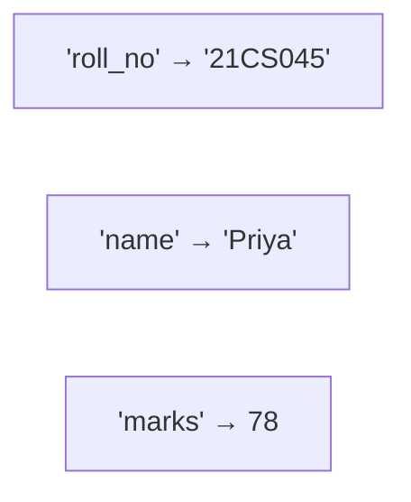

# Dictionaries

---

## 1. Learning Objectives

By the end of this unit, you will be able to:

✓ Create a dictionary and access, add, modify, and delete key-value pairs.  
✓ Loop through a dictionary's keys, values, and items.  
✓ Sort a dictionary's contents by key or by value.  
✓ Build and access nested dictionaries.  
✓ Use `get()` and `setdefault()` to avoid common lookup errors.  
✓ Write a dictionary comprehension, including inverting a dictionary.

---

## 2. Overview

A list and a tuple locate every value by its numbered position. But real records are usually looked up by name, not position — you don't ask for "the record at position 3," you ask for "Priya's marks." Python's **dictionary** stores data as **key-value pairs**, so every value is retrieved by a meaningful key instead of a numeric index.

Think of a dictionary like a college's student database indexed by roll number. You don't scan through every record to find a student — you look them up directly by their roll number, and the system returns their full record instantly. The roll number is the **key**; the student's record is the **value**.

This unit covers creating and accessing a dictionary, adding, modifying, and deleting entries, looping through it three different ways, sorting it, nesting dictionaries inside each other, two safety-focused built-in methods, and dictionary comprehensions.

Dictionaries are the structure you will use to represent almost every real record in Part B — a single API response from an AI model, a row of structured data, or a configuration of settings, are all naturally represented as key-value pairs.

---

## 3. Description

### 3.1 Creating and Accessing a Dictionary

A dictionary is written with `key: value` pairs inside curly braces `{ }`.



```python
student = {"roll_no": "21CS045", "name": "Priya", "marks": 78}

print(student["name"])
```

Output:

```
Priya
```

### 3.2 Adding, Modifying, and Deleting

```python
student["branch"] = "Computer Science"   # add a new key
student["marks"] = 82                    # modify an existing key
del student["roll_no"]                   # delete a key

print(student)
```

Output:

```
{'name': 'Priya', 'marks': 82, 'branch': 'Computer Science'}
```

`pop("marks")` also removes a key, but — unlike `del` — it returns the removed value at the same time.

### 3.3 Looping Through a Dictionary

```python
for key in student.keys():
    print(key)

for value in student.values():
    print(value)

for key, value in student.items():
    print(key, "->", value)
```

Output:

```
name
marks
branch
Priya
82
Computer Science
name -> Priya
marks -> 82
branch -> Computer Science
```

### 3.4 Sorting a Dictionary

Dictionaries themselves aren't sorted, but you can build a sorted **view** of one, by key or by value.

```python
marks = {"Rohan": 65, "Priya": 82, "Arjun": 90}

by_key = dict(sorted(marks.items()))
by_value = dict(sorted(marks.items(), key=lambda item: item[1], reverse=True))

print(by_key)
print(by_value)
```

Output:

```
{'Arjun': 90, 'Priya': 82, 'Rohan': 65}
{'Arjun': 90, 'Priya': 82, 'Rohan': 65}
```

### 3.5 Nested Dictionaries

```python
students = {
    "21CS045": {"name": "Priya", "marks": 82},
    "21CS046": {"name": "Rohan", "marks": 65},
}

print(students["21CS046"]["name"])
```

Output:

```
Rohan
```

### 3.6 Built-in Functions: get() and setdefault()

Looking up a missing key directly (`student["age"]`) raises a `KeyError`. `get()` avoids this by returning a default instead of crashing.

```python
print(student.get("age", "Not recorded"))

student.setdefault("age", 20)
print(student)
```

Output:

```
Not recorded
{'name': 'Priya', 'marks': 82, 'branch': 'Computer Science', 'age': 20}
```

`setdefault()` adds the key with the given default **only if it doesn't already exist** — it leaves an existing value untouched.

### 3.7 Dictionary Comprehension

```python
squares = {n: n * n for n in range(1, 5)}
print(squares)

inverted = {value: key for key, value in squares.items()}
print(inverted)
```

Output:

```
{1: 1, 2: 4, 3: 9, 4: 16}
{1: 1, 4: 2, 9: 3, 16: 4}
```

---

## 4. Real-World Application

| **Where you see it** | **How Python is working behind the scenes** |
|---|---|
| **A college portal looking up your result by roll number** | Your roll number is the key; your entire academic record is the value returned instantly. |
| **A UPI app showing your saved contacts** | Each contact name maps to a UPI ID — a classic key-value relationship stored and retrieved as a dictionary. |
| **ChatGPT's API response** to a prompt | The response returned to a developer is structured as key-value pairs — `{"role": ..., "content": ...}` — read directly as a Python dictionary. |
| **An e-commerce app's shopping cart** | Each product ID maps to its quantity in the cart — added, updated, or removed exactly like a dictionary entry. |

---

## 5. Worked Example

**Scenario:** Your professor asks you to build a small "student record" tool that stores several students by roll number and can look up, update, and report on any of them.

**1. Build the database as a nested dictionary.**
```python
database = {
    "21CS045": {"name": "Priya", "marks": 82},
    "21CS046": {"name": "Rohan", "marks": 65},
    "21CS047": {"name": "Arjun", "marks": 90},
}
```

**2. Look up a student safely, even if the roll number might not exist.**
```python
roll_no = "21CS046"
record = database.get(roll_no, "No such student")
print(record)
```

Output:

```
{'name': 'Rohan', 'marks': 65}
```

**3. Update a student's marks after a re-evaluation.**
```python
database["21CS046"]["marks"] = 70
print(database["21CS046"])
```

Output:

```
{'name': 'Rohan', 'marks': 70}
```

**4. Report every student sorted by marks, highest first.**
```python
ranked = sorted(database.items(), key=lambda item: item[1]["marks"], reverse=True)

for roll_no, info in ranked:
    print(roll_no, info["name"], info["marks"])
```

Output:

```
21CS047 Arjun 90
21CS045 Priya 82
21CS046 Rohan 70
```

*Common mistake: using `student["age"]` to check whether a key exists, and letting the program crash with a `KeyError` when it doesn't. Use `.get()` with a default value, or check `"age" in student` first, whenever a key might be missing.*

---

## 6. Summary

- **Dictionaries** store data as `key: value` pairs inside `{ }`, retrieved by key instead of position.
- **`.keys()`, `.values()`, and `.items()`** give you three different ways to loop through a dictionary's contents.
- **Sorting** a dictionary means building a sorted list of its items — dictionaries themselves have no built-in order to rearrange.
- **`get()` and `setdefault()`** prevent `KeyError` crashes when a key might not exist.
- **Nested dictionaries** represent structured records — a database of students, each with their own record inside.
- **Dictionary comprehensions** build (or invert) a dictionary in a single, readable line.

The next unit looks at iterators, generators, and the `collections` module — tools that work behind almost every loop you have written so far.

---

*© 2026 Revature · AI Native Engineering — Foundations · Unit 3.4 · Version 1.0*
