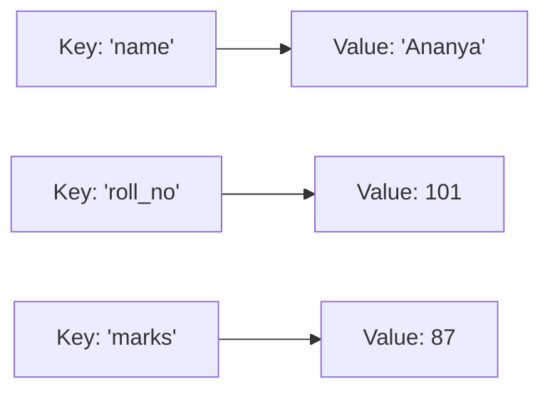
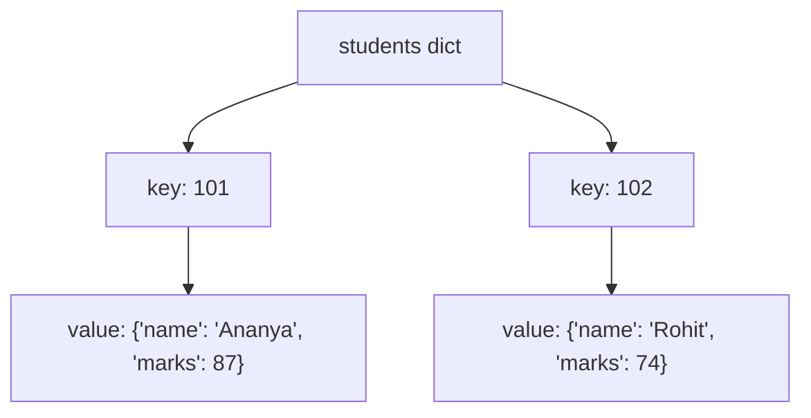

# Dictionaries

---

[← Previous: 3.3 Sets](unit-3-3-sets.md) | [Go back to TOC](../../README.md) | [Next: 3.5 Iterators, Generators & Collections →](unit-3-5-iterators-generators-collections.md)

## 1. Learning Objectives

By the end of this unit, you will be able to:

- **Explain** what a dictionary is, why every key must be unique and hashable, and how a dictionary differs from a list and a set.
- **Create** a dictionary using literals, the `dict()` constructor, and a list of pairs, and **access** a value safely using `[]` and `.get()`.
- **Implement** adding, modifying, and deleting key-value pairs using assignment, `del`, and `pop()`.
- **Apply** the three looping styles — `keys()`, `values()`, `items()` — and sort a dictionary's contents by key or by value.
- **Describe** how nested dictionaries model real records, and access a value that sits two or more levels deep.
- **Create** a dictionary comprehension to build a dictionary from an iterable, and to invert an existing one.

---

## 2. Overview

Every unit so far has taught you a way to store *values*. A list stores values in order. A set stores values without duplicates. But think about how data actually looks in the software you use every day — your bank statement, your UPI payment history, your college mark sheet, a food delivery order. None of these are just "a bunch of values." Each one is a set of **labelled** values: a name paired with a roll number, an amount paired with a transaction ID, a course paired with a grade. Neither a list nor a set captures that idea of "this label points to this value" — and that gap is exactly what a **dictionary** fills.

A dictionary is Python's built-in way to store **key-value pairs** — where each key acts like a label you use to fetch its value, instead of remembering a numeric position. This is the closest data structure you have met so far to a real database record or a row in a spreadsheet, and it is also, not coincidentally, the exact shape that data takes when it travels over the internet as **JSON** — the format almost every web API, mobile app backend, and cloud service in the Indian IT industry uses to exchange information. Whether you go on to build a banking backend, a UPI payment gateway, an e-commerce catalog, or an AI/ML pipeline, you will be reading and writing dictionaries constantly.

This unit covers creating and accessing a dictionary, adding, modifying, and deleting entries, looping through it three different ways, sorting it, nesting dictionaries inside each other, the built-in functions and methods that make dictionaries convenient, and dictionary comprehensions.

---

## 3. Description

### 3.1 Definition

A **dictionary** (type `dict`) is a **mutable collection of key-value pairs**, where each **key** is unique and is used to look up its associated **value** — the way a real dictionary maps a word to its meaning. Instead of asking "what is at position 2?" the way a list does, a dictionary lets you ask "what value belongs to this key?"

You write a dictionary using curly braces, with a colon separating each key from its value, and commas separating the pairs:

```python
student = {"name": "Ananya", "roll_no": 101, "marks": 87}
```

Here, `"name"`, `"roll_no"`, and `"marks"` are keys, and `"Ananya"`, `101`, and `87` are their corresponding values. Together, `"name": "Ananya"` is one **key-value pair**.

### 3.2 Why This Concept Exists

Imagine trying to store the same student record using two separate lists — one for field names and one for values:

```python
fields = ["name", "roll_no", "marks"]
values = ["Ananya", 101, 87]
```

To find the marks, you would have to first find the *position* of `"marks"` in `fields`, and then use that same position to look inside `values`. This works, but it is fragile: if the two lists ever get out of sync — one item added to one list but not the other — your data silently becomes wrong, and there is no built-in safeguard to stop that.

A dictionary solves this by storing the label and the value **together, as one unit**, so there is never any doubt about which value belongs to which key. This is why dictionaries are the natural choice for:

- **Records** — a student, a customer, a bank account — where each field has a name.
- **Lookup tables** — translating one thing into another, such as a state code into a state name.
- **Counting and grouping** — tallying how many times something occurred, keyed by the thing itself.

Because so much real-world data — user profiles, product catalogs, API responses — is naturally a set of named fields, the dictionary ends up being the single most-used non-trivial data structure in production Python code.

### 3.3 Key Terminology

| Term | Simple Meaning |
|---|---|
| **Dictionary** | A mutable, unordered-by-position collection of key-value pairs, written with `{}`; type `dict`. |
| **Key** | The unique label used to look up a value; must be an immutable (hashable) type such as `str`, `int`, or `tuple`. |
| **Value** | The data stored against a key; can be any type at all, including a list or another dictionary. |
| **Key-value pair** | One entry in a dictionary — a key and the value it points to, written `key: value`. |
| **Mapping** | The general term for a type that connects keys to values; `dict` is Python's built-in mapping type. |
| **`.keys()`** | Returns a view of all the keys in the dictionary. |
| **`.values()`** | Returns a view of all the values in the dictionary. |
| **`.items()`** | Returns a view of all key-value pairs, each as a `(key, value)` tuple. |
| **Nested dictionary** | A dictionary whose value is itself a dictionary — used to model records with sub-fields. |
| **Dict comprehension** | A one-line expression, `{key: value for item in iterable}`, that builds a dictionary. |
| **`KeyError`** | The error Python raises when you try to access a key that does not exist. |
| **`.get()`** | A method that reads a key's value, returning a default (instead of raising an error) if the key is missing. |
| **Hashable** | A property of a value that lets Python compute a fixed "fingerprint" for it, so it can be used as a dictionary key; immutable types are hashable, mutable ones (like `list`) are not. |

### 3.4 Syntax

```python
d = {key1: value1, key2: value2}   # dict literal
value = d[key]                     # access — raises KeyError if key is missing
value = d.get(key, default)        # safe access — returns default instead of raising
d[key] = value                     # add a new key, or modify an existing one
del d[key]                         # delete a key-value pair
```

| Part | What it is | Why it's there |
|---|---|---|
| `{key1: value1, key2: value2}` | A **dict literal** — curly braces holding comma-separated `key: value` pairs. | This is how you write a dictionary directly in code. |
| `d[key]` | **Bracket access** — the same brackets used for list indexing, but the "index" is now a key. | Retrieves the value tied to `key`; raises `KeyError` if `key` isn't in `d`. |
| `d.get(key, default)` | The **`.get()`** method. | Retrieves the value tied to `key`, or `default` (or `None` if you omit it) if the key is absent — never raises an error. |
| `d[key] = value` | **Assignment** into a dictionary. | If `key` is new, it is added; if `key` already exists, its value is overwritten. There is no separate "insert" syntax. |
| `del d[key]` | The **`del`** statement. | Removes a key and its value entirely; raises `KeyError` if the key does not exist. |

### 3.5 Rules

- **Keys must be unique.** A dictionary can never hold the same key twice; assigning to an existing key overwrites its value instead of creating a second entry.
- **Keys must be hashable (immutable).** Strings, numbers, and tuples are valid keys. A list or another dictionary **cannot** be a key, because a key's "fingerprint" must never change once it is stored — attempting it raises `TypeError: unhashable type`.
- **Values can be anything, and need not be unique.** A value can be a number, a string, a list, or even another dictionary — and two different keys are allowed to point to the same value.
- **A dictionary is mutable.** You can add, change, and remove key-value pairs after creation, without creating a new dictionary.
- **Since Python 3.7, a dictionary remembers insertion order** — looping over it visits keys in the order they were added, though a dictionary is still looked up *by key*, never by position.

### 3.6 Best Practices

- Use `.get(key, default)` instead of `d[key]` whenever the key *might* be missing — it avoids an unhandled `KeyError` crashing your program.
- Choose descriptive, consistent key names (`"roll_no"`, not sometimes `"roll_no"` and sometimes `"rollNumber"`) — a typo in a key name is one of the most common real-world dictionary bugs.
- Prefer `d.items()` over looping `d.keys()` and re-looking-up each value with `d[k]` — it is both cleaner and avoids a second lookup.
- When you need to change a dictionary's contents, do it in place with assignment or `del`, rather than rebuilding the whole dictionary from scratch, unless a comprehension genuinely makes the code clearer.
- Keep a dictionary's values consistent in shape where possible — for example, every student record having the same fields — so that code processing them doesn't need special cases.

### 3.7 Common Mistakes

- **Assuming a missing key returns `None` silently.** Direct bracket access `d[key]` on a missing key raises `KeyError` and stops the program; only `.get()` returns `None` (or your chosen default) quietly.
- **Forgetting `.get()` as a safer alternative.** New learners often write `if key in d: value = d[key]` when `value = d.get(key, default)` does the same job in one line and is far less error-prone.
- **Confusing keys and values while looping.** Writing `for x in d:` gives you the **keys**, not the values — a very common mix-up. If you print `x` expecting a value and see a key instead, this is almost always why.
- **Trying to use a mutable type as a key.** `d[[1, 2]] = "value"` raises `TypeError: unhashable type: 'list'` — lists cannot be keys because they can change after being stored.
- **Expecting `sorted(d)` to sort by value.** `sorted(d)` sorts the **keys**; sorting by value requires `sorted(d.items(), key=lambda kv: kv[1])`, covered in §3.12.

### 3.8 Comparison Table: List vs Set vs Dict

| Aspect | List | Set | Dict |
|---|---|---|---|
| Access by | position, `lst[i]` | membership only (`in`) | **key**, `d[key]` |
| Ordering | insertion order | unordered | insertion order (since Python 3.7) |
| Duplicates | allowed | never | no duplicate **keys** (values may repeat) |
| Written with | `[ ]` | `{ }` / `set()` | `{key: value}` |
| Typical use case | an ordered sequence of items | unique items, fast membership tests | labelled records, lookup tables, counting |

### 3.9 Diagram: Key-Value Mapping



Each key on the left points to exactly one value on the right — that arrow *is* the dictionary. Look up `"marks"` and you are handed `87` directly; there is no scanning involved.

### 3.10 Diagram: A Nested Dictionary



The outer dictionary's keys (`101`, `102`) are roll numbers; each value is itself a smaller dictionary holding that student's fields. Reaching `"Ananya"` needs two lookups chained together: `students[101]["name"]`.

### 3.11 Built-in Functions and Methods

| Function / Method | What it does |
|---|---|
| `len(d)` | Returns the number of key-value pairs in `d`. |
| `dict(pairs)` | Builds a dictionary from an iterable of `(key, value)` pairs, or from keyword arguments. |
| `d.keys()` | Returns a view of all keys. |
| `d.values()` | Returns a view of all values. |
| `d.items()` | Returns a view of all `(key, value)` pairs. |
| `d.get(key, default)` | Returns the value for `key`, or `default` if the key is absent — never raises `KeyError`. |
| `d.setdefault(key, default)` | Returns the value for `key` if it exists; otherwise inserts `key: default` and returns `default`. |
| `d.update(other)` | Adds all key-value pairs from `other` into `d`, overwriting any matching keys. |
| `d.pop(key, default)` | Removes `key` and returns its value; returns `default` (or raises `KeyError`) if the key is missing. |
| `d.popitem()` | Removes and returns the last-inserted key-value pair as a tuple. |
| `d.clear()` | Removes every key-value pair, leaving an empty dictionary. |
| `sorted(d)` / `sorted(d.items(), key=...)` | Returns a new, sorted **list** — of keys, or of pairs — without changing `d` itself. |

`keys()`, `values()`, and `items()` each return a **view object**, not a plain list — a view stays "live" and reflects later changes to the dictionary; wrap it in `list(...)` if you need an actual, independent list.

### 3.12 Code Examples

**Basic example** — creating a dictionary and accessing a value:

```python
capitals = {"India": "New Delhi", "Japan": "Tokyo"}
print(capitals["India"])
```

*Line-by-line explanation:*
- `capitals = {"India": "New Delhi", "Japan": "Tokyo"}` creates a dictionary with two keys, `"India"` and `"Japan"`, each mapped to its capital city.
- `print(capitals["India"])` looks up the key `"India"` using bracket access and prints its value.
- Output: `New Delhi`.

**Beginner example** — adding, modifying, deleting, and looping:

```python
stock = {"pens": 120, "notebooks": 45}
stock["erasers"] = 200          # add a new key
stock["pens"] = 100             # modify an existing key
del stock["notebooks"]          # delete a key

for item, count in stock.items():
    print(item, "->", count)
```

*Line-by-line explanation:*
- `stock = {"pens": 120, "notebooks": 45}` creates the starting dictionary with two items.
- `stock["erasers"] = 200` — `"erasers"` is a new key, so this **adds** a third entry.
- `stock["pens"] = 100` — `"pens"` already exists, so this **overwrites** its old value of `120` with `100`.
- `del stock["notebooks"]` removes the `"notebooks"` key and its value completely.
- `for item, count in stock.items():` loops over every remaining key-value pair, unpacking each `(key, value)` tuple into `item` and `count` in one step.
- Output:
  ```
  pens -> 100
  erasers -> 200
  ```

**Practical example** — a nested student record, sorted by marks, accessed safely with `.get()`:

```python
students = {
    101: {"name": "Ananya", "marks": 87},
    102: {"name": "Rohit", "marks": 74},
    103: {"name": "Meera", "marks": 91},
}

for roll_no, record in sorted(students.items(), key=lambda kv: kv[1]["marks"], reverse=True):
    attendance = record.get("attendance", "not recorded")
    print(roll_no, record["name"], record["marks"], attendance)
```

*Line-by-line explanation:*
- `students = {...}` is a **nested dictionary**: the outer keys are roll numbers, and each value is itself a dictionary of that student's `name` and `marks`.
- `sorted(students.items(), key=lambda kv: kv[1]["marks"], reverse=True)` takes every `(roll_no, record)` pair from `.items()`, and sorts them by `kv[1]["marks"]` — the marks inside each nested record — from highest to lowest.
- `for roll_no, record in ...:` unpacks each sorted pair, giving `roll_no` (an `int`) and `record` (the inner dictionary) on every iteration.
- `record.get("attendance", "not recorded")` reads an `"attendance"` field that was never actually added to any record — instead of raising `KeyError`, `.get()` safely falls back to `"not recorded"`.
- Output:
  ```
  103 Meera 91 not recorded
  101 Ananya 87 not recorded
  102 Rohit 74 not recorded
  ```

**Industry-oriented example** — a UPI transaction record, plus a dictionary comprehension to summarize a batch of transactions:

```python
transaction = {
    "txn_id": "UPI2026071900123",
    "payer": "Rohit Verma",
    "payee": "Ananya Stores",
    "amount": 499.00,
    "status": "SUCCESS",
}

print(transaction.get("amount"))
print(transaction.get("bank_ref", "not available"))

transactions = [
    {"txn_id": "T1", "amount": 250.0},
    {"txn_id": "T2", "amount": 900.0},
    {"txn_id": "T3", "amount": 120.0},
]
amount_by_txn = {t["txn_id"]: t["amount"] for t in transactions}
print(amount_by_txn)
```

*Line-by-line explanation:*
- `transaction = {...}` models a single UPI payment exactly the way a real payments backend would represent it — a dictionary with named fields such as `txn_id`, `payer`, `payee`, `amount`, and `status`. This is precisely the shape of data a UPI API would send and receive as JSON.
- `transaction.get("amount")` safely reads the amount field — here it exists, so it returns `499.0`.
- `transaction.get("bank_ref", "not available")` reads a field that was never included in this record; `.get()` returns the fallback `"not available"` instead of crashing with `KeyError`.
- `transactions = [...]` is a list of small dictionaries — one per transaction — the way a batch of records might arrive from a database query.
- `amount_by_txn = {t["txn_id"]: t["amount"] for t in transactions}` is a **dictionary comprehension**: for every transaction dictionary `t` in the list, it builds a new key-value pair using `t["txn_id"]` as the key and `t["amount"]` as the value — turning a list of records into a single fast lookup table keyed by transaction ID.
- Output:
  ```
  499.0
  not available
  {'T1': 250.0, 'T2': 900.0, 'T3': 120.0}
  ```

---

## 4. Real-World Application

Dictionaries are the workhorse data structure across almost every domain of Indian IT and beyond:

- **Banking & FinTech:** An account record — account number, holder name, balance, account type — is naturally a dictionary, and a bank's entire customer database is conceptually a dictionary of dictionaries keyed by account number.
- **UPI / Payment Systems:** Every transaction — payer, payee, amount, transaction ID, status — is exchanged between apps and banks as a dictionary serialized to JSON, exactly as shown in the industry example above.
- **E-commerce:** A product catalog is a dictionary keyed by product ID, each value holding name, price, and stock count; a shopping cart is a dictionary mapping product ID to quantity.
- **Healthcare:** A patient record system stores a patient's details — name, age, diagnosis, admission status — as a dictionary, often nested with a separate dictionary for vitals or test results.
- **Education:** A student information system stores marks, attendance, and fee status keyed by roll number or student ID — precisely the nested-dictionary pattern practiced in the worked example.
- **Railway Booking (IRCTC-style systems):** A booking record — PNR number, passenger name, seat, fare, status — is looked up by PNR, which is nothing but a dictionary key.
- **AI/ML & Cloud Apps:** Model configuration, API request and response bodies, and cloud service settings are almost always passed around as dictionaries in Python — this is the exact structure you will meet again as **JSON** when this course reaches API integration in Module 5.

Whenever you hear "this data comes from an API" or "this is a record with fields," think dictionary first.

---

## 5. Worked Example

### Problem Statement

A small coaching center wants a program that stores each student's roll number, name, and marks in three subjects, calculates each student's average marks, and prints the students ranked from the highest average to the lowest.

### Step 1: Understand the Problem

Each student has one roll number (unique, so it makes a good key) and several related fields — name and marks in three subjects. This is a nested-dictionary situation: an outer dictionary keyed by roll number, where each value is itself a dictionary holding that student's name and a further dictionary of subject-wise marks. The final output must be an average per student, ranked from highest to lowest.

### Step 2: Plan the Solution

1. Build a nested dictionary of student records.
2. For each student, compute their average using the `marks` sub-dictionary's values.
3. Store the averages in a new dictionary using a dictionary comprehension, keyed by roll number.
4. Sort that averages dictionary by value, highest first, using `sorted()` with a `lambda`.
5. Loop through the sorted result and print each student's name and average, looking the name up in the original nested dictionary.

### Step 3: Write the Python Code

```python
students = {
    101: {"name": "Ananya", "marks": {"maths": 88, "science": 92, "english": 79}},
    102: {"name": "Rohit", "marks": {"maths": 65, "science": 70, "english": 74}},
    103: {"name": "Meera", "marks": {"maths": 95, "science": 89, "english": 91}},
}

averages = {
    roll_no: sum(record["marks"].values()) / len(record["marks"])
    for roll_no, record in students.items()
}

ranked = sorted(averages.items(), key=lambda kv: kv[1], reverse=True)

for roll_no, avg in ranked:
    name = students[roll_no]["name"]
    print(roll_no, name, round(avg, 2))
```

### Step 4: Explain Each Line

- `students = {...}` creates a two-level nested dictionary: the outer key is the roll number, the outer value is a dictionary with `"name"` and `"marks"`, and `"marks"` itself is a further dictionary of subject-to-score pairs.
- `averages = {roll_no: ... for roll_no, record in students.items()}` is a **dictionary comprehension**. It loops over every `(roll_no, record)` pair from `students.items()`, and for each one, computes `sum(record["marks"].values()) / len(record["marks"])` — the total of that student's marks divided by how many subjects they have — and stores it against `roll_no` in a brand-new dictionary called `averages`.
- `sum(record["marks"].values())` calls the built-in `sum()` on the **values view** of the inner `marks` dictionary, adding up all three subject scores; `len(record["marks"])` counts how many subjects there are (three, here).
- `ranked = sorted(averages.items(), key=lambda kv: kv[1], reverse=True)` converts `averages.items()` into a list of `(roll_no, avg)` pairs, sorted by the average (`kv[1]`) from highest to lowest.
- `for roll_no, avg in ranked:` loops through that sorted list, unpacking each pair.
- `name = students[roll_no]["name"]` chains two bracket lookups — first into the outer `students` dictionary by roll number, then into the resulting record dictionary by `"name"` — to fetch that student's name.
- `print(roll_no, name, round(avg, 2))` displays the roll number, name, and the average rounded to two decimal places.

### Step 5: Sample Input

The `students` dictionary defined directly in the code above — three students, each with marks in maths, science, and English. No external user input is used in this unit yet.

### Step 6: Expected Output

```
103 Meera 91.67
101 Ananya 86.33
102 Rohit 69.67
```

### Step 7: Why the Output Is Produced

The dictionary comprehension computes one average per student by reading straight out of the nested `marks` dictionary, so no student's data can be mixed up with another's — each roll number's average is calculated only from that same roll number's own marks. `sorted()` then arranges the three `(roll_no, avg)` pairs purely by the average value, highest first, without touching the original `students` or `averages` dictionaries at all — both keep their original insertion order. Meera's average of `91.67` is the highest of the three, so her row prints first; Rohit's `69.67` is the lowest, so his row prints last.

---

### Important Notes (Interview Insights)

- A very common fresher interview question: *"Why is looking up a value in a dictionary faster than searching for it in a list?"* Answer: a dictionary uses **hashing** to jump almost directly to a key's location, giving roughly **constant-time, O(1)** average lookup — while a list must scan element by element in the worst case, which is **O(n)**. This is exactly why a dictionary, not a list, is the right structure whenever your program's main job is "look this up by its label."
- Interviewers often probe whether you know **when to use `.get()` versus `[]`**: use `[]` when the key's presence is guaranteed and a missing key genuinely signals a bug you want surfaced immediately; use `.get()` whenever the key is optional or comes from untrusted external input, such as a field that might not exist in an API response.
- Be ready to explain that a dictionary key must be **hashable**, and that this is precisely why a `list` cannot be a key but a `tuple` can — a detail that connects directly back to Unit 3.2 (Tuples) and Unit 3.3 (Sets), where the same hashability rule applies to set elements.

---

## 6. Key Takeaways

- A **dictionary** is a mutable collection of unique, hashable keys mapped to values; access a value with `d[key]`, and expect `KeyError` if the key is missing.
- **`d[key] = value`** adds a new key or overwrites an existing one; `del d[key]` removes a key; `d.pop(key)` removes it and returns the value.
- Loop with **`.keys()`, `.values()`, or `.items()`** — `for k, v in d.items()` is the cleanest way to work with both the key and its value together.
- **`sorted(d)`** sorts keys; **`sorted(d.items(), key=lambda kv: kv[1])`** sorts by value — both return a new list and never change the original dictionary.
- **`.get(key, default)`** reads safely without raising an error; **`.setdefault(key, default)`** reads the existing value or inserts a default if the key is absent.
- A **nested dictionary** stores a dictionary as a value, letting you model real records with sub-fields; reach a deeply nested value by chaining brackets, e.g. `students[101]["marks"]["maths"]`.
- A **dictionary comprehension**, `{key: value for item in iterable}`, builds — or, by swapping key and value, inverts — a dictionary in one line.
- Dictionaries are the Python shape of **JSON data** — remember this connection, since it becomes central once this course reaches API integration.
- A dictionary gives roughly **constant-time (O(1))** lookup by key, versus a list's linear **O(n)** scan — a key interview talking point.

Coming next: Unit 3.5 — Iterators, Generators & Collections, where you will look at the machinery quietly running behind every `for` loop you have written so far, and meet the `collections` module for more specialized dictionary-like tools.

---

## 7. Reference Links

- [The Python Tutorial — Dictionaries](https://docs.python.org/3/tutorial/datastructures.html#dictionaries)
- [Python 3 Documentation — Mapping Types (`dict`)](https://docs.python.org/3/library/stdtypes.html#mapping-types-dict)
- [Real Python — Dictionaries in Python](https://realpython.com/python-dicts/)
- [W3Schools — Python Dictionaries](https://www.w3schools.com/python/python_dictionaries.asp)

[← Previous: 3.3 Sets](unit-3-3-sets.md) | [Go back to TOC](../../README.md) | [Next: 3.5 Iterators, Generators & Collections →](unit-3-5-iterators-generators-collections.md)

---

*© 2026 Revature · AI Native Engineering — Foundations · Unit 3.4 · Version 2.0*
