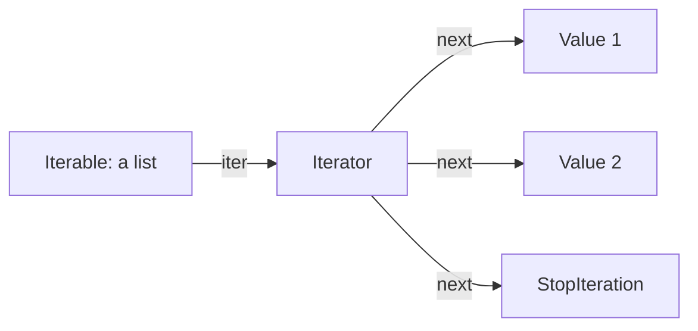

# Iterators, Generators & Collections

---

## 1. Learning Objectives

By the end of this unit, you will be able to:

✓ Explain the difference between an iterable and an iterator.  
✓ Describe how a `for` loop uses `iter()` and `next()` behind the scenes.  
✓ Write a generator function using `yield` and explain lazy evaluation.  
✓ Use `Counter` to count items and `defaultdict` to group them.  
✓ Recognise when `namedtuple` is a cleaner alternative to a plain tuple.

---

## 2. Overview

Every `for` loop you have written on a list, tuple, or dictionary has relied on a mechanism you haven't seen directly yet. Something, behind the scenes, is keeping track of exactly where you are in the collection and handing you the next value on request. That "something" is an **iterator**, and understanding it explains behaviour you have already been relying on without knowing it.

Think of an iterator like a librarian handing out one book at a time from a shelf, in order, one request at a time — the librarian remembers exactly which book comes next, so you never have to. Once every book has been handed out, the librarian simply tells you there are no more left.

This unit covers the difference between an iterable and an iterator, revisits generators through this new lens, and introduces the `collections` module — `Counter`, `defaultdict`, and a brief look at `namedtuple` — three tools built directly on top of the ideas from this unit.

These are the tools behind almost every data-processing pattern you will use from here on — counting word frequencies, grouping records, and streaming large results without loading everything into memory at once.

---

## 3. Description

### 3.1 Iterables vs Iterators

An **iterable** is anything you can loop over — a list, tuple, dictionary, set, or string. An **iterator** is the object that actually does the work of producing one value at a time from an iterable.



```python
subjects = ["Python", "SQL", "Git"]

iterator = iter(subjects)

print(next(iterator))
print(next(iterator))
print(next(iterator))
```

Output:

```
Python
SQL
Git
```

Calling `next()` one more time raises `StopIteration` — which is exactly the signal a `for` loop uses internally to know when to stop, without you ever seeing the error yourself.

### 3.2 Generators — Producing Values Lazily

A **generator function** uses `yield` instead of `return` to produce a sequence of values one at a time, only computing the next one when it is actually asked for. This is called **lazy evaluation** — nothing is computed until it's needed.

```python
def countdown(n):
    while n > 0:
        yield n
        n -= 1

for number in countdown(3):
    print(number)
```

Output:

```
3
2
1
```

Unlike a list, a generator does not build and store every value in memory upfront — useful when working with very large or even unbounded sequences.

### 3.3 The `collections` Module

Python's built-in `collections` module extends the core data structures with a few purpose-built tools.

**`Counter`** — counts how many times each item appears in an iterable.

```python
from collections import Counter

grades = ["A", "B", "A", "C", "A", "B"]
tally = Counter(grades)

print(tally)
print(tally.most_common(1))
```

Output:

```
Counter({'A': 3, 'B': 2, 'C': 1})
[('A', 3)]
```

**`defaultdict`** — a dictionary that supplies a default value automatically the first time a new key is used, instead of raising a `KeyError`.

```python
from collections import defaultdict

groups = defaultdict(list)

for name in ["Priya", "Rohan", "Arjun", "Kavya"]:
    groups[name[0]].append(name)

print(dict(groups))
```

Output:

```
{'P': ['Priya'], 'R': ['Rohan'], 'A': ['Arjun'], 'K': ['Kavya']}
```

**`namedtuple`** (introduction) — a tuple where each position also has a readable name, combining a tuple's efficiency with a dictionary's readability.

```python
from collections import namedtuple

Student = namedtuple("Student", ["name", "marks"])
s1 = Student("Priya", 82)

print(s1.name, s1.marks)
```

Output:

```
Priya 82
```

---

## 4. Real-World Application

| **Where you see it** | **How Python is working behind the scenes** |
|---|---|
| **A quiz app showing "most selected wrong answer"** | The app tallies every submitted answer using something equivalent to `Counter`, then reports the most common one. |
| **YouTube Studio grouping your videos by category** | Videos are grouped into buckets by category — the exact pattern a `defaultdict(list)` builds automatically. |
| **A live cricket score feed updating ball by ball** | Rather than computing the entire match in advance, updates are generated one ball at a time — the same lazy, on-demand pattern a generator uses. |
| **An AI chatbot streaming its response word by word** | Streaming responses are produced one token at a time via a generator-like mechanism, so you see words appear before the full answer is ready. |

---

## 5. Worked Example

**Scenario:** Your professor asks you to analyse a semester's worth of grades and report how many students got each grade, and to group student names by their grade.

**1. Store the raw data.**
```python
records = [
    ("Priya", "A"), ("Rohan", "B"), ("Arjun", "A"),
    ("Meera", "C"), ("Kavya", "B"), ("Sara", "A"),
]
```

**2. Count how many students got each grade.**
```python
from collections import Counter

grades_only = [grade for _, grade in records]
grade_counts = Counter(grades_only)

print(grade_counts)
```

Output:

```
Counter({'A': 3, 'B': 2, 'C': 1})
```

**3. Group student names by grade, using `defaultdict` to avoid manual key checks.**
```python
from collections import defaultdict

by_grade = defaultdict(list)

for name, grade in records:
    by_grade[grade].append(name)

print(dict(by_grade))
```

Output:

```
{'A': ['Priya', 'Arjun', 'Sara'], 'B': ['Rohan', 'Kavya'], 'C': ['Meera']}
```

**4. Write a generator that yields only the "A" grade students, one at a time.**
```python
def a_grade_students(records):
    for name, grade in records:
        if grade == "A":
            yield name

for name in a_grade_students(records):
    print(name)
```

Output:

```
Priya
Arjun
Sara
```

*Common mistake: writing `groups["A"].append(name)` on a plain `dict` before the key `"A"` exists — this raises a `KeyError`. Either use `defaultdict(list)`, as shown here, or check `if "A" not in groups: groups["A"] = []` first.*

---

## 6. Summary

- **An iterable** is anything loopable; **an iterator** is the object that produces one value at a time from it, via `iter()` and `next()`.
- **`StopIteration`** is what silently tells a `for` loop when an iterator has no values left.
- **Generator functions** use `yield` to produce values lazily — one at a time, only when requested, without storing the whole sequence in memory.
- **`Counter`** tallies occurrences in an iterable in a single line, and can report the most common items directly.
- **`defaultdict`** removes the need to manually check whether a key already exists before appending to it.
- **`namedtuple`** gives a tuple's positions readable names, without the overhead of a full class.

This closes Part A's data structures. The next module moves to classes and objects — organising both data and behaviour together, instead of keeping them separate.

---

*© 2026 Revature · AI Native Engineering — Foundations · Unit 3.5 · Version 1.0*
