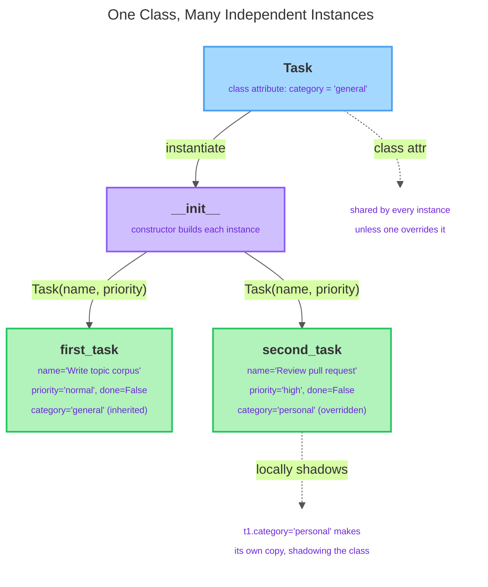

# Object-Oriented Foundations

---

## 1. Learning Objectives

By the end of this unit, you will be able to:

✓ Explain what an abstract data type (ADT) is and why bundling state with behaviour is a useful way to model a real-world thing in code.  
✓ Distinguish a **class** (a blueprint) from an **object**/**instance** (a specific thing built from that blueprint), and create instances from a class.  
✓ Write a constructor (`__init__`) that initializes instance attributes, and explain the difference between an instance attribute and a class attribute.  
✓ Define instance methods, correctly use the `self` parameter, and call methods on an object.

---

## 2. Overview

Every program you've written so far keeps data and the logic that acts on it as two separate things: a variable here, a statement over there. That works for one task, but it falls apart once you're tracking several related values about the same thing — a task's name, priority, and done status — alongside logic that needs all three at once.

**Object-oriented programming (OOP)** fixes this by packaging state (data) and behaviour (the logic that acts on it) into a single unit called an **object**. This unit gives you the vocabulary and mechanics — classes, objects, `__init__`, `self`, instance and class attributes, methods — that every later refinement in this programme (inheritance, encapsulation, operator overloading, dataclasses) builds on top of.

---

## 3. Description

### 3.1 Abstract Data Types — Thinking in Objects

An **abstract data type (ADT)** describes a "thing" by what it *is* and what it *can do*, without worrying about implementation. A `Task` is an ADT if you can say: it has a name, a priority, and a done status (its **state**), and it can be marked complete (its **behaviour**). Before classes, you'd model this with loose variables and a function:

```python
task_name = "Write topic corpus"
task_priority = "normal"
task_done = False

def mark_complete(done):
    return True

task_done = mark_complete(task_done)
```

This works for one task, but nothing ties `task_name` to `task_priority` to `task_done` — they're just variables sitting near each other. Nothing stops you from passing the wrong one into a function by mistake and quietly corrupting a task's priority instead of its completion flag. A class is really two things wearing one name: a **contract** (what attributes and methods you can rely on any instance having) and an **implementation** (how those are stored and written) — bundling data and the functions that operate on it so the association is enforced by the language itself, not by your memory.

### 3.2 Classes and Objects

A **class** is a blueprint. It defines what attributes and methods every object built from it will have, but a class alone isn't a usable "thing" — it's the plan. An **object**, also called an **instance**, is a specific thing created from that blueprint, with its own actual values. You can create as many instances as you like, and each one holds independent state:

```python
class Task:
    pass

first_task = Task()
second_task = Task()

print(type(first_task))
print(first_task is second_task)
```

Output:

```
<class '__main__.Task'>
False
```

`type(first_task)` reports the class an object was built from — the same way `type()` reported `float` or `str` in an earlier unit. `first_task is second_task` prints `False` because `is` compares object identity: two calls to `Task()` allocate two distinct objects in memory, even from the identical blueprint. By convention, class names use `PascalCase` (`Task`, `Person`), while instance names follow the `snake_case` rule you already know — not enforced by Python, but followed by every professional codebase so a name alone signals blueprint vs. thing-built-from-it.

### 3.3 The Constructor — Instance vs. Class Attributes

An empty class isn't useful. The **constructor**, `__init__`, is a special method Python calls automatically on every new instance to set up its starting state:

```python
class Task:
    category = "general"      # class attribute — shared by every Task

    def __init__(self, name, priority):
        self.name = name          # instance attribute
        self.priority = priority  # instance attribute
        self.done = False         # instance attribute
```

`self.name = name` creates an **instance attribute** — a variable that belongs to *this* object alone. `category`, defined directly in the class body rather than inside `__init__`, is a **class attribute**: shared by every instance unless one instance is given its own copy that shadows it. Notice `priority` has no default value — every `Task(...)` call must supply both `name` and `priority` as required, positional arguments, the same way you already call `print()` and `type()`.

The diagram below traces exactly this: one `Task` blueprint, `__init__` building two separate instances from it, and what happens when a class attribute is overridden on just one of them.



Watch what happens if you change the class attribute through the class itself, versus through one instance:

```python
t1 = Task("Write topic corpus", "normal")
t2 = Task("Review pull request", "high")

Task.category = "work"
print(t1.category, t2.category)

t1.category = "personal"
print(t1.category, t2.category)
```

Output:

```
work work
personal work
```

`Task.category = "work"` changes the shared value, so every instance without its own `category` attribute sees the new value. But `t1.category = "personal"` does something different: it creates a *new instance attribute* on `t1` alone, which now shadows the class attribute for `t1` only — `t2` still reads the shared class value. Assigning through an instance never changes the class attribute; it only creates or overwrites an attribute local to that one instance. Use class attributes for values genuinely shared across every instance; use instance attributes, set via `self.attribute = value` inside `__init__`, for anything that varies per object — in practice, almost everything you model.

### 3.4 Methods and `self`

A **method** is a function defined inside a class body — the "what it can do" half of the ADT. Every method takes `self` as its first parameter: it's how the method reaches back to the specific object it was called on.

```python
class Task:
    def __init__(self, name, priority):
        self.name = name
        self.priority = priority
        self.done = False

    def mark_complete(self):
        self.done = True

    def describe(self):
        return f"{self.name} ({self.priority}) - done={self.done}"

t1 = Task("Write topic corpus", "normal")
t1.mark_complete()
print(t1.describe())
```

Output:

```
Write topic corpus (normal) - done=True
```

When you write `t1.mark_complete()`, Python is quietly rewriting that call behind the scenes into `Task.mark_complete(t1)`. The object to the left of the dot doesn't vanish — it gets slipped in as the method's first argument, automatically, every time. `self` is just the parameter that catches it. This is a naming convention, not a keyword — you could technically call the parameter anything, but every Python codebase you'll ever read uses `self`, so you should too. Under the hood, Python looks up `mark_complete` on `t1`'s class (not on `t1` itself — instances don't carry their own copy of each method), finds the function, and binds it to `t1` so `self` inside the body means "this object."

---

## 4. Real-World Application

The state-in-`__init__`, behaviour-in-methods, `self`-ties-them-together shape shows up everywhere real Python code models something with a lifecycle. A web application's **account model** typically looks like this even before a database sits behind it: instance attributes such as `username`, `email`, `is_active`, and `login_count`, with methods like `deactivate()` and `record_login()` that mutate that state through `self`.

A game's **player entity** follows the identical shape for a different domain: a `Player` with `health` and `score` as instance attributes, so two players in the same game hold completely independent values, the same independence `first_task` and `second_task` demonstrated above. An **inventory record** in a small business system — a `Product` with `sku`, `price`, and `quantity_in_stock`, and methods like `restock()` and `sell()` — needs no class attributes at all, since every product's values genuinely vary per instance; not every class needs one.

---

## 5. Worked Example

**Goal:** Build a `BankAccount` class from scratch, following the same four steps every class in this unit has used, then see exactly what happens when a method forgets `self`.

**1. Name the class**, using `PascalCase`.

```python
class BankAccount:
    ...
```

**2. Write `__init__`**, taking required positional parameters and assigning each to an instance attribute.

```python
class BankAccount:
    def __init__(self, owner_name, balance):
        self.owner_name = owner_name
        self.balance = balance
```

**3. Add a class attribute** — only for a value every instance should share.

```python
class BankAccount:
    bank_name = "First National"   # class attribute — shared by every account

    def __init__(self, owner_name, balance):
        self.owner_name = owner_name
        self.balance = balance
```

**4. Define methods**, always with `self` first.

```python
class BankAccount:
    bank_name = "First National"

    def __init__(self, owner_name, balance):
        self.owner_name = owner_name
        self.balance = balance

    def deposit(self, amount):
        self.balance = self.balance + amount

    def withdraw(self, amount):
        self.balance = self.balance - amount

    def describe(self):
        return f"{self.owner_name}'s account at {self.bank_name}: {self.balance}"
```

**5. Put it to use.**

```python
account = BankAccount("Priya Nair", 500)
account.deposit(150)
account.withdraw(80)
print(account.describe())
```

Output:

```
Priya Nair's account at First National: 570
```

`account.deposit(150)` looks up `deposit` on the class, binds `account` as `self`, and runs `self.balance = self.balance + amount` — reading `500`, adding `150`, writing `650` back into the same attribute. `account.withdraw(80)` repeats the pattern: reads `650`, writes back `570`.

**6. Now see what happens if `deposit` forgets `self`.**

```python
class BrokenAccount:
    def deposit(amount):        # missing self
        self.balance = self.balance + amount

broken = BrokenAccount()
broken.deposit(150)
```

Output:

```
TypeError: deposit() takes 1 positional argument but 2 were given
```

Python still passes `broken` in automatically as the first positional argument, so now `broken` and `150` are both competing to fill the single parameter `amount`.

*Common mistake: forgetting `self` as a method's first parameter. It's the single most common beginner mistake in Python OOP, and it always produces a confusing `TypeError` about argument counts rather than an obvious complaint about a missing `self`.*

---

## 6. Summary

- An **abstract data type** describes a thing by its state and behaviour together; a Python class is how you implement that idea.
- **A class** is a blueprint; **an object (instance)** is a specific thing built from that blueprint, with its own independent state.
- **`__init__`** runs automatically on creation and is where instance attributes (`self.attribute = value`) are set up; **class attributes**, defined in the class body, are shared defaults across all instances until an instance overrides one locally.
- **Methods** are functions defined inside a class; **`self`** is how a method refers to the specific object it was called on, and Python supplies it automatically at the call site.

Up next: inheritance and encapsulation — extending one class's behaviour into another, and controlling which parts of an object stay hidden from outside code.

---

*© 2026 Revature · AI Native Engineering — Foundations · Unit 4.1 · Version 1.0*
