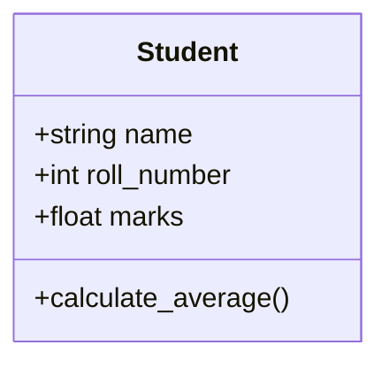

# Object-Oriented Foundations

---

## 1. Learning Objectives

By the end of this unit, you will be able to:

✓ Explain the difference between an object's state and its behaviour.  
✓ Define a class using `__init__` and create multiple instances from it.  
✓ Distinguish between instance attributes and class attributes.  
✓ Write and call methods on an object, using `self` correctly.  
✓ Describe why grouping data and behaviour together is called object-oriented programming.

---

## 2. Overview

So far in this programme, data and the functions that act on it have lived separately — a dictionary here, a function there. Object-oriented programming (OOP) changes that: it bundles related data and the actions that work on that data into a single unit called an **object**.

Think of a class the way you would think of an engineering drawing for a machine part. The drawing (the class) specifies every dimension and feature the part must have, but it is not itself a physical part. Every part actually manufactured from that drawing (each object) shares the same design, yet each one is a separate, physical unit — one part can be scratched or painted without affecting any other part built from the same drawing.

This unit introduces that foundation: what a class is, how an object is created from it, and how a class's own functions — called methods — operate on the data stored inside each object.

Every AI library you will use later in this programme — a data-cleaning tool, a trained model, a chatbot client — is itself built from classes. A trained ML model you load in Part B is an object with its own state (its learned parameters) and behaviour (its ability to make a prediction) — exactly the pattern you are about to learn here.

---

## 3. Description

### 3.1 Abstract Data Types — Thinking in Objects

- **State** — the data an object holds (for example, a student's name, roll number, and marks).
- **Behaviour** — the actions available on that data (for example, calculating an average, or checking if the student has passed).
- **Abstract data type** — describing something by *what it is* (state) and *what it can do* (behaviour), without worrying about how it is implemented underneath.



Thinking this way mirrors how you would naturally describe a real student — by their details and by what they can do — which is exactly why OOP scales so well to larger programs.

### 3.2 Classes and Objects

- **Class** — a blueprint that defines what state and behaviour every object built from it will have.
- **Object (instance)** — one actual thing created from that blueprint; also called an instance.
- **Instantiation** — the act of creating an object from a class.

```python
class Student:
    pass

student_one = Student()
student_two = Student()

print(type(student_one))
```

**Output:**
```
<class '__main__.Student'>
```

`student_one` and `student_two` are two separate objects, both built from the same `Student` blueprint — the same way two parts manufactured from one engineering drawing are still two physical, independent parts.

### 3.3 The Constructor — `__init__`

- **`__init__`** — a special method Python calls automatically every time a new object is created; short for "initialise".
- **Instance attributes** — data stored separately on each object, usually set inside `__init__`.
- **Class attributes** — data shared by every object of that class, defined directly inside the class body, outside any method.

```python
class Student:
    college = "Revature AI Native Engineering"  # class attribute — shared by every student

    def __init__(self, name, roll_number, marks):
        self.name = name                # instance attribute
        self.roll_number = roll_number  # instance attribute
        self.marks = marks              # instance attribute

priya = Student("Priya", 101, 78.5)
rohan = Student("Rohan", 102, 85.0)

print(priya.name, priya.marks)
print(rohan.name, rohan.marks)
print(priya.college)
```

**Output:**
```
Priya 78.5
Rohan 85.0
Revature AI Native Engineering
```

Notice `name` and `marks` are different for each student (instance attributes), while `college` is identical for both (a class attribute).

### 3.4 Methods and the `self` Parameter

- **Method** — a function defined inside a class that operates on an object's data.
- **`self`** — the first parameter of every method; it refers to the specific object the method was called on. Python passes it automatically — you never supply it yourself when calling the method.

```python
class Student:
    def __init__(self, name, marks):
        self.name = name
        self.marks = marks

    def has_passed(self):
        return self.marks >= 40

priya = Student("Priya", 78.5)
print(priya.has_passed())
```

**Output:**
```
True
```

Calling `priya.has_passed()` is Python's way of saying "run `has_passed`, with `self` set to `priya`" — which is why the method can read `self.marks` and know exactly whose marks to check.

---

## 4. Real-World Application

| **Where you see it** | **How Python is working behind the scenes** |
|---|---|
| **Your college ERP student profile** | Every student's record — name, roll number, attendance, marks — is stored as one object, with methods to calculate attendance percentage or GPA. |
| **A cricket scoring app** | Each player is an object holding runs, balls faced, and wickets, with a method to calculate the current strike rate. |
| **An Instagram post** | Every post is an object holding its caption, likes, and comments, with methods to add a like or add a comment. |
| **A UPI transaction record** | Each payment is an object storing the amount, sender, receiver, and timestamp, with a method to check whether the transaction succeeded. |
| **A trained ML model in Part B** | The model itself is an object — its state is the learned parameters, and its behaviour is a `.predict()` method you will call on new data. |

---

## 5. Worked Example

**Scenario:** Your Python lab instructor asks you to model a single student record as a class, create two students, and print whether each has passed.

**1. Define the class.**
```python
class Student:
    def __init__(self, name, roll_number, marks):
        self.name = name
        self.roll_number = roll_number
        self.marks = marks

    def has_passed(self):
        return self.marks >= 40
```

**2. Create two student objects.**
```python
priya = Student("Priya", 101, 78.5)
arjun = Student("Arjun", 102, 32.0)
```

**3. Print each student's result.**
```python
print(f"{priya.name}: {'Pass' if priya.has_passed() else 'Fail'}")
print(f"{arjun.name}: {'Pass' if arjun.has_passed() else 'Fail'}")
```

**Output:**
```
Priya: Pass
Arjun: Fail
```

*Common mistake: forgetting to include `self` as the first parameter of a method causes a `TypeError` the moment the method is called — Python always passes the object automatically as the first argument, so every method needs a parameter to receive it.*

---

## 6. Summary

- **A class** is a blueprint that defines the state and behaviour every object built from it will share.
- **An object (instance)** is one actual thing created from a class — separate from every other object built from the same class.
- **`__init__`** runs automatically when an object is created, and is where instance attributes are usually set.
- **Instance attributes** differ per object, while **class attributes** are shared by every object of that class.
- **`self`** refers to the specific object a method was called on, and Python supplies it automatically.

The next unit builds on this foundation with inheritance — extending one class's behaviour into another, and controlling which attributes stay private to an object.

---

*© 2026 Revature · AI Native Engineering — Foundations · Unit 4.1 · Version 1.0*
