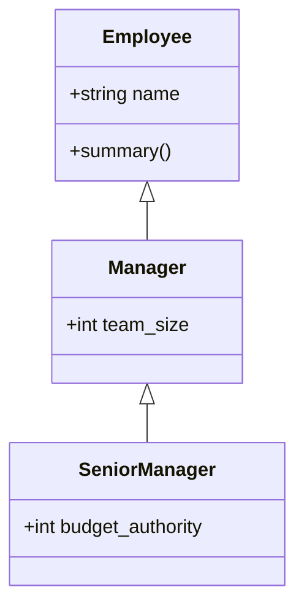

# Inheritance & Encapsulation

---

## 1. Learning Objectives

By the end of this unit, you will be able to:

✓ Create a subclass that extends a parent class using inheritance.  
✓ Use `super()` to call a parent class's constructor or method, and explain what happens if you forget to.  
✓ Describe what Method Resolution Order (MRO) means when a class extends more than one parent.  
✓ Apply the single- and double-underscore naming conventions to signal which attributes outside code shouldn't touch.  
✓ Explain, honestly, how much protection Python's encapsulation actually gives you — and how much it doesn't.

---

## 2. Overview

**Inheritance** lets you build a new class on top of an existing one: the new class automatically gets everything the original already does, and only needs to add or adjust what's actually different. The class being extended is the **superclass** (or parent class); the new class built on top is the **subclass** (or child class).

Here's a real-world parallel: picture how job roles work at a company. Every employee — regardless of title — has a base employment contract: a name, an ID, a way their base pay gets calculated. A **Manager** doesn't get a brand-new contract written from scratch; they get the same base contract, *plus* extra clauses for team budgets and performance reviews bolted on top. The base contract didn't change — the Manager's role just extends it, exactly the way a subclass extends a superclass.

This unit also covers **encapsulation** — deciding which parts of an object's data are safe for outside code to touch directly, and which parts should stay off-limits. Think of an ATM: you can check your balance and withdraw cash through its defined buttons, but you can't reach past the screen and rewire the cash dispenser yourself, even though the wiring is right there behind the panel. Python's version of that "panel" is softer than a real ATM's, though — which is exactly the honest nuance this unit gets into.

---

## 3. Description

### 3.1 Single-Level Inheritance

- **Superclass (parent class)** — the class being extended.
- **Subclass (child class)** — the new class that extends the superclass, written as `class Child(Parent):`.
- A subclass automatically has every attribute and method the superclass has, and can add new ones without touching the original class's code at all.

```python
class Employee:
    def __init__(self, name, employee_id):
        self.name = name
        self.employee_id = employee_id

    def summary(self):
        return f"{self.name} (ID: {self.employee_id})"

class Manager(Employee):
    def __init__(self, name, employee_id, team_size):
        super().__init__(name, employee_id)
        self.team_size = team_size

priya = Manager("Priya", "E1042", team_size=6)
print(priya.summary())
print(priya.team_size)
```

Output:

```
Priya (ID: E1042)
6
```

`Manager` never redefines `summary()` — it inherits that method directly from `Employee`, exactly like a Manager's employment contract inherits the base pay-calculation clause without rewriting it.

**`super()`** is the line `super().__init__(name, employee_id)` above — it means "run the parent class's own version of this method first," so you don't have to copy-paste `self.name = name` and `self.employee_id = employee_id` into every subclass by hand.

### 3.2 Chaining Several Levels of Inheritance

Inheritance can stack more than one level deep — a class can extend a class that itself extends another class, the same way a "Senior Manager" role could sit on top of "Manager," which itself sits on top of "Employee."



```python
class SeniorManager(Manager):
    def __init__(self, name, employee_id, team_size, budget_authority):
        super().__init__(name, employee_id, team_size)
        self.budget_authority = budget_authority

    def summary(self):
        base = super().summary()
        return f"{base} — approves budgets up to ₹{self.budget_authority}"

rohan = SeniorManager("Rohan", "E2091", team_size=12, budget_authority=500000)
print(rohan.summary())
```

Output:

```
Rohan (ID: E2091) — approves budgets up to ₹500000
```

Notice `SeniorManager.summary()` doesn't rewrite the greeting from scratch — it calls `super().summary()` to get `Manager`'s version (which itself came from `Employee`), then adds its own sentence on top. This is the pattern to reach for whenever a subclass needs to *extend* a parent's behavior rather than fully replace it.

### 3.3 Extending More Than One Parent — and the Order That Decides Ties

- **Multiple inheritance** — a class can extend more than one parent at once: `class Child(ParentA, ParentB):`.
- **Method Resolution Order (MRO)** — the fixed left-to-right order Python searches through parent classes to find a method, used whenever more than one parent defines something with the same name.

Imagine an employee who's officially "dual-hatted" — both a certified Trainer and a Manager at the same time. If both roles define a `run_session()` method with different behavior, company policy has to say which one wins.

```python
class Trainer:
    def lead(self):
        return "runs a training session"

class TeamLead:
    def lead(self):
        return "runs a status meeting"

class DualRole(Trainer, TeamLead):
    pass

print(DualRole().lead())
print(DualRole.__mro__)
```

Output:

```
runs a training session
(<class '__main__.DualRole'>, <class '__main__.Trainer'>, <class '__main__.TeamLead'>, <class 'object'>)
```

Because `Trainer` is listed first in `class DualRole(Trainer, TeamLead)`, Python checks `Trainer` before `TeamLead` and its `lead()` wins. Multiple inheritance is powerful but easy to make confusing — if you ever find yourself unsure which parent's method will run, `.__mro__` tells you the exact search order Python will use, left to right.

### 3.4 Encapsulation — and What Python Actually Enforces

- **Public attribute** — a plain attribute name, freely readable and writable from outside the object. This is the default.
- **Single leading underscore (`_balance`)** — a *convention*, nothing more: it signals "this is internal, please don't touch it from outside," but Python does not stop you from touching it anyway.
- **Double leading underscore (`__pin`)** — triggers **name mangling**: Python internally renames the attribute (to something like `_BankAccount__pin`) so a casual `account.__pin` from outside the class fails. This raises the difficulty, but a determined piece of code that knows the mangled name can still reach it.

Be honest with yourself about what this buys you: Python's encapsulation is a set of speed bumps and social contracts among developers, not a locked vault. Compare this to a real ATM, where the panel genuinely is bolted shut — Python's "panel" is more like a sign that says "staff only," sitting on an unlocked door. Most of the time that's enough, because most bugs come from accidents, not attackers, and a clear signal that "you're not supposed to touch this" prevents the vast majority of those accidents.

```python
class BankAccount:
    def __init__(self, balance, pin):
        self._balance = balance   # "staff only" sign — not enforced
        self.__pin = pin          # name-mangled — harder to reach by accident

    def check_balance(self, entered_pin):
        if entered_pin == self.__pin:
            return self._balance
        return "Incorrect PIN"

account = BankAccount(15000, "4321")
print(account.check_balance("4321"))
print(account.check_balance("0000"))
print(account._balance)  # works — Python never actually stopped you
```

Output:

```
15000
Incorrect PIN
15000
```

That last line is the honest part: `account._balance` printed successfully. Nothing crashed. The underscore didn't lock a door — it posted a sign on one. Respecting that sign is a professional habit you're building now, not a rule Python enforces for you.

Name mangling, on the other hand, is a real mechanism — not just a stronger-sounding warning sign. Try reaching for `__pin` by its original name from outside the class:

```python
print(account.__pin)
```

Output:

```
AttributeError: 'BankAccount' object has no attribute '__pin'
```

That fails because the attribute `__pin` was never actually created — Python silently rewrote it, at the moment the class body compiled, to `_BankAccount__pin`. That rewritten name still works:

```python
print(account._BankAccount__pin)
```

Output:

```
4321
```

So double-underscore mangling raises the difficulty (you'd have to know the exact rewritten name), but it's still just a renamed attribute, not a locked one.

---

## 4. Real-World Application

A college ERP's `Student`, `Faculty`, and `Admin` accounts, or a ride-hailing app's `Rider` and `Driver` profiles, are almost never written as three or four unrelated classes. They're subclasses of one shared `User`/`Account` base class (§3.1) — login, profile fields, and password logic get written once in the parent and inherited everywhere, exactly like `Manager` adding `team_size` on top of `Employee` without rewriting `summary()`.

scikit-learn's classifier and regressor classes work the same way one level deeper: every specific model type extends a common base estimator, reusing its shared training/prediction scaffolding and calling `super()` where it needs the parent's setup (§3.2) — the same chaining pattern as `SeniorManager` building on `Manager`.

And your online banking app never letting you edit your balance directly through its interface is §3.4's encapsulation in production: the balance is kept as an internal attribute, changed only through verified methods like `deposit()` or `withdraw()` — buttons only, no reaching behind the panel.

---

## 5. Worked Example

**Goal:** Extend a `Student` class into a `GraduateStudent` class, then deliberately break it by skipping `super().__init__()`, so the failure this causes is something you've *seen*, not just been warned about.

**1. Start from the existing `Student` class.**

```python
class Student:
    def __init__(self, name, roll_number, marks):
        self.name = name
        self.roll_number = roll_number
        self.marks = marks

    def has_passed(self):
        return self.marks >= 40
```

**2. Extend it into `GraduateStudent` — correctly, calling `super().__init__()`.**

```python
class GraduateStudent(Student):
    def __init__(self, name, roll_number, marks, thesis_topic):
        super().__init__(name, roll_number, marks)
        self.thesis_topic = thesis_topic

arjun = GraduateStudent("Arjun", 301, 88.0, "Computer Vision for Traffic Systems")
print(arjun.has_passed())
print(arjun.thesis_topic)
```

Output:

```
True
Computer Vision for Traffic Systems
```

**3. Now break it on purpose — write a version that forgets to call `super().__init__()`.**

```python
class BrokenGraduateStudent(Student):
    def __init__(self, name, roll_number, marks, thesis_topic):
        self.thesis_topic = thesis_topic   # forgot to set up the parent's attributes

broken = BrokenGraduateStudent("Meera", 302, 91.0, "Speech Recognition")
print(broken.thesis_topic)
print(broken.has_passed())
```

Output:

```
Speech Recognition
AttributeError: 'BrokenGraduateStudent' object has no attribute 'marks'
```

`broken.thesis_topic` works fine, because that line ran. But `has_passed()` needs `self.marks` — and nothing ever set it, because `Student.__init__` never ran. `super().__init__()` isn't boilerplate you can skip when you're in a hurry; it's the only line that actually builds the parent's part of the object.

*Common mistake: assuming a subclass "automatically" has the parent's attributes just because it inherits the parent's methods. Inheriting a method only makes the method available — the object's actual data (`self.marks`, `self.name`, …) only exists if `__init__` genuinely ran and set it, which is exactly what a missing `super().__init__()` call skips.*

---

## 6. Summary

- **Inheritance** lets a subclass reuse a superclass's attributes and methods, adding or extending only what's new — like a Manager role sitting on top of the base Employee contract.
- **`super()`** calls the parent class's own version of a method (often `__init__`) instead of duplicating its logic — and skipping it means the parent's attributes never get set, causing an `AttributeError` later.
- **Multiple inheritance** lets a class extend more than one parent at once; **MRO** (`ClassName.__mro__`) is the exact left-to-right order Python uses to decide whose method wins when both parents define the same name.
- **Single underscore (`_name`) is a convention**, not a lock — Python lets you access it anyway. **Double underscore (`__name`)** triggers name mangling, raising the difficulty but still not creating a hard boundary.
- Python's encapsulation is a professional courtesy backed by naming conventions, not a security feature — know the difference before you rely on it for anything sensitive.

Up next: special methods and dataclasses — controlling how your objects are printed and compared, and cutting down the boilerplate needed to define them.

---

*© 2026 Revature · AI Native Engineering — Foundations · Unit 4.2 · Version 1.0*
