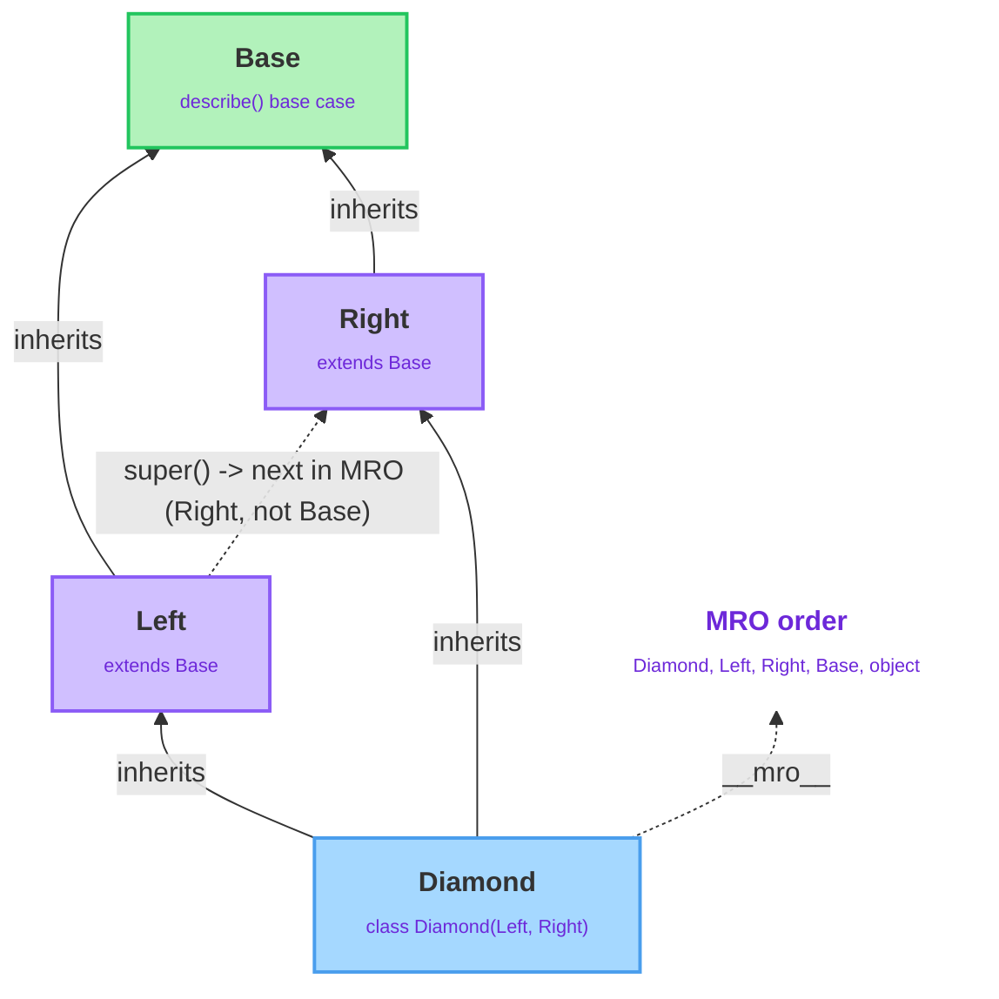

# Inheritance & Encapsulation

---

## 1. Learning Objectives

By the end of this unit, you will be able to:

✓ Define a subclass that extends a superclass using single-level inheritance, and explain what a subclass inherits automatically versus what it must override.  
✓ Use `super()` inside a subclass's `__init__` and its methods to extend the superclass's behavior instead of duplicating it, across a chain of more than one level.  
✓ Explain, at a basic level, what Method Resolution Order (MRO) is, why it matters once a class has more than one direct base, and how to inspect it.  
✓ Distinguish the single-underscore naming convention from double-underscore name mangling, and explain what each one actually does — and doesn't do — to attribute access.  
✓ Build a small multi-level class hierarchy that correctly threads shared state and behavior through every level.

---

## 2. Overview

The previous unit left you with a `Student` class — `name`, `roll_number`, `marks`, and a `has_passed()` method. **Inheritance** is Python's mechanism for saying "this class is a `Student`, plus a little more," without copying a single line of `Student`'s own code. The class being extended is the **superclass** (or parent class); the new class built on top is the **subclass** (or child class).

The same idea scales past one level — a `GraduateStudent` is a `Student`, plus a thesis topic, and something built on top of `GraduateStudent` would still carry everything `Student` already provides. Once classes stack that way, two more questions become unavoidable: how do you call up to a specific ancestor's version of a method (`super()`), and what happens if a class has more than one direct ancestor (Method Resolution Order)? This unit also covers **encapsulation** — the naming conventions Python gives you to signal which attributes are meant to stay internal to a class.

---

## 3. Description

### 3.1 Single-Level Inheritance: A Subclass Extends a Superclass

A **subclass** (child/derived class) is defined in terms of another class, its **superclass** (base/parent class), using `class Subclass(Superclass):`. The subclass automatically gets every attribute-setting and method the superclass has:

```python
class Student:
    def __init__(self, name, roll_number, marks):
        self.name = name
        self.roll_number = roll_number
        self.marks = marks

    def has_passed(self):
        return self.marks >= 40


class GraduateStudent(Student):
    pass
```

Even with only `pass` in its body, `GraduateStudent("Arjun", 301, 88.0)` works immediately. Python looks for `__init__` on `GraduateStudent`, finds nothing, walks up to `Student`, and runs `Student.__init__` there — binding the new object as `self` and assigning `name`, `roll_number`, `marks`. `has_passed()` is found and run the same way. Nothing about inheriting a method requires rewriting it; the subclass just doesn't define its own version, so lookup continues upward.

`isinstance(gs, Student)` returns `True` — a `GraduateStudent` is usable anywhere a `Student` is expected. `issubclass(GraduateStudent, Student)` is the same check at the class level. `type(gs)` still reports `GraduateStudent`, never `Student` — `type()` always reports the exact class an object was built from.

**Overriding** happens when a subclass defines its own version of a method the superclass already has; since lookup checks the instance's own class first, the subclass's version wins:

```python
class GraduateStudent(Student):
    def has_passed(self):
        return self.marks >= 50   # graduate-level pass mark is higher
```

But `GraduateStudent` still needs a `thesis_topic` that `Student` doesn't have. Overriding `__init__` by re-typing `Student.__init__`'s body works, but any future change to `Student.__init__` won't propagate to the copy — exactly the duplication problem `super()` exists to solve.

### 3.2 `super()`: Extending Behavior Across Multiple Levels

`super()`, called inside a subclass method, is a proxy for "whatever comes next in the hierarchy," letting you call the superclass's version without naming it explicitly:

```python
class GraduateStudent(Student):
    def __init__(self, name, roll_number, marks, thesis_topic):
        super().__init__(name, roll_number, marks)
        self.thesis_topic = thesis_topic
```

`super().__init__(name, roll_number, marks)` runs `Student.__init__` on the object under construction, setting `name`/`roll_number`/`marks`; control returns and `GraduateStudent.__init__` adds only `thesis_topic`. Nothing from `Student.__init__` was retyped.

The pattern holds across more than two levels, and each level only needs to know about the level directly above it — a `SeniorGraduateStudent` extending `GraduateStudent` would only ever call `super().__init__()` once, with no idea `Student` exists two levels up. The same logic applies to ordinary methods, not just `__init__`: a method can call `super().some_method()` to get the superclass's return value and build on top of it — that's **extending** behavior, as distinct from the plain overriding in §3.1, which replaces it outright.

Attribute lookup follows the same order but starts in a different place. A class attribute defined on `Student` (say, `institution = "SRMIST"`) isn't in any instance's `__dict__` unless an `__init__` explicitly set it there — so Python walks the classes, `GraduateStudent` then `Student`, and finds it on `Student`'s class body. Contrast an instance attribute like `name`: the search never leaves the instance dictionary at all, because `Student.__init__` assigned `self.name` directly. Instance attributes shadow class attributes at every level of a chain, not just within one class.

### 3.3 Multiple Inheritance and the Diamond Problem

Every example so far is a **single-inheritance chain** — one direct base per class — so `super()` has only one place to go. **Multiple inheritance** (`class Sub(BaseA, BaseB):`) raises a real question: if `BaseA` and `BaseB` both define the same method, which does `super()` find first? Python answers this with the **Method Resolution Order (MRO)** — a fixed order over every class in the hierarchy, computed once when the subclass is defined. You rarely compute an MRO by hand; you need to know it exists and how to inspect it with `ClassName.__mro__`.

The **diamond problem** makes MRO visible: `Left` and `Right` both extend `Base`, and `Diamond` extends both `Left` and `Right`.



```python
class Base:
    def describe(self):
        return "Base"

class Left(Base):
    def describe(self):
        return f"Left -> {super().describe()}"

class Right(Base):
    def describe(self):
        return f"Right -> {super().describe()}"

class Diamond(Left, Right):
    pass

print(Diamond().describe())
print(Diamond.__mro__)
```

Output:

```
Left -> Right -> Base
(<class '__main__.Diamond'>, <class '__main__.Left'>, <class '__main__.Right'>, <class '__main__.Base'>, <class 'object'>)
```

This is the detail that trips people up: `super()` inside `Left` does **not** mean "go to `Base`." It means "continue to whatever's next in the MRO," which is `Right`, not `Base`. `Right.describe` runs, its own `super().describe()` continues to `Base`, and the result assembles back up the chain. `super()` always means "the next class in the computed MRO," never "my literal parent." Multiple inheritance and the full MRO algorithm are topics for later coursework; what matters here is recognizing the diamond shape and knowing `__mro__` exists to inspect it.

### 3.4 Encapsulation: Underscores and Name Mangling

**Encapsulation** controls which parts of an object's state outside code may rely on versus treat as internal detail. Python has no `private` keyword — it uses two naming conventions, one purely social and one with a real mechanism behind it.

A **single leading underscore** (`_balance`) is convention only: "internal use — don't rely on this from outside code." Python does not enforce it:

```python
class BankAccount:
    def __init__(self, balance):
        self._balance = balance   # convention: internal, not enforced

account = BankAccount(15000)
print(account._balance)   # 15000 — works, nothing stopped you
```

A **double leading underscore** (`__pin`) triggers **name mangling**: Python rewrites `self.__pin` inside a class body to `self._ClassName__pin`, using the literal class name:

```python
class SecureAccount:
    def __init__(self, pin):
        self.__pin = pin

    def verify_pin(self, attempt):
        return attempt == self.__pin

account = SecureAccount(4477)
print(account.verify_pin(4477))          # True
print(account.__pin)                     # AttributeError
print(account._SecureAccount__pin)       # 4477 — the mangled name, still reachable
```

`account.__pin` raises `AttributeError` — not because Python enforced privacy, but because that exact attribute name was never created. The real attribute is `_SecureAccount__pin`, and reaching it directly proves it's an ordinary attribute under a rewritten name.

The real reason double-underscore mangling exists is **collision avoidance across a hierarchy**, not secrecy. If a base class sets `self.__secret` and a subclass, entirely unaware, also sets `self.__secret`, mangling rewrites them to two genuinely separate attributes — `_Base__secret` and `_Derived__secret` — so neither class's internal bookkeeping can silently clobber the other's just because they happened to pick the same name. Default to single underscore; reach for double underscore specifically when a subclass reusing the same attribute name would actually break something.

---

## 4. Real-World Application

**Web frameworks and GUI toolkits** model shared plumbing this way: a `TextField` and an `IntegerField` both extend a shared `Field` base that handles validation machinery common to every field type; a `Button` and a `Checkbox` both extend a shared `Widget` base that handles positioning and rendering. Each subclass overrides only what's genuinely different.

**Exception hierarchies** are a clean real-world use of the exact single- and multi-level mechanics from §3.1–3.2. Python's own built-in error types form a hierarchy — `ValueError` and `TypeError` both extend `Exception` — and application code routinely extends that same base further: a `MissingFieldError(ValidationError)` extending `ValidationError(Exception)` means `isinstance(some_error, ValidationError)` reports `True` for either, without checking every specific error type by name.

**ORMs** (object-relational mappers) ask every model class to extend one shared `Model` base handling save/load plumbing, so each specific model (`User`, `Product`) only declares its own fields and extends `save()` via `super()` — the identical pattern built in §3.2.

---

## 5. Worked Example

**Goal:** Build a `GraduateStudent` from `Student` end to end, then see exactly what breaks if `super().__init__()` is skipped.

**1. Start from the existing `Student` class, and decide what's new.** `name`, `roll_number`, and `marks` stay on `Student`; only `thesis_topic` is new to `GraduateStudent`.

**2. Declare the subclass and extend `__init__` with `super()`.**

```python
class Student:
    def __init__(self, name, roll_number, marks):
        self.name = name
        self.roll_number = roll_number
        self.marks = marks

    def has_passed(self):
        return self.marks >= 40


class GraduateStudent(Student):
    def __init__(self, name, roll_number, marks, thesis_topic):
        super().__init__(name, roll_number, marks)
        self.thesis_topic = thesis_topic

    def describe(self):
        base = f"{self.name} ({self.roll_number})"
        return f"{base} — thesis: {self.thesis_topic}"


gs = GraduateStudent("Arjun", 301, 88.0, "Computer Vision for Traffic Systems")
print(gs.describe())
print(gs.has_passed())
print(isinstance(gs, Student))
```

Output:

```
Arjun (301) — thesis: Computer Vision for Traffic Systems
True
True
```

**3. Verify the mechanics.** `class GraduateStudent(Student):` fixed `GraduateStudent.__mro__` at `(GraduateStudent, Student, object)` the instant it was defined. `super().__init__(name, roll_number, marks)` resolved by finding `GraduateStudent`'s position in that MRO and calling the `__init__` belonging to whatever comes immediately after — `Student.__init__`. `has_passed()` was never redefined on `GraduateStudent`, so it's still `Student`'s version, found by walking the same MRO. `isinstance(gs, Student)` reports `True` because Python checks whether `Student` appears anywhere in `GraduateStudent`'s full MRO, not just whether it's the one immediate base.

**4. Now break it on purpose — skip `super().__init__()` entirely.**

```python
class BrokenGraduateStudent(Student):
    def __init__(self, name, roll_number, marks, thesis_topic):
        self.thesis_topic = thesis_topic   # forgot to set up the parent's attributes

broken = BrokenGraduateStudent("Meera", 302, 91.0, "Speech Recognition")
print(broken.thesis_topic)
print(broken.has_passed())
```

Output:

```
Speech Recognition
AttributeError: 'BrokenGraduateStudent' object has no attribute 'marks'
```

`broken.thesis_topic` works fine, because that line ran. But `has_passed()` needs `self.marks` — and nothing ever set it, because `Student.__init__` never ran. `super().__init__()` isn't boilerplate you can skip when you're in a hurry; it's the only line that actually builds the parent's part of the object.

*Common mistake: assuming a subclass "automatically" has the parent's attributes just because it inherits the parent's methods. Inheriting a method only makes the method available — the object's actual data only exists if `__init__` genuinely ran and set it, which is exactly what a missing `super().__init__()` call skips.*

---

## 6. Summary

- A subclass (`class Sub(Super):`) inherits every attribute-setting and method automatically; it only needs to define what's new or different.
- `super()` calls the next class in the object's Method Resolution Order — not necessarily a hardcoded parent — letting a subclass extend inherited logic instead of duplicating it, across any number of chained levels.
- MRO is the fixed order Python searches classes in, computed once per class definition; it matters most once a class has more than one direct base (the diamond problem), and is inspectable via `ClassName.__mro__`.
- A single leading underscore (`_name`) is a non-enforced convention meaning "internal use only"; a double leading underscore (`__name`) triggers real name mangling to `_ClassName__name`, preventing attribute collisions across a hierarchy — not providing security.
- Skipping `super().__init__()` in a subclass means the parent's attributes never get set, surfacing later as an `AttributeError` the moment code tries to use them.

Up next: special methods and dataclasses — controlling how your objects are printed and compared, and cutting down the boilerplate needed to define them.

---

*© 2026 Revature · AI Native Engineering — Foundations · Unit 4.2 · Version 1.0*
