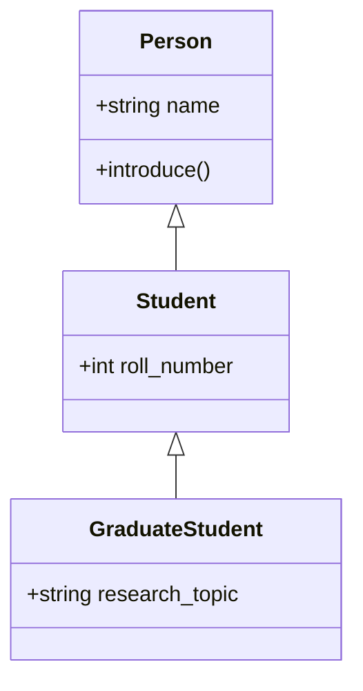

# Inheritance & Encapsulation

---

## 1. Learning Objectives

By the end of this unit, you will be able to:

✓ Create a subclass that extends a parent class using inheritance.  
✓ Use `super()` to call a parent class's constructor or method.  
✓ Describe what Method Resolution Order (MRO) means in multiple inheritance.  
✓ Apply the single- and double-underscore naming conventions to control attribute visibility.  
✓ Explain why encapsulation makes code safer to maintain.

---

## 2. Overview

Many manufacturers build several models on top of one shared base platform — the same chassis, engine mounts, and wiring layout, with each model then adding its own features on top. Inheritance in Python works the same way: a new class can be built on top of an existing one, reusing everything the original class already does and adding only what is different.

The class being built upon is called the **superclass** (or parent class); the new class built on top of it is the **subclass** (or child class). This avoids rewriting code that already works, and keeps related classes consistent with one another.

This unit also covers **encapsulation** — controlling which parts of an object's data are safe for outside code to touch directly, and which parts should stay hidden inside the object, the same way a circuit's internal wiring is sealed inside an insulated casing so only the intended switches and ports are exposed to the user.

Both ideas matter beyond this course: production AI systems are built from class hierarchies (a `BaseModel` that specific model types extend) with carefully encapsulated internal state, so understanding this now prepares you to read and extend real codebases later.

---

## 3. Description

### 3.1 Single-Level Inheritance

- **Superclass (parent class)** — the class being extended.
- **Subclass (child class)** — the new class that extends the superclass, written as `class Child(Parent):`.
- A subclass automatically has every attribute and method the superclass has, and can add new ones.

```python
class Person:
    def __init__(self, name):
        self.name = name

    def introduce(self):
        return f"I am {self.name}."

class Student(Person):
    def __init__(self, name, roll_number):
        super().__init__(name)
        self.roll_number = roll_number

priya = Student("Priya", 101)
print(priya.introduce())
print(priya.roll_number)
```

**Output:**
```
I am Priya.
101
```

`Student` never redefines `introduce()` — it inherits it directly from `Person`.

### 3.2 Multiple Levels of Inheritance and `super()`

- **`super()`** — a way to call the parent class's version of a method, instead of rewriting it.
- Inheritance can chain across several levels: a class can extend a class that itself extends another class.



```python
class GraduateStudent(Student):
    def __init__(self, name, roll_number, research_topic):
        super().__init__(name, roll_number)
        self.research_topic = research_topic

    def introduce(self):
        base = super().introduce()
        return f"{base} I am researching {self.research_topic}."

rohan = GraduateStudent("Rohan", 205, "Natural Language Processing")
print(rohan.introduce())
```

**Output:**
```
I am Rohan. I am researching Natural Language Processing.
```

`GraduateStudent.introduce()` calls `super().introduce()` to reuse `Person`'s greeting, then extends it — rather than repeating the whole sentence from scratch.

### 3.3 Multiple Inheritance and MRO

- **Multiple inheritance** — a class can extend more than one parent class at once: `class Child(ParentA, ParentB):`.
- **Method Resolution Order (MRO)** — the fixed order Python searches through parent classes to find a method, left to right, avoiding ambiguity when two parents define the same method name.

```python
class Swimmer:
    def move(self):
        return "swims"

class Runner:
    def move(self):
        return "runs"

class Triathlete(Swimmer, Runner):
    pass

print(Triathlete().move())
print(Triathlete.__mro__)
```

**Output:**
```
swims
(<class '__main__.Triathlete'>, <class '__main__.Swimmer'>, <class '__main__.Runner'>, <class 'object'>)
```

Because `Swimmer` is listed first in `class Triathlete(Swimmer, Runner)`, its `move()` wins — the MRO always checks the leftmost parent first.

### 3.4 Encapsulation and Information Hiding

- **Public attribute** — a normal attribute name, freely accessible from outside the object.
- **Single underscore (`_balance`)** — a convention signalling "internal use only"; Python does not enforce this, but other developers should not access it directly.
- **Double underscore (`__pin`)** — triggers **name mangling**, where Python internally renames the attribute to make accidental access from outside the class much harder.

```python
class BankAccount:
    def __init__(self, balance, pin):
        self._balance = balance   # internal-use convention
        self.__pin = pin          # name-mangled

    def check_balance(self, entered_pin):
        if entered_pin == self.__pin:
            return self._balance
        return "Incorrect PIN"

account = BankAccount(15000, "4321")
print(account.check_balance("4321"))
print(account.check_balance("0000"))
```

**Output:**
```
15000
Incorrect PIN
```

---

## 4. Real-World Application

| **Where you see it** | **How Python is working behind the scenes** |
|---|---|
| **A college ERP's user roles** | `Student`, `Faculty`, and `Admin` are all subclasses of a shared `User` base class, reusing login and profile logic while adding their own permissions. |
| **A ride-hailing app's account types** | `Rider` and `Driver` extend a common `Account` class, inheriting shared details (name, phone number) while adding role-specific data (vehicle details for a driver). |
| **Your online banking app** | Your account balance is kept as a private attribute inside an `Account` object — the app never lets outside code edit it directly, only through verified methods. |
| **A food delivery app's user hierarchy** | `PremiumUser` extends a base `User` class, inheriting the ordering logic and adding extra behaviour like free delivery. |
| **Scikit-learn's model classes** | Every specific model type (a classifier, a regressor) extends a common base estimator class, reusing shared training and prediction logic. |

---

## 5. Worked Example

**Scenario:** Your professor asks you to extend the `Student` class from the previous unit into a `GraduateStudent` class for a mini project, and demonstrate that it still behaves like a regular student while adding its own detail.

**1. Start from the existing `Student` class.**
```python
class Student:
    def __init__(self, name, roll_number, marks):
        self.name = name
        self.roll_number = roll_number
        self.marks = marks

    def has_passed(self):
        return self.marks >= 40
```

**2. Extend it into `GraduateStudent`.**
```python
class GraduateStudent(Student):
    def __init__(self, name, roll_number, marks, thesis_topic):
        super().__init__(name, roll_number, marks)
        self.thesis_topic = thesis_topic
```

**3. Create an instance and use both inherited and new attributes.**
```python
arjun = GraduateStudent("Arjun", 301, 88.0, "Computer Vision for Traffic Systems")

print(arjun.has_passed())
print(arjun.thesis_topic)
```

**Output:**
```
True
Computer Vision for Traffic Systems
```

*Common mistake: forgetting to call `super().__init__(...)` inside the subclass's `__init__`. Without it, the parent class's attributes (like `name` and `marks`) are never set, and accessing them later raises an `AttributeError`.*

---

## 6. Summary

- **Inheritance** lets a subclass reuse a superclass's attributes and methods, adding only what is new.
- **`super()`** calls the parent class's own version of a method, avoiding duplicated code.
- **Multiple levels of inheritance** can chain classes together, each adding its own detail on top.
- **MRO** determines which parent's method runs first when multiple parents define the same method name.
- **Encapsulation**, using single- and double-underscore conventions, controls which attributes outside code should — and cannot easily — access directly.

The next unit covers special methods and dataclasses — controlling how your objects are printed and compared, and cutting down the boilerplate needed to define them.

---

*© 2026 Revature · AI Native Engineering — Foundations · Unit 4.2 · Version 1.0*
