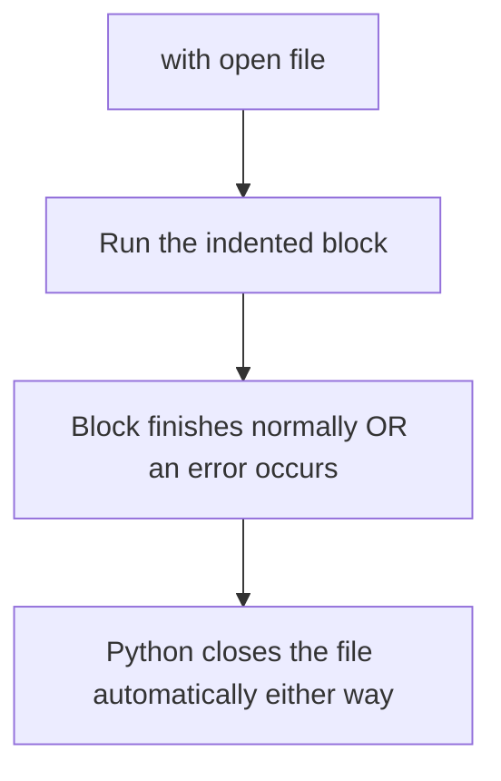

# File Handling

---

## 1. Learning Objectives

By the end of this unit, you will be able to:

✓ Distinguish between text and binary files, and between absolute and relative file paths.  
✓ Open a file in the correct mode (read, write, append) and safely close it.  
✓ Use a `with` block so files are closed automatically, even if an error occurs.  
✓ Read data from a CSV file using Python's `csv` module.  
✓ Load and save simple JSON data using `json.load()` and `json.dump()`.

---

## 2. Overview

Every program you have written so far in this course has lived and died inside a single Colab session — the moment the runtime restarts, every value you created disappears. Real programs cannot work this way. A college attendance system, a marks portal, or an AI model's training log all need to store data permanently, in a file, so it survives long after the program that created it has stopped running.

Think of a file the way you think of a physical lab register kept in your engineering department. The register exists whether or not anyone is currently writing in it. You can open it to read old entries, open it to add a new entry at the end, or occasionally start a fresh register altogether. Python's file-handling tools give you exactly this same set of operations — open, read, write, close — applied to a file stored on disk instead of a paper register.

This unit covers how Python opens, reads, and writes files safely, including two of the most common file formats in real data work: CSV (spreadsheet-style rows and columns) and JSON (the format almost every web API uses to send data).

Every AI system that trains on data starts by reading that data from a file exactly the way you will practise in this unit — which is why file handling is one of the first practical skills every data-facing Python programmer needs.

---

## 3. Description

### 3.1 Introduction to Files

- **Text files** store human-readable characters — such as `.txt`, `.csv`, and `.json` files. You can open one in Notepad and read it directly.
- **Binary files** store data as raw bytes not meant to be read directly — such as `.jpg` images or `.mp3` audio files. Opening one in a text editor shows unreadable characters.
- **Absolute path** — the complete location of a file starting from the root of the drive, such as `C:\Users\Priya\data\marks.csv`.
- **Relative path** — a location given relative to wherever your program is currently running, such as `data/marks.csv`. Relative paths are shorter and more portable between machines, which is why most course exercises use them.

### 3.2 File Operations

Python opens a file using the built-in `open()` function, which takes a file path and a **mode** describing what you intend to do with it.

| **Mode** | **Meaning** |
|---|---|
| `r` | Read an existing file. Fails if the file does not exist. |
| `w` | Write a new file. Creates the file if it doesn't exist; erases existing content if it does. |
| `a` | Append to an existing file, adding new content at the end without erasing what's already there. |
| `r+` | Read and write the same file without erasing its existing content. |

```python
file = open("notes.txt", "w")
file.write("Python file handling notes\n")
file.close()
```

Once a file is open, these are the core operations you will use:

- **`read()`** — reads the entire file as one string.
- **`readline()`** — reads just one line at a time.
- **`readlines()`** — reads every line into a list of strings.
- **`write()`** — writes a string into the file.
- **`close()`** — releases the file so other programs (and the rest of your own code) can use it safely.

### 3.3 Context Managers — the `with` Statement

Calling `close()` manually is easy to forget — especially if an error happens between `open()` and `close()`, in which case `close()` never runs at all. Python's **context manager**, written with the `with` keyword, solves this by closing the file automatically the moment the block finishes, whether it finished normally or because of an error.

```python
with open("notes.txt", "r") as file:
    content = file.read()
    print(content)
```



**Output:**
```
Python file handling notes
```

Notice there is no `file.close()` line at all — the `with` block handles it for you. This is the pattern you should use for every file you open from now on.

### 3.4 Reading CSVs

A **CSV** (Comma-Separated Values) file stores data as rows and columns, like a simplified spreadsheet — exactly the shape most college marksheets and attendance exports are shared in. Python's built-in `csv` module reads each row as a list.

```python
import csv

with open("marks.csv", "r") as file:
    reader = csv.reader(file)
    for row in reader:
        print(row)
```

**Output:**
```
['Name', 'Marks']
['Priya', '78']
['Rohan', '85']
```

### 3.5 Working with JSON

**JSON** (JavaScript Object Notation) stores data as key-value pairs, similar to a Python dictionary — and it is the format almost every web API, including AI model APIs, uses to send and receive data.

- **`json.load()`** — reads JSON data from a file into a Python dictionary.
- **`json.dump()`** — writes a Python dictionary out to a file as JSON.

```python
import json

student = {"name": "Priya", "marks": 78}

with open("student.json", "w") as file:
    json.dump(student, file)

with open("student.json", "r") as file:
    data = json.load(file)
    print(data)
```

**Output:**
```
{'name': 'Priya', 'marks': 78}
```

---

## 4. Real-World Application

| **Where you see it** | **How Python is working behind the scenes** |
|---|---|
| **Downloading your semester result as a PDF or CSV** | The portal's backend reads your marks from a database and writes them out to a file in exactly the read/write pattern covered in this unit. |
| **A cricket score app updating live** | The app repeatedly reads a small JSON file (or API response) containing the current score and re-displays it the moment it changes. |
| **UPI transaction history export** | Banking apps let you export your transaction history as a CSV file, read using the exact `csv.reader()` pattern shown above. |
| **NPTEL or Internshala saving your profile** | Your profile details are stored and reloaded as JSON, the same `json.load()` / `json.dump()` pair used in this unit. |
| **ChatGPT and other AI APIs** | Every request and response between your code and an AI model is exchanged as JSON — the format this unit introduces. |

---

## 5. Worked Example

**Scenario:** Your professor has shared a CSV file, `marks.csv`, containing student names and their marks. You must write a Python program that reads the file and prints each student's name along with a Pass/Fail result.

**1. Prepare the input file.** Assume `marks.csv` contains:
```
Name,Marks
Priya,78
Rohan,32
Arjun,55
```

**2. Open the file safely.** Use a `with` block so the file always closes correctly:
```python
import csv

with open("marks.csv", "r") as file:
    reader = csv.reader(file)
    header = next(reader)
    for row in reader:
        name, marks = row[0], int(row[1])
        result = "Pass" if marks >= 40 else "Fail"
        print(f"{name}: {result}")
```

**3. Run the cell.** Press `Shift + Enter` in Colab.

**4. Check the output.**
```
Priya: Pass
Rohan: Fail
Arjun: Pass
```

**5. Save your work.** Save the notebook to Google Drive so both your code and the result are stored together.

*Common mistake: forgetting to skip the header row (`Name,Marks`) before processing the data — this causes an error when Python tries to convert the word "Marks" into a number with `int()`. Always call `next(reader)` once before the loop to skip it.*

---

## 6. Summary

- **Files** let a program's data survive after the program itself has stopped running, unlike a Colab runtime's temporary memory.
- **File modes** (`r`, `w`, `a`, `r+`) control whether you are reading, writing, appending, or doing both.
- **The `with` statement** closes a file automatically, even if an error occurs inside the block — always prefer it over calling `close()` manually.
- **The `csv` module** reads spreadsheet-style data row by row, exactly the shape most marksheets and exports use.
- **JSON**, read and written with `json.load()` and `json.dump()`, is the data format almost every web and AI API uses.

With files now readable and writable, the next unit covers what happens when that data isn't clean — errors and exceptions, and how to handle them without crashing your program.

---

*© 2026 Revature · AI Native Engineering — Foundations · Unit 5.1 · Version 1.0*
