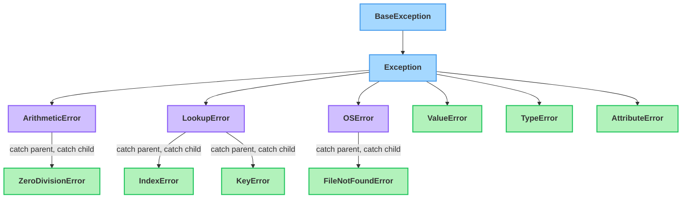

# Errors & Exceptions

---

## 1. Learning Objectives

By the end of this unit, you will be able to:

✓ Tell a syntax error apart from a runtime exception, and explain why one stops your program before it even starts.  
✓ Write a `try`/`except`/`else`/`finally` block and explain what each part actually guarantees.  
✓ Explain — with a real example — why a bare `except:` is dangerous, and catch specific exception types instead.  
✓ Handle more than one kind of failure from the same `try` block.  
✓ Raise your own exception with `raise`, including a custom exception class.

---

## 2. Overview

The file-handling unit right before this one deliberately left a question open: what happens the day someone deletes `sales.csv`, or a user types text where a number belongs? Try it, and Python stops the program cold with a red message ending in an exception name. **Exception handling** is how you plan for exactly that: code that watches for a specific kind of failure and runs a planned response instead of letting the whole program crash.

You don't write one catch-all "something broke" response for every possible failure — a missing file, a bad number, and a division by zero each deserve their own specific next step, the same way a program's logic branches on `if`/`elif` rather than one generic `else`. This unit covers the full toolkit: recognizing errors versus exceptions, the anatomy of `try`/`except`/`else`/`finally`, why catching *everything* indiscriminately is a real danger rather than just bad style, handling multiple failure types from one block, and raising exceptions — including your own — when your code detects a problem no built-in exception describes.

---

## 3. Description

### 3.1 Errors vs. Exceptions

- **Syntax errors** happen before your code runs at all. Python reads your file, can't make sense of its structure — a missing colon, a misspelled keyword — and refuses to even start. There's no "handling" a syntax error at runtime; you fix it in the editor.
- **Exceptions** happen *while* the program is running. The code was valid Python — it started executing — but something went wrong partway through: a file wasn't there, a value couldn't be converted, a number got divided by zero.
- Every exception Python raises is an *object*, built from a class — and if that sounds familiar, it's the same class/inheritance system from Part 4. `ValueError`, `FileNotFoundError`, and every other built-in exception all ultimately inherit from a base class called `Exception`, arranged in a tree:


*A simplified slice of Python's exception tree — catching a parent class also catches every child beneath it.*

This matters in practice: catching a **parent** class also catches all its children. `except LookupError:` catches both `IndexError` and `KeyError`, since both descend from it. That's also why `except` order matters once types are related — put the specific one first, or a broader parent listed above it will catch the error before the specific block ever gets a chance.

```python
# This next line has a typo Python catches before running anything:
prin("hello")
```

Output:

```
  File "<cell>", line 2
    prin("hello")
SyntaxError: invalid syntax
```

That's a syntax error — nothing ran. Compare it to this, which is perfectly valid Python that fails *during* execution:

```python
print(10 / 0)
```

Output:

```
ZeroDivisionError: division by zero
```

### 3.2 The Anatomy of `try` / `except` / `else` / `finally`

A `try`/`except`/`else`/`finally` block has four distinct parts, each with its own job:

```python
try:
    marks = int(input("Enter marks: "))
    print("You entered:", marks)
except ValueError:
    print("That wasn't a valid whole number.")
else:
    print("No errors occurred.")
finally:
    print("Attempt logged.")
```

- **`try`** — the code that might fail.
- **`except SomeError`** — runs only if `SomeError` (or a subclass of it) was raised inside `try`. Naming the type is what makes this a *specific* plan, not a generic one.
- **`else`** — runs only if `try` finished with zero exceptions. Skipped entirely if any `except` fired.
- **`finally`** — runs unconditionally: whether `try` succeeded, whether an `except` fired, even if the code inside `except` itself raises a *new* exception. It's the one block you can always count on executing.

Read it as a sentence: *try* this; if it fails this way, do the matching *except*; if it succeeded with no exception at all, also do the *else*; and in every case, *finally* do this last.

### 3.3 Why a Bare `except:` Is a Real Danger, Not Just Bad Style

It's tempting to write one `except:` with no type at all, so *nothing* can crash your program. Here's the concrete problem with that:

```python
def get_score(scores, student):
    try:
        return scores[studnt]      # typo: should be 'student'
    except:
        return "Score unavailable"

scores = {"Asha": 88, "Rahul": 76}
print(get_score(scores, "Asha"))
```

Output:

```
Score unavailable
```

There's a real bug here — `studnt` is misspelled — and the bare `except:` just swallowed it whole. The function silently returns a wrong answer instead of ever showing you the `NameError` that would've pointed straight at the typo. A bare `except:` catches every exception, including ones you never anticipated and would have wanted to see. Naming the exception type fixes this immediately:

```python
def get_score(scores, student):
    try:
        return scores[studnt]      # same typo
    except KeyError:
        return "Score unavailable"

print(get_score(scores, "Asha"))
```

Output:

```
NameError: name 'studnt' is not defined
```

Now the real bug surfaces instead of hiding behind a message that looked like normal, expected behavior. **Rule of thumb:** name the specific exception(s) you actually expect — never catch everything just to make errors disappear.

### 3.4 Handling Multiple, Specific Failures

A `try` block can be followed by more than one `except`, each aimed at one specific failure:

```python
try:
    value = int(input("Enter a number: "))
    result = 100 / value
except ValueError:
    print("Please enter a valid whole number.")
except ZeroDivisionError:
    print("You cannot divide by zero.")
```

Only one `except` runs per attempt — Python checks them top to bottom and stops at the first type match. Related failures that deserve the *same* response can share one `except` using a tuple:

```python
try:
    value = int(input("Enter a number: "))
    result = 100 / value
except (ValueError, ZeroDivisionError):
    print("Something was wrong with the number you entered.")
```

### 3.5 What `finally` Actually Guarantees

It's easy to assume `finally` is just "code after the try/except" — it isn't. `finally` still runs even when a `return` fires inside `try`, and even when the `except` block itself raises a brand-new exception. That's the actual guarantee: no path out of this block skips `finally`.

```python
def risky_lookup(d, key):
    try:
        return d[key]
    finally:
        print("Lookup attempt finished — logging either way.")

risky_lookup({"a": 1}, "b")
```

Output:

```
Lookup attempt finished — logging either way.
KeyError: 'b'
```

Notice the print statement ran *before* the `KeyError` propagated out — `finally` fired even though nothing caught the exception and the function never got to actually return. That's why `finally` is the natural home for cleanup that must happen no matter what: closing a file, releasing a resource, logging that an attempt was made.

### 3.6 Common Built-in Exceptions

| **Exception** | **When it happens** |
|---|---|
| `FileNotFoundError` | You try to open a file that doesn't exist. |
| `ValueError` | A value has the right type but an inappropriate value — `int("abc")`. |
| `IOError` | An input/output operation fails — a disk problem, a broken stream. In modern Python it's just another name for `OSError`, the same family `FileNotFoundError` belongs to. |
| `KeyError` | You access a dictionary key that doesn't exist. |
| `IndexError` | You access a list/tuple index that's out of range. |
| `ZeroDivisionError` | You divide a number by zero. |
| `TypeError` | An operation is applied to a value of the wrong type — adding a string to an integer. |
| `AttributeError` | You call a method or access an attribute that doesn't exist on that object. |

A useful pair to keep straight: `ValueError` means *right type, wrong content* (`int("cat")` — a string, just not a numeric one); `TypeError` means *wrong type entirely* (`len(5)` — an integer has no length at all).

### 3.7 Raising Your Own Exceptions

Sometimes *your* code detects a problem no built-in exception describes well. `raise` lets you trigger one deliberately:

```python
def set_marks(marks):
    if marks < 0 or marks > 100:
        raise ValueError("Marks must be between 0 and 100")
    return marks

set_marks(150)
```

Output:

```
ValueError: Marks must be between 0 and 100
```

You can also define your own exception type — a class that inherits from `Exception`, exactly like the inheritance you built in Part 4:

```python
class InvalidMarksError(Exception):
    pass

def set_marks(marks):
    if marks < 0 or marks > 100:
        raise InvalidMarksError(f"{marks} is not a valid mark")
    return marks

set_marks(150)
```

Output:

```
InvalidMarksError: 150 is not a valid mark
```

A custom exception type gives whoever calls `except InvalidMarksError:` a way to catch *exactly* this problem, distinct from any other `ValueError` that might occur elsewhere in the same program.

---

## 4. Real-World Application

A data-cleaning script processing a million rows and skipping the three bad ones instead of crashing at row 40,502 is running §3.4's per-type `except` inside a loop — catch the specific parsing exception for that one row, log it, and let the loop continue to the next.

A payment app that logs "transaction attempted" whether the payment succeeded, failed, or timed out is leaning on §3.5's `finally` guarantee — that logging line runs on every path out of the attempt. The inverse shows up in real production incidents: teams whose blanket `except Exception: pass` silently swallowed a genuine bug for months before anyone noticed — §3.3's danger, at a scale where it actually costs money.

---

## 5. Worked Example

**Goal:** Build a small calculator function that divides two user-provided numbers, handles bad input *and* division by zero as two genuinely different problems, and logs every attempt regardless of outcome.

**1. Start with the unprotected version, and see it crash.**

```python
def divide(a, b):
    return int(a) / int(b)

print(divide("100", "0"))
```

Output:

```
ZeroDivisionError: division by zero
```

**2. Wrap it — but start with a bare `except:` to see the danger firsthand.**

```python
def divide(a, b):
    try:
        return int(a) / int(b)
    except:
        return "Something went wrong"

print(divide("100", "abc"))   # a genuine typo-like bug: 'abc' isn't a number
```

Output:

```
Something went wrong
```

That message is technically true and completely useless — it can't tell you whether the problem was a bad number, a divide-by-zero, or a real bug in `divide` itself.

**3. Replace it with specific, named exceptions.**

```python
def divide(a, b):
    try:
        return int(a) / int(b)
    except ValueError:
        return "Both inputs must be valid numbers."
    except ZeroDivisionError:
        return "Cannot divide by zero."
    finally:
        print(f"Attempted: {a} / {b}")

print(divide("100", "abc"))
print(divide("100", "0"))
print(divide("100", "4"))
```

Output:

```
Attempted: 100 / abc
Both inputs must be valid numbers.
Attempted: 100 / 0
Cannot divide by zero.
Attempted: 100 / 4
25.0
```

**4. Read what just happened.** All three calls logged their attempt via `finally`, no matter which path each one took — two failed for two distinct, correctly identified reasons, and the third succeeded normally.

*Common mistake: writing `except:` with no type "just to be safe." It's the opposite of safe — it hides exactly the bugs you most need to see, the way step 2 hid a real problem behind a useless message. Always name the exception(s) you're actually expecting.*

---

## 6. Summary

- **Syntax errors** stop your program before it runs at all; **exceptions** happen mid-execution and can be handled.
- **`try`/`except`/`else`/`finally`** each guarantee something specific: `try` attempts, `except` catches a named failure, `else` runs only on success, `finally` runs unconditionally — even through a `return` or a new exception inside `except`.
- **A bare `except:` is a real bug risk**, not just a style nitpick — it silently swallows failures you never anticipated, including your own typos.
- **Multiple, specifically-named `except` blocks** let one `try` handle several distinct failure types correctly, each with its own response.
- **`raise`**, including a custom class inheriting from `Exception`, lets your own code signal a problem no built-in exception describes.

Up next: unit 5.3 pulls file handling and exception handling together into one case study — a program that reads real, messy data and survives it instead of crashing on the first bad line.

---

*© 2026 Revature · AI Native Engineering — Foundations · Unit 5.2 · Version 1.0*
