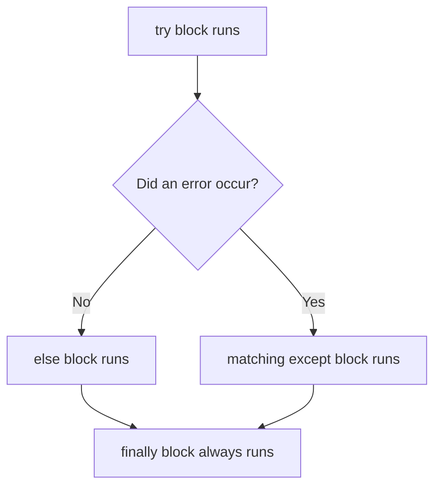

# Errors & Exceptions

---

## 1. Learning Objectives

By the end of this unit, you will be able to:

✓ Distinguish between a syntax error and a runtime exception.  
✓ Handle a risky operation safely using `try`, `except`, `else`, and `finally`.  
✓ Catch multiple different exception types in a single `try` block.  
✓ Recognise Python's most common built-in exceptions and what triggers each one.  
✓ Raise your own exception using the `raise` statement.

---

## 2. Overview

Every program you write eventually meets data or conditions it wasn't expecting — a file that doesn't exist, a user who types text where a number was expected, a list index that doesn't exist. Without a plan for this, your program simply crashes and stops.

Think of exception handling the way you think of a circuit breaker in an electrical panel. Normal current flows through without any special handling — but the moment something goes wrong, like a short circuit, the breaker trips in a controlled way instead of letting the fault damage the whole building. Python's `try`/`except` block is that circuit breaker: it lets normal code run untouched, and only steps in the moment something actually goes wrong.

This unit covers Python's full exception-handling toolkit — recognising the difference between an error and an exception, writing `try`/`except`/`else`/`finally` blocks, handling several exception types at once, and raising your own exceptions when your code detects a problem no built-in exception describes.

Real AI systems process enormous amounts of messy, real-world data — and the difference between a script that crashes on the first bad record and one that logs it and keeps going is exactly the skill this unit builds.

---

## 3. Description

### 3.1 Errors vs Exceptions

- **Syntax errors** happen before your code even runs — Python cannot understand the structure of what you've written (a missing colon, a misspelled keyword). These must be fixed before the program starts at all.
- **Exceptions** happen while the program is running — the code is syntactically valid, but something goes wrong during execution (a file is missing, a value can't be converted).
- Python organises exceptions into a hierarchy: every exception, from `ValueError` to `FileNotFoundError`, is ultimately a type of the base `Exception` class.

### 3.2 Exception Handling — try / except / else / finally

```python
try:
    marks = int(input("Enter marks: "))
    print("You entered:", marks)
except ValueError:
    print("That wasn't a valid number.")
else:
    print("No errors occurred.")
finally:
    print("This always runs, error or not.")
```



- **`try`** — the risky code you want to attempt.
- **`except`** — runs only if an error occurs in the `try` block, and matches the exception type you specify.
- **`else`** — runs only if the `try` block completed with no error at all.
- **`finally`** — always runs, whether or not an error occurred — commonly used to close a file or release a resource.

### 3.3 Handling Multiple Exceptions

A single `try` block can be followed by more than one `except`, each handling a different failure:

```python
try:
    value = int(input("Enter a number: "))
    result = 100 / value
except ValueError:
    print("Please enter a valid number.")
except ZeroDivisionError:
    print("You cannot divide by zero.")
```

Related exceptions can also be grouped in one `except` using a tuple:

```python
except (ValueError, ZeroDivisionError):
    print("Something went wrong with your number.")
```

### 3.4 Common Exceptions

| **Exception** | **When it happens** |
|---|---|
| `FileNotFoundError` | You try to open a file that doesn't exist. |
| `ValueError` | A function receives a value of the correct type but an inappropriate value (e.g. `int("abc")`). |
| `IOError` | An input/output operation fails, such as reading from a closed file. |
| `KeyError` | You access a dictionary key that doesn't exist. |
| `IndexError` | You access a list index that is out of range. |
| `ZeroDivisionError` | You divide a number by zero. |
| `TypeError` | An operation is applied to a value of the wrong type (e.g. adding a string and an integer). |
| `AttributeError` | You call a method or access an attribute that doesn't exist on that object. |

### 3.5 Raising Exceptions

Sometimes your own code detects a problem that Python's built-in exceptions don't describe well. The `raise` statement lets you trigger an exception deliberately:

```python
def set_marks(marks):
    if marks < 0 or marks > 100:
        raise ValueError("Marks must be between 0 and 100")
    return marks

set_marks(150)
```

**Output:**
```
ValueError: Marks must be between 0 and 100
```

You can also define your own exception types by creating a class that inherits from `Exception` — a technique you will use more as your programs grow larger.

---

## 4. Real-World Application

| **Where you see it** | **How Python is working behind the scenes** |
|---|---|
| **A college portal showing "Invalid roll number"** | Instead of crashing, the backend catches an exception (such as a missing database record) and shows a friendly message. |
| **A UPI app rejecting an incorrect PIN gracefully** | The transaction code catches the validation failure as an exception rather than letting the app crash mid-payment. |
| **ChatGPT handling an unexpected request** | The underlying service wraps model calls in exception handling so one bad request doesn't take down the entire service for every other user. |
| **Online exam portals during network drops** | Exception handling around file/network operations lets the portal save your progress and show a recoverable error instead of losing your answers. |

---

## 5. Worked Example

**Scenario:** Your professor asks you to write a small program that calculates the average of marks entered by a user, and to make sure it doesn't crash if the user enters invalid input.

**1. Write the risky code first, without protection.**
```python
marks = input("Enter your marks: ")
print(100 / int(marks))
```
Typing a non-numeric value here crashes the program immediately.

**2. Wrap it in a try/except/else/finally block.**
```python
try:
    marks = int(input("Enter your marks: "))
    result = 100 / marks
except ValueError:
    print("Please enter a whole number.")
except ZeroDivisionError:
    print("Marks cannot be zero.")
else:
    print("Percentage score:", result)
finally:
    print("Marks check complete.")
```

**3. Run the cell** with a valid input, such as `50`.

**4. Check the output.**
```
Percentage score: 2.0
Marks check complete.
```

**5. Run it again** with an invalid input, such as `abc`, and confirm the program does not crash:
```
Please enter a whole number.
Marks check complete.
```

*Common mistake: writing one broad `except:` with no exception type at all. This catches every possible error, including ones you didn't anticipate, and can hide real bugs in your code. Always name the specific exception you expect to handle.*

---

## 6. Summary

- **Syntax errors** are caught before the program runs; **exceptions** occur while the program is running.
- **`try`/`except`** lets your program recover from a risky operation instead of crashing outright.
- **`else`** runs only when no error occurred, and **`finally`** always runs regardless — useful for cleanup such as closing a file.
- **Multiple `except` blocks** (or a grouped tuple) let you handle several different failure types from the same `try`.
- **`raise`** lets your own code trigger an exception deliberately when it detects a problem no built-in exception fits.

With error handling in place, the next unit brings file handling and exception handling together to build a single robust program — a file reader that survives bad data instead of crashing on it.

---

*© 2026 Revature · AI Native Engineering — Foundations · Unit 5.2 · Version 1.0*
