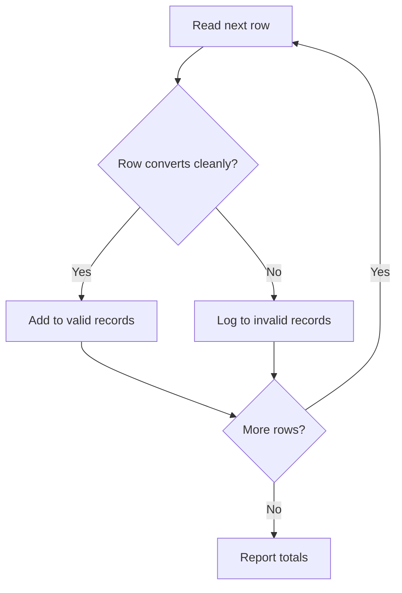

# Case Study — Building a Robust File Reader

---

## 1. Learning Objectives

By the end of this unit, you will be able to:

✓ Combine file handling and exception handling into a single working program.  
✓ Read a CSV file row by row while skipping and logging invalid rows instead of crashing.  
✓ Separate valid data from invalid data into two different outputs.  
✓ Explain why a fault-tolerant reader is preferable to one that stops at the first bad row.

---

## 2. Overview

Every skill this module has covered so far — opening files safely, reading CSVs, and handling exceptions — exists to solve one very common real problem: real data is never perfectly clean. A marks sheet exported from a college database might have a blank cell in one row, or text where a number was expected in another.

Think of this the way a quality inspector on a production line works. The inspector does not shut down the entire line the moment one faulty item appears — they pull the faulty item aside, log it, and let the good items continue down the line. A robust file reader applies exactly this idea to data: process every row it can, set aside the rows it can't, and keep a clear record of what was rejected and why.

This unit is a single worked case study that brings together everything from Units 5.1 and 5.2 into one complete, reusable pattern.

This is precisely the pattern behind almost every real data-loading step in an AI project — a training pipeline that crashes on the first malformed record is far less useful than one that reports what it skipped and keeps working.

---

## 3. Description

### 3.1 The Problem with a Naive Reader

Consider a CSV file, `students.csv`, where one row has bad data:

```
Name,Marks
Priya,78
Rohan,eighty
Arjun,91
```

A simple reader that assumes every row is well-formed will crash the moment it reaches Rohan's row:

```python
import csv

with open("students.csv", "r") as file:
    reader = csv.reader(file)
    next(reader)
    for row in reader:
        name, marks = row[0], int(row[1])
        print(name, marks)
```

**Output:**
```
Priya 78
ValueError: invalid literal for int() with base 10: 'eighty'
```

Every row after the bad one — including Arjun's perfectly valid entry — never gets processed at all.

### 3.2 Designing a Robust Reader

A robust reader wraps the risky conversion in a `try`/`except` block, so one bad row does not stop the rest of the file from being processed:



```python
import csv

valid_records = []
invalid_records = []

with open("students.csv", "r") as file:
    reader = csv.reader(file)
    next(reader)
    for row in reader:
        name = row[0]
        try:
            marks = int(row[1])
            valid_records.append((name, marks))
        except ValueError:
            invalid_records.append(row)

print("Valid records:", valid_records)
print("Invalid records:", invalid_records)
```

**Output:**
```
Valid records: [('Priya', 78), ('Arjun', 91)]
Invalid records: [['Rohan', 'eighty']]
```

### 3.3 Logging Bad Rows Separately

In a real system, invalid rows are usually written out to their own error-log file rather than just printed, so nothing is silently lost:

```python
with open("invalid_rows.csv", "w") as error_file:
    writer = csv.writer(error_file)
    writer.writerow(["Name", "Marks"])
    writer.writerows(invalid_records)
```

This keeps a clear, permanent record of exactly what was rejected, separate from the clean data that continued through the pipeline.

---

## 4. Real-World Application

| **Where you see it** | **How Python is working behind the scenes** |
|---|---|
| **A college bulk-upload tool for student records** | The upload script processes every valid row, and produces a downloadable error report for rows that failed — exactly the pattern in this unit. |
| **AI model training on scraped data** | A large training pipeline skips malformed records, logs them for review, and continues training instead of stopping the whole run for one bad entry. |
| **UPI bulk statement reconciliation** | Bank backend systems process thousands of transaction rows, isolating any that don't match expected formats for manual review. |
| **NPTEL bulk result processing** | Result-upload systems handle thousands of student rows, separating valid submissions from ones that need manual correction. |

---

## 5. Worked Example

**Scenario:** Your professor has given the whole class a shared `attendance.csv` file to process, and warned that a few rows are known to be corrupted. You must submit a notebook that reports both the clean attendance data and a list of the rows that failed.

**1. Prepare the input.** Assume `attendance.csv` contains:
```
Name,DaysPresent
Priya,45
Rohan,
Arjun,50
```

**2. Write the robust reader.**
```python
import csv

valid_records = []
invalid_records = []

with open("attendance.csv", "r") as file:
    reader = csv.reader(file)
    next(reader)
    for row in reader:
        name = row[0]
        try:
            days = int(row[1])
            valid_records.append((name, days))
        except ValueError:
            invalid_records.append(row)

print("Processed successfully:", valid_records)
print("Skipped rows:", invalid_records)
```

**3. Run the cell.**

**4. Check the output.**
```
Processed successfully: [('Priya', 45), ('Arjun', 50)]
Skipped rows: [['Rohan', '']]
```

**5. Save the notebook to Google Drive** so both the code and its output are preserved for submission.

*Common mistake: catching the exception but forgetting to actually store the bad row anywhere — the program no longer crashes, but the invalid data silently disappears instead of being reported. Always log or store what you skip, not just skip it.*

---

## 6. Summary

- **Real data is rarely clean** — a robust reader assumes some rows will fail, rather than assuming every row is valid.
- **Wrapping the risky conversion** in `try`/`except`, per row, lets processing continue past a single bad entry.
- **Separating valid and invalid records** into two collections keeps good data usable while preserving a record of what failed.
- **Logging invalid rows** to their own file, rather than only printing them, ensures nothing is silently lost.
- This pattern — read, attempt, separate, log — is the same one used in production data pipelines, including the ones that feed real AI models.

This closes Part A's file-and-exception-handling module. The next unit moves into version control with Git and GitHub — the professional habit of saving and sharing the code you have written so far.

---

*© 2026 Revature · AI Native Engineering — Foundations · Unit 5.3 · Version 1.0*
