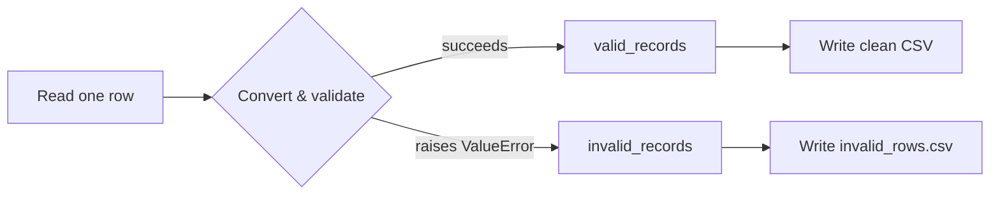

# Case Study — Building a Robust File Reader

---

## 1. Learning Objectives

By the end of this unit, you will be able to:

✓ Combine file handling and exception handling into a single working program.  
✓ Read a CSV file row by row while separating good rows from bad ones instead of crashing on the first problem.  
✓ Log invalid rows to their own file so nothing is silently lost.  
✓ Validate a field against a rule Python can't check on its own (like a valid mark range), and `raise` your own error when it's broken.  
✓ Extend a working reader to produce a summary — not just pass/fail, but real numbers computed from the clean data.

---

## 2. Overview

Units 5.1 and 5.2 taught you two separate skills: opening and reading files safely, and catching exceptions instead of letting them crash your program. This unit exists to answer the question those two skills raise together — what do you actually *do* with a file when some of its rows are fine and some aren't, which is what real data almost always looks like?

A **robust file reader** doesn't stop the moment it hits one bad row. It processes every row it can, sets aside the rows it can't, and keeps a clear, honest record of what got rejected and why — instead of crashing and losing everything, good and bad, the instant something goes wrong.

That's the same idea a quality inspector on a production line follows: they don't shut down the whole line the moment one faulty item rolls past. They pull it aside, log what was wrong with it, and let the good items keep moving.

This is the pattern behind almost every real data-loading step in an AI project. A training pipeline that halts on the first malformed record is far less useful than one that reports what it skipped and keeps going.

---

## 3. Description

### 3.1 The Problem with a Naive Reader

Here's `students.csv`, where one row has bad data:

```
Name,Marks
Priya,78
Rohan,eighty
Arjun,91
```

A reader that assumes every row is well-formed crashes the instant it reaches Rohan's row — and everything after it, including Arjun's perfectly good entry, never gets processed at all:

```python
import csv

with open("students.csv", "r") as file:
    reader = csv.reader(file)
    next(reader)               # skip the header row
    for row in reader:
        name, marks = row[0], int(row[1])
        print(name, marks)
```

Output:

```
Priya 78
ValueError: invalid literal for int() with base 10: 'eighty'
```

Notice what's lost here: not just Rohan's bad row, but Arjun's *good* one right behind it. One bad row took down the rest of the file with it.

### 3.2 Designing a Robust Reader

The fix is to wrap only the risky part — converting the text `"eighty"` into a number — in a `try`/`except` block placed *inside* the loop, so a failure on one row gets caught and logged without ever stopping the loop from reaching the next row.

```python
import csv

valid_records = []
invalid_records = []

with open("students.csv", "r") as file:
    reader = csv.reader(file)
    next(reader)
    for row in reader:
        name = row[0]
        try:
            marks = int(row[1])
            valid_records.append((name, marks))
        except ValueError:
            invalid_records.append(row)

print("Valid records:", valid_records)
print("Invalid records:", invalid_records)
```

Output:

```
Valid records: [('Priya', 78), ('Arjun', 91)]
Invalid records: [['Rohan', 'eighty']]
```

Same file, same bad row — but now Arjun's record survives. One detail worth noticing: the `except` clause catches `ValueError` specifically, not every possible error. If you wrote a bare `except:` instead, you'd also silently swallow real bugs in your own code (a typo in a variable name, say) and never find out — catch the *specific* failure you're expecting, not everything.



### 3.3 Validating Business Rules — Raising Your Own Errors

Not every bad value fails to *convert*. `int("105")` succeeds just fine even though 105 is not a possible exam mark — Python has no way to know that on its own. This is where *you* enforce a rule Python doesn't know about, using `raise`:

```python
try:
    marks = int(row[1])
    if not (0 <= marks <= 100):
        raise ValueError(f"marks {marks} out of range")
    valid_records.append((name, marks))
except ValueError:
    invalid_records.append(row)
```

A row like `Meena,150` now gets caught by the exact same `except ValueError` — except this time the error came from *your* `raise`, not from `int()` itself. Python-raised and self-raised errors funnel through the same handler, which is the point: your own validation checks and Python's built-in checks are just two sources for the same "this row is bad" signal.

### 3.4 Logging Bad Rows Separately

Printing the invalid rows is fine for a quick check, but in a real system you'd write them to their own file, so the rejected data has a permanent, reviewable trail instead of vanishing the moment the program ends:

```python
with open("invalid_rows.csv", "w") as error_file:
    writer = csv.writer(error_file)
    writer.writerow(["Name", "Marks"])
    writer.writerows(invalid_records)
```

Now anyone — a teammate, or you, a week from now — can open `invalid_rows.csv` and see exactly what got rejected, without having to re-run the whole program.

---

## 4. Real-World Application

A college's bulk student-record upload tool runs on exactly §3.2/§3.3's split: it converts and validates every row, processes what passes, and hands back a downloadable error report for the rest — including rows that failed a business rule, like a mark outside 0-100, not just rows that failed to convert at all. A bank's overnight batch reconciliation does the same at a larger scale, isolating any transaction that doesn't match the expected format into a queue for a human to check, instead of one bad row blocking the night's entire run.

---

## 5. Worked Example

**Goal:** The reader from §3.2 already separates good rows from bad ones. Now extend it to do something more useful than just reporting pass/fail — compute a real summary (how many rows succeeded, how many failed, and the class average) using only the clean data.

**1. Start from the working reader**, applied to a new file, `attendance.csv`:

```
Name,DaysPresent
Priya,45
Rohan,
Arjun,50
Meena,48
```

Rohan's row has a blank value where a number was expected — a different flavor of bad data than `"eighty"` was, but it fails the exact same `int()` conversion, so the exact same `except ValueError` catches it.

**2. Read and separate, exactly as before.**

```python
import csv

valid_records = []
invalid_records = []

with open("attendance.csv", "r") as file:
    reader = csv.reader(file)
    next(reader)
    for row in reader:
        name = row[0]
        try:
            days = int(row[1])
            valid_records.append((name, days))
        except ValueError:
            invalid_records.append(row)
```

**3. Now go further than a pass/fail report — compute a summary from the valid data only.**

```python
total_rows = len(valid_records) + len(invalid_records)
average_days = sum(days for _, days in valid_records) / len(valid_records)

print(f"Processed {total_rows} rows: {len(valid_records)} valid, {len(invalid_records)} skipped.")
print(f"Average attendance (valid rows only): {average_days:.1f} days")
print("Skipped rows:", invalid_records)
```

Output:

```
Processed 4 rows: 3 valid, 1 skipped.
Average attendance (valid rows only): 47.7 days
Skipped rows: [['Rohan', '']]
```

**4. Notice what almost went wrong here.** The average is computed over `valid_records` — 3 rows — not `total_rows`, which is 4. If you'd divided by `total_rows` instead, Rohan's skipped row would have silently dragged the average down, even though it contributed no real number to the sum. Separating valid from invalid data isn't just about not crashing; it's about making sure your *math* only ever runs on data you actually trust.

*Common mistake: catching the exception but forgetting to store the bad row anywhere. The program stops crashing, which feels like success — but if you don't append it to `invalid_records`, that row's data just disappears with no record it ever existed. Always log or store what you skip; silence is not the same as success.*

---

## 6. Summary

- **Real data is rarely clean** — a robust reader assumes some rows will fail, rather than assuming every row is valid.
- **Wrapping only the risky conversion** in `try`/`except`, per row, lets the loop continue past a single bad entry instead of dying on it.
- **Catch the specific exception you expect** (`ValueError`, here) rather than a bare `except:` — otherwise you also hide real bugs in your own code.
- **Not every bad value fails to convert.** A rule Python can't check on its own (like a valid mark range) needs you to `raise` your own `ValueError` — it's caught by the same `except` as any error Python raises for you.
- **Separating valid and invalid records** into two collections keeps good data usable while preserving exactly what failed and why.
- **Logging invalid rows to their own file** — not just printing them — means the rejected data leaves a permanent, reviewable trail.
- **Any summary math you compute** should run over the valid records only — mixing in skipped rows (or their count) silently corrupts the result.

This closes the file-and-exception-handling module. Next: version control with Git and GitHub — the professional habit of saving and sharing the code you've written so far.

---

*© 2026 Revature · AI Native Engineering — Foundations · Unit 5.3 · Version 1.0*
