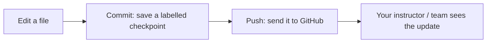

# Version Control Basics

---

## 1. Learning Objectives

By the end of this unit, you will be able to:

✓ Explain what Git is and why version control matters for every engineering project.  
✓ Describe the basic Git loop — repository, commit, push — and what each step does.  
✓ Accept an assignment through GitHub Classroom and locate your cohort repository.  
✓ Edit a file directly on the GitHub web interface and read a repository's commit history.  
✓ Write a small, descriptive commit message instead of a vague one.  
✓ Explain why a README and a `.gitignore` file matter for a professional repository.

---

## 2. Overview

Every piece of code you have written so far in this programme has lived only on your own Google Drive, visible only to you. From this unit onward, that changes. **Git** is a system that tracks every change made to a project over time, and **GitHub** is the website that hosts those tracked projects so they can be shared, reviewed, and built on by others — exactly how real engineering teams work.

Think of Git the way you would think of the revision history on an engineering drawing. Every design change is dated, labelled, and saved as its own version — nothing is silently overwritten. If a later revision turns out to be wrong, the original is still sitting there, untouched, ready to be recovered. Git does the same thing for code: every meaningful change is saved as a labelled checkpoint you can always return to.

This unit covers the basic Git loop — repository, commit, push — how your cohort's assignments are distributed and submitted through **GitHub Classroom**, how to work entirely through the GitHub web interface with no command line required, and the habits that separate a professional repository from a messy one.

This is also the final unit of Part A. Everything you have practised — Python syntax, control flow, data structures, classes, files, and now version control — comes together in the diagnostic at the end of Unit 6.2, which gates your entry into Part B.

---

## 3. Description

### 3.1 What Git Is and the Basic Loop

- **Version control** is a system that records every change made to a project, who made it, and when — so nothing is ever permanently lost, and every change can be reviewed or reversed.
- **Why professionals never work without it.** Any team building software needs a shared, dependable history of every change — without it, work gets overwritten, lost, or impossible to trace back to the person or reason behind it.

The basic loop every Git user repeats constantly has three parts:

- **Repository** — a project folder that Git is tracking. Every file inside it has a complete history of changes.
- **Commit** — a saved checkpoint of your work, with a short message describing what changed and why.
- **Push** — sending your committed changes from your own copy up to the shared copy on GitHub, where the rest of your team (or your instructor) can see them.



---

### 3.2 GitHub Classroom and the Web Interface

- **GitHub Classroom** is how this cohort's assignments are distributed. Your instructor creates an assignment; you **accept** it through a link, and GitHub automatically creates your own personal copy of the repository for that assignment.
- **Working via the web interface.** Everything in this unit is done directly in the browser — no software to install, and no command-line commands to memorise.
  - **Editing files in the browser** — open any file in your repository, click the pencil (edit) icon, make your change, and commit it directly from the same page.
  - **Reading commit history** — every repository has a "Commits" tab showing every checkpoint ever saved, who saved it, and when — a complete, permanent diary of the project.

*Note: accepting a GitHub Classroom assignment creates a repository that only you (and your instructor) can see — it is your own private workspace, not a shared document everyone edits at once.*

---

### 3.3 Good Habits for a Professional Repository

- **README as the front door.** The `README.md` file is the first thing anyone sees when they open your repository — it should explain what the project is and how to use it, the same way a lab record's cover page explains what the experiment is before anyone reads further.
- **Small, descriptive commits.** A commit message like `"fixed stuff"` tells a reviewer nothing. A message like `"Fix rounding error in average marks calculation"` tells them exactly what changed and why — write commits the way you would write a clear line in a lab record.
- **Branching, briefly.** A **branch** is a separate line of work that does not affect the main project until it is ready — `main` is the stable, always-working version of your project; a **feature branch** is where new or experimental changes are tried out first. You will work mostly on `main` in this unit, with deeper branching covered later in the programme.
- **`.gitignore`, briefly.** A `.gitignore` file tells Git which files to never track — most importantly, files containing passwords or API keys, which should never be pushed to a shared repository.

---

## 4. Real-World Application

| **Where you see it** | **How Git/GitHub is working behind the scenes** |
|---|---|
| **Group project submissions on your college portal** | Many colleges now ask teams to submit a GitHub repository link instead of a zip file, so every member's contribution is visible in the commit history. |
| **Internship applications (Internshala, LinkedIn)** | Recruiters increasingly check a candidate's GitHub profile to see real project history — commit activity is treated as evidence of hands-on skill. |
| **NPTEL or Coursera programming assignments** | Some courses now distribute starter code and collect submissions through GitHub Classroom, exactly as this programme does. |
| **Every professional software team** | From two-person startups to global product teams, changes to a shared codebase are tracked, reviewed, and merged through Git — it is the industry-standard way software gets built collaboratively. |
| **Open-source AI libraries** | Every library mentioned earlier in this course — TensorFlow, PyTorch, scikit-learn — is itself a public GitHub repository, with every change tracked exactly the way you are learning here. |

---

## 5. Worked Example

**Scenario:** Your instructor has posted a GitHub Classroom assignment link for a short warm-up task: create a file that lists three things you learned in Part A. Here is the exact sequence to follow.

**1. Accept the assignment.** Click the GitHub Classroom link your instructor shared. Sign in with your GitHub account. Click **Accept this assignment** — GitHub creates your own private repository for it.

**2. Open your repository.** Once created, click the link GitHub gives you to open your new repository.

**3. Create the file.** Click **Add file → Create new file**. Name it `part-a-notes.md`.

**4. Write the content.** In the text box, type:

```
# What I Learned in Part A

- Python syntax and control flow
- Data structures: lists, dictionaries, and sets
- Reading and writing files safely
```

**5. Commit the change.** Scroll down to the commit box. Instead of leaving the default message, type a clear one: `Add Part A learning notes`. Click **Commit changes**.

**6. Check the commit history.** Click the **Commits** tab at the top of the repository. Your commit — with your message and timestamp — is now permanently part of the project history.

*Common mistake: leaving the default commit message (`Create part-a-notes.md`) instead of writing a description of what actually changed. A repository full of default messages is very difficult for anyone — including you, months later — to make sense of.*

---

## 6. Summary

- **Git** is a version control system that records every change to a project, so nothing is ever silently lost or overwritten.
- **The basic loop** — repository, commit, push — is the cycle you will repeat every time you save and share work from here on.
- **GitHub Classroom** distributes and collects assignments by giving each student their own private repository copy.
- **The web interface** lets you edit files, commit changes, and read commit history entirely in the browser, with no command line required.
- **Small, descriptive commits** and a clear **README** are what separate a professional repository from a messy one.
- **This unit closes the version-control half of Part A** — the next step is the personal portfolio and diagnostic in Unit 6.2, which gates your entry into Part B.

---

*© 2026 Revature · AI Native Engineering — Foundations · Unit 6.1 · Version 1.0*
