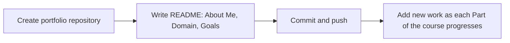

# Portfolio & Diagnostic

---

## 1. Learning Objectives

By the end of this unit, you will be able to:

✓ Create a personal portfolio repository with a clear, well-organised README.  
✓ Structure a README around About Me, Discipline & Domain, and Learning Goals sections.  
✓ Explain what the end-of-Part-A diagnostic checks and why it exists.  
✓ Submit a diagnostic task that demonstrates both Python and Git readiness.  
✓ Describe what happens after submission and what faculty sign-off means for your progress.

---

## 2. Overview

Every unit in Part A has built toward this point. You now know enough Python to read and write data safely, and enough Git to track and share your work the way a professional would. This unit brings both together: a personal portfolio repository you will keep building throughout the programme, and a diagnostic task that confirms you are ready for Part B.

Think of your portfolio repository the way a civil engineer keeps a master set of as-built drawings for a project — a single, always-current record that anyone can open to understand what has been built so far and how it evolved. Your portfolio works the same way: one repository, growing steadily, that represents your progress across the entire course.

This unit covers how to set up that portfolio repository properly, and what the Part A diagnostic actually checks before you are allowed to move on.

Passing this diagnostic is the gate into Part B — AI Fundamentals. Faculty sign-off here is not a formality; it confirms you have the Python and Git foundation that every later AI module assumes you already have.

---

## 3. Description

### 3.1 The Personal Portfolio Repository

- **One repository, used across the whole programme.** Unlike the small assignment repositories from Unit 6.1, your portfolio repository is created once and grows with you — every later part of this course adds to it.
- **A strong README has three sections at minimum:**
  - **About Me** — a short introduction: your name, college, and department.
  - **Discipline & Domain** — your engineering background and the area of AI you are most interested in exploring.
  - **Learning Goals** — two or three specific things you want to be able to do by the end of the programme.



- **Why this matters beyond the classroom.** A well-kept portfolio repository is something you can genuinely show a recruiter — it is direct proof of what you have built, not just a claim on a resume.

---

### 3.2 The End-of-Part-A Diagnostic

- **What it checks.** The diagnostic is a small, self-contained task that requires you to use a Python skill from Part A (reading and summarising a file) together with a Git skill (committing and pushing the result) — proof that both foundations are solid, not just one.
- **How it is submitted.** You commit your working script to your portfolio repository and push the change, exactly as practised in Unit 6.1.
- **What happens after submission.** Your instructor reviews the commit directly on GitHub. Faculty sign-off confirms your Part A foundation is solid before Part B — AI Fundamentals — begins.

*Note: the diagnostic is deliberately small. Its purpose is to confirm readiness, not to test anything new — every skill it requires has already been practised earlier in Part A.*

---

## 4. Real-World Application

| **Where you see it** | **How Git/GitHub is working behind the scenes** |
|---|---|
| **A recruiter reviewing your GitHub profile** | Your portfolio repository's commit history and README are often the first real evidence of your skills a recruiter sees, before any interview. |
| **Placement and internship platforms (Internshala, LinkedIn)** | Many student profiles now link directly to a GitHub portfolio alongside a resume, exactly like the one you are building in this unit. |
| **College project evaluations** | Faculty reviewing a group project increasingly check the GitHub repository directly, since commit history shows genuine individual contribution. |
| **Every AI Native Engineering module after this one** | Every later Part of this programme assumes you can commit and push your work — your portfolio repository is where that work will keep accumulating. |

---

## 5. Worked Example

**Scenario:** Rohan is ready to submit his Part A diagnostic. He needs to set up his portfolio repository properly and complete the diagnostic task.

**1. Create the portfolio repository.** On GitHub, click **New repository**. Name it `rohan-ai-native-portfolio`. Set it to **Public** so it can later be shared with recruiters. Click **Create repository**.

**2. Write the README.** Click on `README.md`, then the pencil (edit) icon, and add:

```
# Rohan's AI Native Engineering Portfolio

## About Me
Second-year Computer Science student, learning Python and AI fundamentals.

## Discipline & Domain
Interested in applying AI to healthcare diagnostics.

## Learning Goals
- Build a solid Python foundation
- Understand core machine learning concepts
- Complete a capstone AI project
```

Commit with the message: `Add portfolio README`.

**3. Add the diagnostic script.** Click **Add file → Create new file**, name it `diagnostic.py`, and add a short script that reads a CSV of sample marks and prints a summary — combining a Part A Python skill with this unit's Git skill.

**4. Commit and push the diagnostic.** Write a clear commit message such as `Add Part A diagnostic script`, then click **Commit changes**.

**5. Notify your instructor.** Share your repository link as instructed, so faculty can review your commit and sign off.

*Common mistake: setting the portfolio repository to Private with no way for an instructor (or later, a recruiter) to view it. Unless told otherwise, keep your portfolio Public so it can actually be reviewed and shared.*

---

## 6. Summary

- **The portfolio repository** is created once and grows across the entire programme, unlike the smaller per-assignment repositories from Unit 6.1.
- **A strong README** covers About Me, Discipline & Domain, and Learning Goals at minimum.
- **The Part A diagnostic** combines a Python skill and a Git skill in one small task, confirming both foundations are solid.
- **Faculty sign-off** on the diagnostic is the gate that allows you to move into Part B — AI Fundamentals.
- **This unit closes Part A entirely** — from here, the programme moves into AI-specific modules that assume everything covered so far is second nature.

---

*© 2026 Revature · AI Native Engineering — Foundations · Unit 6.2 · Version 1.0*
